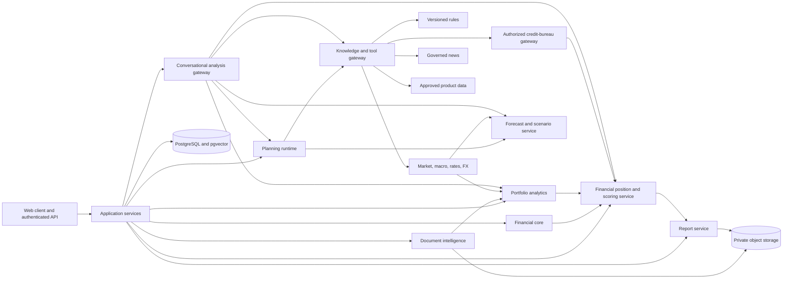

# Finance Coach: Later Production Architecture

## Purpose

This plan starts after MVP 1 provides a working deterministic journey and MVP 2 proves that RAG-assisted strategy selection is useful, testable, and safe. It converts the prototype into a system suitable for real financial documents and longer-lived user cases.

Do not begin these workstreams during the MVP 1 timebox. Each adds operational and privacy obligations that are disproportionate for a prototype.

## Guiding Architecture

Keep a modular monolith initially. Split deployment units only when independent scaling, isolation, or ownership is proven necessary.



The contracts established in MVP 1 and MVP 2 remain the APIs between modules. They gain identifiers, versions, provenance, and persistence metadata rather than being replaced with unconstrained agent messages.

## Boundary From MVP 2

MVP 2 already proves a small, governed adaptive-strategy loop:

* 10–15 reviewed coaching documents;
* deterministic topic and metadata filtering;
* open-source embeddings in a local ChromaDB collection;
* a three-policy allowlist;
* model-or-rule selection of a policy ID only;
* deterministic policy execution, allocation validation, citation validation, and baseline fallback;
* deterministic Financial Position Profile, 0–100 Financial Resilience Score, and goal-aligned actions;
* novice/Detailed report projections, exact maths explanations, grounded report conversation, profile-derived prompt suggestions, and immutable session-scoped scenarios;
* schema-constrained tools, purpose-based OpenRouter model routes, token/cost budgets, and offline prompt/skill/model eval gates.

Later does not rebuild that architecture. It productionizes and extends it. The Later boundary begins where information becomes live, user cases become persistent, document inputs require institution-grade reconciliation, holdings require current valuation and portfolio analytics, forecasts influence scenarios, or a recommendation approaches a regulated product/advice boundary.

MVP 2's constrained policy adaptation and Later dynamic allocation are different:

* **MVP 2:** selects among three checked-in policies using stable coaching evidence and confirmed preferences.
* **Later:** may use versioned jurisdiction rules, current structured data, calibrated forecasts, and a larger reviewed policy registry. Live news never directly allocates money; it may only trigger a labelled scenario or review request.

## Production Priority Plan

Each priority below is one complete feature. Its contracts, ingestion/connectors, deterministic logic, validation, UI, operations, and fallback are kept together. Priorities are sequential unless an item explicitly says it can be developed in parallel after its entry dependencies are green.

| Priority | Feature | Complete feature checklist | Exit condition |
|---|---|---|---|
| L0 | Persistent identity, consent, and audit foundation | [x] Managed authentication (moved up ahead of schedule, 2026-07-19 — Logto via Streamlit's native `st.login()`; see `utils/auth.py` and `Implementation Plan - MVP 1.md`'s maintenance log. Identifies the signed-in user only — the rest of L0's persistence/consent/audit items below remain deferred, since nothing yet stores per-user data.)<br>[ ] Internal principal/case IDs<br>[ ] Consent and retention records<br>[ ] PostgreSQL versioned contracts<br>[ ] Private object storage<br>[ ] Encryption and tenant isolation<br>[ ] Export/delete workflow<br>[ ] Immutable audit events<br>[ ] Backup/restore and access tests | A user can securely create, revisit, export, and delete a case with reproducible history |
| L1 | Comprehensive financial-document and transaction reconciliation | [ ] Institution/document adapters<br>[ ] Bank/card/loan/holding/transaction contracts<br>[ ] Opening/closing balance reconciliation<br>[ ] Income/expense/debt/transfer/savings/investment/refund/fee types<br>[ ] Internal-transfer pairing<br>[ ] Duplicate/reversal/refund handling<br>[ ] Partial-period and one-off handling<br>[ ] Holdings, lots, cost basis, quantity, and valuation-date extraction<br>[ ] Recurring-transaction detection<br>[ ] Source-row/page provenance and confidence<br>[ ] Human correction flow<br>[ ] Precision/recall and reconciliation fixtures | Financial and holding facts are reconciled, dated, sourced, and user-correctable |
| L2 | Governed laws and regulatory rules | [ ] User-confirmed jurisdiction/tax context<br>[ ] Approved regulator/source allowlist<br>[ ] Effective-from/to and supersession model<br>[ ] Versioned rules compiler/registry<br>[ ] Scheduled refresh and human approval<br>[ ] Citation and “as of” UI<br>[ ] Stale/conflicting-source block<br>[ ] Jurisdiction regression suite<br>[ ] Legal/compliance release approval | No jurisdiction-sensitive guidance runs without an active, approved, cited rule version |
| L3 | Structured market, macro, rate, and FX context | [ ] Licensed/official source adapters<br>[ ] Market/macro/interest/FX contracts<br>[ ] Units, currency pairs, observation and release timestamps<br>[ ] Source-vintage preservation<br>[ ] Caching/TTL and market-calendar handling<br>[ ] Outlier and cross-source validation<br>[ ] “Informational vs transaction rate” semantics<br>[ ] Stale-data fallback<br>[ ] Scenario-only integration tests | Current numeric context is reproducible, time-stamped, source-cited, and cannot silently alter historical facts |
| L4 | Portfolio analytics and financial-position extension | [ ] Reconciled portfolio snapshot<br>[ ] Current and historical valuation<br>[ ] Asset/sector/geography/currency allocation<br>[ ] Concentration and diversification<br>[ ] Return, volatility, drawdown, benchmark, fee drag, liquidity, income, and currency-exposure metrics where data supports them<br>[ ] Deterministic portfolio-dimension statuses with metric refs<br>[ ] Financial Resilience Score extension kept separate from performance and bureau scores<br>[ ] Goal/time-horizon impact<br>[ ] Actions separated into generic education versus regulated advice<br>[ ] Novice and Detailed portfolio views<br>[ ] Data-gap and stale-price disclosure<br>[ ] Golden/property tests | The report can dissect a portfolio in precise financial terms with traceable metrics and actions bounded by facts, goals, and regulatory capability |
| L5 | Governed news and event context | [ ] Publisher allowlist and licensing<br>[ ] Deduplication and event clustering<br>[ ] Event/published/retrieved timestamps<br>[ ] Geography and topic tagging<br>[ ] Claim/evidence separation<br>[ ] Confidence and expiry<br>[ ] Contradiction handling<br>[ ] User-visible source links<br>[ ] Profile/portfolio relevance rules<br>[ ] No-goal context-action candidates<br>[ ] Suggested-prompt integration<br>[ ] No-direct-allocation enforcement<br>[ ] Alert/scenario tests | News can create a cited, expiring context alert, action candidate, or scenario/prompt suggestion but never a financial fact or automatic allocation |
| L6 | Forecasting and calibrated scenarios | [ ] Forecast target/feature contracts<br>[ ] Historical-vintage datasets<br>[ ] Baseline/adverse/optimistic scenarios<br>[ ] Prediction intervals and assumptions<br>[ ] Backtesting and calibration thresholds<br>[ ] Model registry/versioning<br>[ ] Drift monitoring<br>[ ] Deterministic non-ML baseline<br>[ ] User-controlled scenario acceptance<br>[ ] No single-point certainty language | Forecasts are reproducible scenarios with measured error, explicit uncertainty, and safe fallback |
| L7 | Authorized credit-bureau profile | [ ] Explicit separate consent and purpose<br>[ ] Authorized bureau/provider agreement and India-specific legal review<br>[ ] Identity matching and least-privilege retrieval<br>[ ] Bureau score/report provenance and freshness<br>[ ] Official factor/reason-code mapping without reverse engineering<br>[ ] Dispute/correction links<br>[ ] Clear separation from Financial Resilience Score<br>[ ] No loan-approval prediction<br>[ ] Access/audit/deletion tests | An actual CIBIL or other bureau score is shown only as sourced bureau data, never imitated, recomputed, or conflated with the Coach's resilience score |
| L8 | Regulated product-advice capability | [ ] Capability matrix by jurisdiction/license<br>[ ] Suitability and eligibility inputs<br>[ ] Approved home-loan/investment/product universe and current disclosures<br>[ ] Conflict/compensation disclosure<br>[ ] Human or licensed-adviser approval where required<br>[ ] Explainability and alternatives<br>[ ] Prohibited-output filters<br>[ ] Complaint/audit retention<br>[ ] Legal/compliance sign-off<br>[ ] Generic-education fallback | Named loan, stock, fund, or other product guidance is enabled only where authority, suitability, evidence, and audit requirements are satisfied |
| L9 | Expanded dynamic allocation | [ ] Larger reviewed policy registry<br>[ ] Policy eligibility from rules and scenarios<br>[ ] Portfolio-metric inputs where applicable<br>[ ] Hard constraint precedence<br>[ ] Live-data and forecast provenance refs<br>[ ] Scenario sensitivity comparison<br>[ ] User approval before activation<br>[ ] Baseline and last-approved-plan fallback<br>[ ] Golden/property/adversarial tests<br>[ ] No news-direct-allocation test | A broader adaptive plan can change allocation only through deterministic, versioned, validated policy execution |
| L10 | Production conversational analysis and prompt/scenario gateway | [ ] Persisted conversation/scenario contracts<br>[ ] Report/profile/portfolio scope and authorization<br>[ ] Versioned strict-schema tool registry<br>[ ] Capability routing to rules, market, news, forecast, portfolio, bureau, and product gateways<br>[ ] Profile/search/current-context suggested prompts<br>[ ] Exact maths-explanation tools<br>[ ] Baseline immutability and scenario versioning<br>[ ] Citations and “as of” timestamps<br>[ ] Clarification for missing inputs<br>[ ] Prompt-injection/data-leakage tests<br>[ ] Human approval before plan promotion<br>[ ] Full audit trail | Users can ask report, home-loan, stock, market, law, credit-profile, and portfolio questions through only the capabilities authorized and active for their case |
| L11 | Production model, prompt, skill, and context governance | [ ] Purpose-based OpenRouter model registry<br>[ ] Current capability/price/latency discovery<br>[ ] Per-route quality/cost/token budgets<br>[ ] `Fable`/`5.6 Sol` denylist gate<br>[ ] Minimal-context packer<br>[ ] Offline decision/tool/grounding/maths evals<br>[ ] Live-capability freshness evals<br>[ ] Human-calibrated qualitative judge<br>[ ] Prompt/skill/model promotion and rollback<br>[ ] Drift/cost monitoring<br>[ ] No runtime model voting | Model upgrades improve measured quality or cost without changing deterministic financial truth or bypassing capability gates |
| L12 | Resumable workflow, operations, and integrations | [ ] Persistent workflow references<br>[ ] Human review/approval interrupts<br>[ ] Idempotent background jobs<br>[ ] End-to-end tracing and cost/quality metrics<br>[ ] Alerts and incident runbooks<br>[ ] Account/Drive connectors with least privilege<br>[ ] Plan-versus-actual history<br>[ ] Consent-based notifications<br>[ ] Disaster recovery and SLO tests | The full product operates safely over time and failures are observable, recoverable, and auditable |

### Priority dependency rules

* L0 is mandatory before storing real user cases or enabling external account connections.
* L1 is mandatory before historical behavior, forecasting, or plan-versus-actual claims are treated as reliable.
* L2 is mandatory before jurisdiction-specific rules or regulated advice.
* L3 requires L0; market-valued portfolio analytics in L4 requires L1 and L3.
* L5 news may be developed after L0 but remains read-only context.
* L6 requires L1 and the relevant L3 historical-vintage data.
* L7 requires L0, explicit consent, an authorized bureau relationship, and India-specific privacy/compliance review; it is not required for the internal Financial Resilience Score.
* L8 requires L0 and L2; where products depend on current valuation or rates, it also requires L3 and L4. Bureau data from L7 is used only when necessary and consented.
* L9 requires L1, L2, L3, and L6. L5 news may suggest review but is never an allocation dependency; L8 is required only when named products are in scope.
* L10 can expose only priorities whose gates are already active; it does not bypass them.
* L11 begins with MVP 2's eval assets and expands as each live capability activates; it cannot replace deterministic acceptance tests.
* L12 productionizes approved capabilities; it does not weaken any earlier gate.

### Relationship to the existing Later phases

The priorities above are the implementation order; the phase sections below remain the architectural detail:

| Priority | Existing architecture section |
|---|---|
| L0 | Phase L1 plus the security/audit portions of Phase L5 |
| L1 | Phase L2 Document Intelligence, expanded to transactions, holdings, and reconciliation |
| L2–L3 and L5 | Phase L3, split into rules, structured numeric data, and news because they have different trust and freshness semantics |
| L4 | New deterministic portfolio analytics attached to Document Intelligence, Financial Core, and structured market data |
| L6 | New calibrated scenario service attached to Phase L3 data governance and the Financial Core |
| L7 | New authorized credit-bureau gateway and separately presented bureau profile |
| L8 | New gated product capability behind rules, market data, portfolio context, and jurisdiction controls |
| L9 | Expansion of MVP 2's deterministic policy registry and Planning Runtime |
| L10 | Production extension of MVP 2 report chat, suggested prompts, and immutable scenario workspace |
| L11 | Expansion of MVP 2's model/tool/prompt/skill evaluation and token-cost governance |
| L12 | Phases L4–L6: resumability, operations, integrations, and ongoing tracking |

## Phase L1: Identity, Consent, and Persistent Cases

### Goals

* Authenticate users through a managed identity provider.
* Map identity subjects to internal principal IDs; do not use provider IDs as financial-domain keys.
* Record explicit consent for document analysis, retention, and external connections.
* Persist profiles, corrections, snapshots, plans, reports, and immutable audit records.
* Support user-controlled data deletion and retention expiration.

### Storage boundaries

* PostgreSQL: cases, profile versions, transactions, debts, goals, snapshots, plans, reports, citations, and audit metadata.
* Private object storage: original documents, derived artifacts, and generated reports.
* pgvector: curated knowledge only. Do not index user transactions or raw financial statements by default.

### Required controls

* Tenant/principal filtering on every query.
* Encryption in transit and at rest.
* Server-side provider keys only.
* Redacted logging and no PDF/body content in telemetry.
* Explicit data-deletion workflow and retention schedule.

## Phase L2: Document Intelligence

Expand document support only after reliable fixtures and extraction evaluation exist.

```text
Validate upload
-> inspect MIME/type/size
-> detect digital PDF, scan, image, or CSV
-> document classification
-> native table extraction or OCR fallback
-> normalize fields with page-level provenance
-> reconcile totals and detect duplicates/transfers
-> send uncertain fields to human review
```

Target document families:

* Bank and credit-card statements.
* Loan statements with balance, rate, payment, and dates.
* Mutual-fund/CAS/SIP statements with holdings, contributions, and valuation date.
* Manual forms as a first-class source with explicit provenance.

Every extracted value needs a source reference, confidence, and confirmation status. The extractor reports facts; it does not judge financial health or create goals.

## Phase L3: Governed Knowledge and Live Information

MVP 2's local RAG becomes a governed knowledge gateway.

### Curated corpus

* Version sources, chunks, embedding model, effective dates, and review status.
* Include publisher, jurisdiction, topic, source type, effective-from/to dates, and a content hash.
* Require citations for evidence-backed advice.

### Live information

Live information is split by risk and data semantics rather than exposed as one generic search tool:

* **Rules gateway:** laws, regulations, tax rules, contribution limits, and schemes; versioned by jurisdiction and effective dates with human approval.
* **Structured data gateway:** market, macroeconomic, interest-rate, and FX observations; versioned by observation time, release time, source vintage, unit, and currency pair.
* **News gateway:** licensed/allowlisted current events; produces expiring `ContextAlert` objects, never financial facts or direct allocations.
* **Credit-bureau gateway:** retrieves consented, purpose-limited bureau data through an authorized provider; it never estimates or reconstructs a bureau score.
* **Product gateway:** approved product facts and disclosures; unavailable unless the L8 capability gate is active for the user's jurisdiction.

Every connector includes source allowlists, timestamps, caching/TTL, request budgets, validation, circuit breakers, and user-visible "as of" dates. A stale or unavailable source produces a disclosed fallback, not an uncited model guess.

Agents never access external search, MCP tools, or SQL directly. They call one gateway that applies those controls.

### Goal and no-goal action boundary

All recommendations continue to resolve to deterministic `Action` objects. If confirmed goals exist, actions are ranked by goal impact, urgency, constraints, and evidence. If no goal exists, the Coach first applies the MVP 2 financial-resilience baseline, then may add governed current-context candidates derived from recent news, structured market context, and historical analysis.

A current-context candidate records geography/jurisdiction, profile/portfolio relevance, source links, `as_of`/expiry, confidence, affected dimensions, and a proposed review/scenario action. It cannot silently become an allocation or named product instruction. Conflicting, stale, or weakly relevant context is suppressed. The primary action remains a stable financial-resilience action unless deterministic policy rules establish that a current event materially changes its urgency.

### Forecasting boundary

Forecasting is not ordinary RAG. It is a separate scenario service with versioned datasets, model versions, prediction intervals, backtesting, calibration thresholds, and a deterministic baseline. Forecasts may populate user-visible scenarios; they do not overwrite observed history or silently change an approved plan.

### Dynamic allocation boundary

Later may expand MVP 2's three-policy registry, but every strategy remains a deterministic registry entry. Live rules and structured data may determine policy eligibility; calibrated forecasts may provide scenario inputs; news may only suggest that the user review a scenario. The LLM never emits allocation formulas or amounts.

### Product-advice boundary

Named product guidance is disabled by default. It requires an active jurisdiction capability, approved product data, suitability inputs, current disclosures, conflicts handling, audit retention, and any required licensed-human approval. Without those controls, the Coach returns generic education and comparison criteria only.

### Financial Resilience Score and credit-bureau boundary

MVP 2's 0–100 Financial Resilience Score remains the Coach's deterministic financial-planning indicator. Later may extend its component view with portfolio dimensions, but must retain versioned formulas, exact component maths, goal impact, and the disclosure that it is not a credit score.

An actual CIBIL or other bureau score is a separate sourced object. For India, CIBIL describes its score as a three-digit 300–900 value based on the Accounts and Enquiries sections of the CIBIL report. The Coach must not imitate this scale, use the CIBIL name for its own score, reconstruct a bureau score from user transactions, or claim creditworthiness/approval probability. With explicit consent and authorized access, L7 may display the bureau-provided score, freshness, report factors/reason codes, source, limitations, and dispute path beside—but never blended into—the resilience profile.

### Portfolio analytics boundary

Portfolio analysis is deterministic and fact-led. It requires reconciled holdings with quantity, cost basis where available, valuation date, currency, source provenance, and current/historical prices from the structured data gateway.

The portfolio report may calculate, when supported by sufficient data:

```text
current value and invested cost
absolute and annualized return
asset, sector, geography, and currency allocation
single-name and top-N concentration
diversification indicators
volatility and maximum drawdown
benchmark-relative performance
income/yield actually observed
fees and expense drag where known
liquidity and emergency-access classification
goal and time-horizon alignment
```

Every metric records period, currency, source/vintage, formula version, and data sufficiency. Missing cost basis or history suppresses dependent performance/risk metrics rather than producing estimates disguised as facts.

Portfolio assessments use precise financial dimensions—diversification, concentration risk, market risk, risk-adjusted and benchmark-relative performance, fee drag, liquidity, currency exposure, and goal/time-horizon alignment—with deterministic status rules over these metrics. Actions may discuss diversification, concentration reduction, fees, liquidity, or goal alignment generically. A named buy/sell/hold action is product advice and requires L8.

The report keeps the MVP 2 dual-depth model:

* **Simple:** overall position, Financial Resilience Score with separate portfolio dimensions, goal progress, one primary action, next actions, and critical warnings.
* **Detailed:** holdings, algorithms, formulas, substituted calculations, time periods, benchmarks, risk/performance metrics, assumptions, evidence, limitations, and advisory boundary.

Both views resolve to the same immutable report version.

### Conversational analysis boundary

The production conversational gateway extends MVP 2's typed report chat. It does not grant the LLM direct access to case storage or live systems. A deterministic router authorizes tools based on user, case, jurisdiction, consent, and active priority gates.

Every agent role receives a strict-schema, purpose-specific tool allowlist. The model can request a JSON/function call; application code validates authorization, schema, references, freshness, budget, and capability status before execution. No role gets a generic web, SQL, MCP, filesystem, report-mutation, or arbitrary-code tool. Mathematical explanations fetch deterministic formulas and steps; the model only adapts their language and cannot change the result.

Examples:

* “Explain this section of my report” reads only immutable report references.
* “Can I afford this house?” creates a versioned scenario; live loan rates require L3 and named lender comparison requires L8.
* “What happens if I buy ₹100,000 of this stock?” may compare liquidity/concentration using approved current data; whether the user should buy it requires L8.
* “What law applies here?” requires an active L2 rule version and returns citations plus an `as_of` date.
* “How did this news affect my scenario?” may use L5 context but cannot turn news into a fact or allocation.
* “What does this equation mean?” returns the exact recorded formula, substitutions, steps, units, and then a simpler explanation.
* “What affects my credit profile?” may read authorized L7 bureau factors and official reason codes, but never infer approval probability.

Conversation never changes an approved report or plan. It creates a new scenario version. Promotion to an approved plan requires explicit user approval, deterministic revalidation, and a persisted audit event.

Suggested prompts are capability-aware actions, not generic generated questions. They are ranked from goals, high-priority dimensions, portfolio exposures, data gaps, recent authorized searches, and current context. Every suggestion stores its source refs and required capability; unavailable or unconsented capabilities are not suggested. Show two to four suggestions and preserve user control.

## Phase L4: Resumable Planning Workflow

Introduce a graph runtime only when multi-step review and asynchronous work make it necessary. A possible workflow is:

```text
load case
-> validate extraction
-> interrupt for missing/uncertain data
-> calculate financial snapshot
-> retrieve evidence
-> select and validate strategy policy
-> interrupt for user approval
-> persist approved plan and generate report
```

Persist compact workflow identifiers and state references, not raw document bytes, full transactions, or unbounded prompt history. Use human review for extraction corrections and final plan approval.

## Phase L5: Evaluation, Observability, and Operations

### Purpose-based OpenRouter model runtime

Preserve MVP 2's four routing tiers: deterministic/no-model, economy structured, balanced judgement, and high-reasoning exception. Each route has one documented purpose, strict input/output schemas, an allowed tool list, reasoning level, fallback, and request/session/daily token and cost limits. Calculations, scores, dimension statuses, actions, forecasts, allocation, authorization, and validation remain deterministic or specialist-service outputs—not model judgement.

Model slugs are configuration selected from OpenRouter's current catalogue after task-specific evaluation. Candidate families can include GPT, Claude, Kimi, DeepSeek, or comparable models. Availability and pricing change, so CI/release discovery records the exact slug, provider policy, context limit, tool/structured-output support, input/output price, latency, eval result, and selection date. The case-insensitive `Fable` and `5.6 Sol` denylist applies to primary routes and fallbacks.

Use the cheapest model that clears the capability's quality and safety thresholds. High-reasoning routes are exceptions for genuinely ambiguous interpretation and offline qualitative judging, use compact referenced context, and have a small traffic/cost ceiling. There is no runtime model voting. OpenRouter provider routing cannot substitute an unevaluated model slug.

### Evaluation suites

* Ingestion: document type, field extraction, row-level precision/recall, reconciliation, and confidence calibration.
* Financial core: unit and property tests for payment, allocation, and scenario invariants.
* RAG: retrieval relevance, source correctness, source freshness, citation resolution, and retrieval-token limits.
* Strategy: constraint compliance, no invented values, correct fallback behavior, and explanation quality.
* Reporting: all rendered values reconcile with snapshot and plan versions.
* Financial profile: dimension/status fidelity, score component invariants, goal-action alignment, no-goal baseline, and bureau/resilience separation.
* Agent decisions: intent, clarification, authorized tool selection, schema-valid arguments, call count, refusal, and fallback correctness.
* Maths explanation: formula/input/step/result equality plus novice comprehension.
* Prompt suggestions: source-reference validity, relevance, diversity, capability/consent validity, and no unsupported live prompt.
* Live context: source quality, geographic relevance, chronology, freshness/expiry, contradiction handling, and no direct allocation.
* Model/prompt/skill: quality by capability, token/context utilization, latency, cost, stability, and rollback readiness.

### Operations

* Trace request IDs through ingestion, calculation, retrieval, and report generation.
* Measure latency, retrieval count, model usage, fallback rate, validation failures, and human-review rate.
* Alert on failed report generation, extraction degradation, invalid-plan attempts, and unexpected model costs.
* Run model, prompt, skill, reasoning-level, and context-pack comparisons offline against a human-calibrated evaluation corpus; do not use runtime model voting.
* Record model slug/provider, prompt and skill versions, tool schema version, tokens, cost, latency, tool trace, result refs, and fallback per request.
* Alert when a route exceeds quality, token, cost, latency, schema-error, tool-error, or high-reasoning-usage thresholds.

## Phase L6: Product Integrations

Only after consent, storage, authorization, and deletion flows exist:

* User-approved Drive import/export.
* Account aggregation or institution connectors with separate authorization.
* Historical monthly tracking and plan-versus-actual reporting.
* Notification/reminder systems with user-controlled consent.

Each integration exposes a narrow contract, uses idempotency keys for writes, and receives the minimum permission scope necessary.

## Production Contract Additions

Every persisted contract gains:

```python
{
    "schema_version": "2.0",
    "case_id": "case-001",
    "profile_version": 4,
    "baseline_report_id": "report-004",
    "parent_scenario_id": null,
    "producer": "financial-core",
    "produced_at": "2026-07-18T10:30:00Z",
    "source_ids": ["document-001"],
    "model_route_id": "report-explanation-v1",
    "prompt_version": "report-explanation-v3",
    "tool_call_refs": ["tool-call-001"],
    "token_usage": {"input": 1200, "output": 280},
    "cost_usd": 0.0012,
    "warnings": [],
    "errors": [],
}
```

Rules remain unchanged:

* IDs originate upstream and are reused downstream.
* Outputs are immutable and versioned.
* Unknown remains `null`/`None`.
* Agents return schema-constrained output and never write databases directly.
* Recommendations include calculation references, evidence IDs, or both.
* Reports are immutable; corrected or approved outputs create a new version.
* Scenarios reference a baseline report and store explicit overrides and assumptions.
* Conversation responses record authorized tool calls and resolving report/data/evidence references.
* Financial-dimension, score, maths-explanation, action, prompt-suggestion, and bureau-profile objects remain separate, versioned contracts.
* Bureau-derived values retain consent, source, freshness, and dispute references and never feed the internal score without an explicit reviewed policy.

## Planning References

These references support architecture boundaries; they are not runtime data sources by themselves:

* [CRED Money](https://cred.club/money): inspiration for a consolidated financial profile, progressive disclosure, consent-led data access, and goal-oriented insights. Do not copy branding or product claims.
* [CIBIL: Understanding Your CIBIL Report](https://www.cibil.com/content/dam/cibil/consumer/CIBIL-Report-Understanding.pdf): source for the distinct 300–900 bureau-score boundary and Accounts/Enquiries basis.
* [OpenRouter tool calling](https://openrouter.ai/docs/guides/features/tool-calling) and [structured outputs](https://openrouter.ai/docs/guides/features/structured-outputs): source for model-proposed, application-executed tools and strict JSON Schema outputs.
* [OpenRouter model catalogue](https://openrouter.ai/docs/guides/overview/models): use current catalogue metadata at release time rather than freezing planning-time prices or model rankings.

## Exit Criteria

Production readiness requires more than a functional demo:

1. A user can view, correct, export, and delete their own case without seeing another user's data.
2. Re-running a report against the same profile, snapshot, plan, and evidence versions reproduces the result.
3. All financial allocations pass deterministic validation before display or export.
4. Every evidence-backed recommendation has a resolving citation and effective-date information when relevant.
5. Extraction and strategy regressions are detected in CI before deployment.
6. Incident logging excludes document contents and sensitive values by default.
7. Simple and Detailed report views reconcile to the same immutable report version.
8. Portfolio metrics are suppressed when required holdings, price, cost-basis, or history data is insufficient.
9. Conversation cannot mutate a baseline report or invoke a capability whose priority gate is inactive.
10. Every promoted scenario creates a new validated plan version and an audit event.
11. Every financial assessment uses a named dimension, status, metric refs, goal impact, and deterministic action refs; no loose positive/negative labels remain.
12. The Financial Resilience Score is reproducible and visually/semantically distinct from any consented bureau score.
13. Every agent tool call is authorized, schema-valid, budgeted, logged, and tied to an evaluated model/prompt/skill route.
14. Suggested prompts resolve to available capabilities and cited profile/current-context reasons.

The later product story is: **versioned financial facts, deterministic calculations, governed knowledge, user approval, and reproducible reports form the trust boundary around any agent behavior.**
