# Finance Coach: MVP 2 — RAG-Assisted Constrained Adaptive Strategy

## Purpose

MVP 2 adds a small, governed RAG system and user-confirmed preferences so the Coach can select among a few pre-approved financial strategies. It also adds a deterministic Financial Position Profile and Financial Resilience Score, an NLP interaction layer over the generated report, and a session-scoped what-if workspace. It preserves MVP 1's deterministic core: an LLM or retrieved document may select a policy ID, explain referenced results, or request an approved tool call, but only deterministic code may define or execute policy, calculate money or a score, create actions, build a roadmap, create a scenario result, or validate an allocation.

The hackathon story is deliberately narrow:

> Given the same verified financial facts, the Coach retrieves reviewed guidance, selects and executes one allowed strategy deterministically, presents a novice-friendly financial profile with an auditable score and actions, answers grounded questions—including step-by-step maths—and compares user-created scenarios without modifying the baseline report.

MVP 2 proves constrained adaptation. It does not add live laws, news, market/FX feeds, forecasting, product advice, persistence, or institution-grade transaction reconciliation.

## Entry Gate: Complete MVP 1

The current codebase is not the definition of MVP 1 completeness. [Implementation Plan - MVP 1.md](Implementation%20Plan%20-%20MVP%201.md), including Phases 6–11 after the currently implemented Phase 5, is the source of truth.

MVP 2 starts only when MVP 1 Phase 11 is green and provides:

- reviewed golden expected outputs;
- reports and tracker;
- the integrated Streamlit journey and offline path;
- edge-case and property-based tests;
- completed UX and release rehearsal gates;
- a reproducible green test run;
- canonical profile, snapshot, trend, finding, risk, roadmap, specialist, validation, Coach Summary, and report contracts;
- one deterministic allocation authority in `build_roadmap()`;
- consistency validation before display or export.

No MVP 2 stub, contract, corpus, vector store, or feature flag belongs in MVP 1.

### MVP 1 scope decision

No broad feature is added to MVP 1 for this plan. During MVP 1 Phases 8–11, defects against already-promised behavior remain MVP 1 defects: user corrections must reach calculation, unknown data must not become fact, negative cashflow must force zero distributed allocation, specialist amounts must match the roadmap, reports must reconcile, and data-quality limitations must be visible.

Full reconciliation, live context, and production controls remain Later unless an MVP 1 release gate proves the promised hackathon journey itself is incorrect.

## Non-Negotiable Boundaries

### MVP 1 owns financial truth

MVP 1 remains authoritative for normalized user facts, metrics, trends, findings, risks, hard constraints, and calculation functions. MVP 2 consumes these objects and does not re-derive them.

### RAG supplies evidence, not numbers

RAG may support why an allowed strategy applies. It may not calculate surplus, invent a rule, recommend a product, or produce an allocation.

### The policy registry—not the model—defines strategy behavior

The model or deterministic selector may return only an allowed `strategy_id` plus resolving evidence and preference references. A checked-in deterministic registry owns:

- action ordering rules;
- permitted allocation weights;
- debt method;
- eligibility conditions;
- hard exclusions;
- fallback policy.

The selector never returns executable formulas, arbitrary percentages, or monetary values.

### Hard constraints always override policy

Every policy execution must preserve:

- debt minimums and mandatory commitments;
- user-protected monthly buffer;
- `sum(distributed allocation) <= allocatable_surplus`;
- zero distributed allocation during negative cashflow;
- protected categories;
- no named product, tax, legal, or jurisdiction-specific recommendation.

An invalid or ineligible policy falls back to `baseline_balanced` with visible disclosure.

### Preferences are explicit

Preferences are optional and user-confirmed. They are not inferred from transactions, financial behavior, locale, or unconfirmed chat. Skipped preferences remain `None` and have no effect.

### The baseline report is immutable

NLP chat and scenarios read a versioned/hash-identified baseline report. They cannot mutate its profile, snapshot, findings, risks, policy, roadmap, validation result, or rendered values. A what-if request creates a separate `ScenarioResult` from an explicit copy-on-write override set. The UI always labels baseline and scenario views distinctly.

### Simple and detailed views share one truth

The simple and detailed report modes are two projections of the same structured report—not independently generated reports. Simple mode selects the highest-priority facts and actions. Detailed mode expands calculations, assumptions, evidence, limitations, specialist explanations, and traceable IDs. Switching modes cannot change any value, priority, or conclusion.

### Every assessment leads to a goal-aligned action

The report does not use loose labels such as “strength” or “weakness.” It evaluates named financial dimensions: cashflow adequacy, liquidity and emergency runway, debt servicing and interest burden, savings capacity, budget variance and spending stability, goal-funding progress, and data confidence. Each displayed assessment must resolve to metrics, a status, goal impact, evidence/calculation references, and at least one deterministic action. A healthy dimension receives a maintain/monitor action with a review cadence; an unknown dimension receives a data-completion action.

Actions first support the user's confirmed goals and their dates. If no goal exists, MVP 2 uses a deterministic `financial_resilience_baseline`: stabilize negative cashflow, protect mandatory commitments, establish an emergency buffer, address high-cost debt, improve savings consistency, and ask the user to define a goal. MVP 2 may use the user's historical profile and reviewed corpus for this fallback; it must not imply that it used current news, live market conditions, or recent web searches. Governed current-context actions belong in Later.

## MVP 2 User Journey

```text
Completed MVP 1 profile + snapshot + trends + findings + risks + baseline roadmap
  -> user optionally confirms planning preferences
  -> deterministic rules derive 2-4 evidence topics
  -> KnowledgeGateway filters by topic and metadata
  -> open-source embeddings rank approved chunks
  -> EvidenceBundle returns at most four resolving citations
  -> constrained selector chooses one allowed strategy_id
  -> deterministic policy registry resolves strategy behavior
  -> deterministic executor builds and validates the adaptive roadmap
  -> consistency validator checks policy, evidence, specialists, and numbers
  -> Coach builds deterministic financial-dimension assessments, score, and goal-aligned actions
  -> report renders Simple and Detailed views from the same objects
  -> user asks NLP questions about report sections, evidence, or assumptions
  -> user may create a separate what-if scenario with explicit overrides
  -> scenario reruns the same deterministic pipeline and compares against baseline
```

If preferences, embeddings, the corpus, or the model are unavailable, use the deterministic topic fallback and/or `baseline_balanced`. The product must remain usable offline after required local assets are installed.

## Architecture

```mermaid
flowchart LR
    A[MVP 1 FinancialProfile] --> B[MVP 1 deterministic core]
    B --> C[Snapshot, trends, findings, risks]
    A --> D[Confirmed preferences]
    C --> E[Decision context builder]
    D --> E
    E --> F[KnowledgeGateway]
    F --> G[Topic filter]
    G --> H[Open-source embedding retrieval]
    H --> I[EvidenceBundle]
    E --> J[Constrained strategy selector]
    I --> J
    J --> K[StrategyPolicy: allowed ID + refs]
    K --> L[Deterministic policy registry and executor]
    C --> L
    A --> L
    L --> M[PlanValidation]
    M --> N[Adaptive Roadmap]
    N --> O[Specialists, consistency validation, Coach]
    O --> V[Financial Position Profile and Resilience Score]
    V --> P[Immutable baseline report]
    P --> Q[Simple or Detailed projection]
    P --> R[NLP intent and tool router]
    R --> S[Grounded report explanation]
    R --> T[Copy-on-write scenario workspace]
    T --> U[Deterministic scenario result and comparison]
```



There are two knowledge boundaries:

1. **User financial facts** remain in MVP 1 contracts and are never placed in the vector store as raw statements or full transaction histories.
2. **Curated coaching knowledge** contains only reviewed educational guidance and is the only MVP 2 content embedded for retrieval.

No agent directly accesses the vector database, filesystem, web, SQL, MCP, or external connector. All retrieval goes through `KnowledgeGateway`.

## New Contracts

These schema-version `1.1` additions are introduced only after the MVP 1 release gate.

### `PreferenceProfile`

```python
{
    "schema_version": "1.0",
    "debt_payoff_style": "quick_wins",  # quick_wins | lowest_interest | no_preference
    "planning_style": "simple_steps",   # simple_steps | detailed_plan | no_preference
    "goal_tradeoff": "balanced",        # debt_first | goal_first | balanced | no_preference
    "source": "user_confirmed",          # user_confirmed | user_skipped
    "confirmed_at": "2026-07-19T10:30:00Z",
}
```

No psychological diagnosis or hidden behavioral label is stored.

### `DecisionContext`

```python
{
    "schema_version": "1.0",
    "finding_refs": ["FINDING_LOW_EMERGENCY_FUND"],
    "risk_refs": ["RISK_HIGH_INTEREST_DEBT"],
    "baseline_action_refs": ["ACTION_STARTER_BUFFER", "ACTION_ACCELERATE_DEBT"],
    "constraints": {
        "minimum_monthly_buffer": 300.0,
        "protected_categories": ["Medication"],
    },
    "preferences": "PreferenceProfile",
    "topics": ["emergency_fund", "high_interest_debt", "quick_wins"],
    "audience": "individual_consumer",
    "jurisdiction": "general",
    "currency": "INR",
}
```

Topics are derived deterministically from known MVP 1 IDs and confirmed preferences. `jurisdiction="general"` is required because MVP 2 contains no jurisdiction-specific rules.

### `EvidenceQuery`

```python
{
    "schema_version": "1.0",
    "topics": ["high_interest_debt", "emergency_fund"],
    "audience": "individual_consumer",
    "jurisdiction": "general",
    "max_results": 4,
    "corpus_version": "2026-07-19",
    "embedding_model_version": "all-MiniLM-L6-v2@pinned-revision",
}
```

### `EvidenceBundle`

```python
{
    "schema_version": "1.0",
    "corpus_version": "2026-07-19",
    "retrieval_mode": "topic_filter_plus_embedding",
    "embedding_model_version": "all-MiniLM-L6-v2@pinned-revision",
    "evidence": [
        {
            "evidence_id": "debt-buffer-001",
            "document_id": "debt-buffer",
            "title": "Starter-buffer sequencing",
            "topic": "high_interest_debt",
            "audience": "individual_consumer",
            "jurisdiction": "general",
            "excerpt": "...",
            "source_uri": "knowledge/debt-buffer.md",
            "publisher": "Finance Coach reviewed corpus",
            "source_version": "1.0",
            "last_reviewed_at": "2026-07-19",
            "content_hash": "sha256:...",
            "score": 0.91,
        }
    ],
    "warnings": [],
    "fallback_used": False,
}
```

### `StrategyPolicy`

The selector returns references, not policy mechanics:

```python
{
    "schema_version": "1.0",
    "strategy_id": "starter_buffer_then_avalanche",
    "evidence_ids": ["debt-buffer-001"],
    "preference_refs": ["debt_payoff_style", "goal_tradeoff"],
    "rationale": "Protect a starter buffer, then emphasize high-interest debt.",
    "selector": "allowlisted_model",  # deterministic_rules | allowlisted_model | fallback
}
```

`strategy_id` must resolve in the deterministic registry. The registry—not this object—contains weights and formulas.

### `PlanValidation`

```python
{
    "schema_version": "1.0",
    "valid": True,
    "violations": [],
    "requested_policy": "starter_buffer_then_avalanche",
    "applied_policy": "starter_buffer_then_avalanche",
    "calculation_refs": ["allocatable_surplus", "emergency_fund_months"],
    "evidence_refs": ["debt-buffer-001"],
    "fallback_used": False,
}
```

### `FinancialDimensionAssessment`

```python
{
    "schema_version": "1.0",
    "dimension_id": "debt_servicing_and_interest_burden",
    "status": "stressed",  # resilient | adequate | watch | stressed | critical | unknown
    "metric_refs": ["debt_service_ratio", "weighted_interest_rate"],
    "goal_impact": {
        "goal_refs": ["GOAL_HOME_001"],
        "effect": "delays",
        "reason_refs": ["RISK_HIGH_INTEREST_DEBT"],
    },
    "action_refs": ["ACTION_ACCELERATE_DEBT"],
    "calculation_refs": ["CALC_DEBT_SERVICE_RATIO"],
    "evidence_refs": ["debt-buffer-001"],
    "data_confidence": "high",
}
```

Allowed MVP 2 dimensions are:

```text
cashflow_adequacy
liquidity_and_emergency_runway
debt_servicing_and_interest_burden
savings_capacity_and_consistency
budget_variance_and_spending_stability
goal_funding_progress
data_confidence
```

Portfolio diversification, concentration, performance, market risk, fee drag, portfolio liquidity, and currency exposure require reconciled holdings and current data, so they are Later dimensions.

### `FinancialResilienceScore`

```python
{
    "schema_version": "1.0",
    "score_name": "Financial Resilience Score",
    "score": 63,
    "scale": {"minimum": 0, "maximum": 100},
    "component_points": {
        "cashflow_adequacy": 18,                 # maximum 25
        "liquidity_and_emergency_runway": 10,   # maximum 20
        "debt_servicing_and_interest_burden": 9,# maximum 20
        "savings_capacity_and_consistency": 10, # maximum 15
        "goal_funding_progress": 8,             # maximum 10
        "data_confidence": 8,                   # maximum 10
    },
    "formula_version": "financial-resilience-v1",
    "calculation_refs": ["CALC_RESILIENCE_SCORE"],
    "missing_input_refs": [],
    "limitations": ["This is a coaching score, not a credit-bureau score."],
}
```

The score is deterministic, versioned, explainable, and computed only from MVP 1 structured outputs. Missing data cannot be silently treated as healthy. Component points sum to the total and every component resolves to its inputs and formula. Threshold names are presentation aids, not lending decisions.

This score is inspired by the usefulness of a compact three-digit credit summary, not by CIBIL's model. It must never be named or styled as a CIBIL score, use the CIBIL 300–900 scale, claim to measure creditworthiness, predict loan approval, or imply bureau affiliation. Actual CIBIL data integration is a separate consented Later capability.

### `ReportPresentation`

```python
{
    "schema_version": "1.0",
    "baseline_report_hash": "sha256:...",
    "view_mode": "simple",  # simple | detailed
    "score_ref": "FINANCIAL_RESILIENCE_SCORE",
    "dimension_refs": ["cashflow_adequacy", "debt_servicing_and_interest_burden"],
    "priority_action_refs": ["ACTION_ACCELERATE_DEBT"],
    "section_order": ["profile", "goals", "financial_dimensions", "actions"],
}
```

The score, dimension assessments, and actions are deterministic projections of existing Finding, Risk, Trend, Snapshot, Goal, and Roadmap objects. The LLM may explain them but cannot create or change a status, score, goal impact, priority, formula, or action.

### `ScenarioRequest`

```python
{
    "schema_version": "1.0",
    "scenario_id": "scenario-home-001",
    "baseline_report_hash": "sha256:...",
    "scenario_type": "home_purchase_affordability",
    "user_confirmed_overrides": {
        "purchase_price": 8000000.0,
        "down_payment": 2000000.0,
        "interest_rate": 0.085,
        "term_months": 240,
    },
    "source": "user_confirmed",
}
```

MVP 2 supports only generic, user-supplied what-if assumptions. It does not look up a current mortgage rate, stock price, law, product, or market forecast.

### `ScenarioResult`

```python
{
    "schema_version": "1.0",
    "scenario_id": "scenario-home-001",
    "baseline_report_hash": "sha256:...",
    "changed_inputs": {},
    "scenario_snapshot": "FinancialSnapshot",
    "scenario_roadmap": "Roadmap",
    "metric_deltas": {},
    "action_deltas": {},
    "assumptions": [],
    "warnings": [],
    "baseline_unchanged": True,
}
```

### `ConversationResponse`

```python
{
    "schema_version": "1.0",
    "intent": "explain_report_section",
    "answer": "...",
    "report_section_refs": ["financial_dimensions"],
    "metric_refs": ["debt_to_income_percent"],
    "finding_refs": ["FINDING_HIGH_DEBT_BURDEN"],
    "risk_refs": ["RISK_HIGH_INTEREST_DEBT"],
    "action_refs": ["ACTION_ACCELERATE_DEBT"],
    "evidence_refs": ["debt-buffer-001"],
    "scenario_id": None,
    "capability_status": "answered",  # answered | needs_user_inputs | later_capability | blocked
}
```

### `MathExplanation`

```python
{
    "schema_version": "1.0",
    "calculation_ref": "CALC_DEBT_SERVICE_RATIO",
    "formula": "monthly_debt_payments / monthly_income * 100",
    "substituted_values": {"monthly_debt_payments": 25000, "monthly_income": 100000},
    "steps": ["25000 / 100000 = 0.25", "0.25 * 100 = 25"],
    "result": 25,
    "unit": "percent",
    "period": "monthly",
    "input_refs": ["DEBT_PAYMENT_TOTAL", "INCOME_MONTHLY"],
    "plain_language": "₹25 of every ₹100 of monthly income goes to debt payments.",
}
```

Deterministic code emits the formula, substituted values, steps, result, unit, and period. An allowlisted language model may simplify the wording or answer a follow-up, but it receives and must preserve those fields; it never recalculates the result.

### `PromptSuggestion`

```python
{
    "schema_version": "1.0",
    "prompt_id": "PROMPT_DEBT_IMPACT_001",
    "display_text": "How is my debt affecting my home goal?",
    "intent": "explain_goal_impact",
    "source_refs": ["GOAL_HOME_001", "debt_servicing_and_interest_burden"],
    "required_capability": "report_read",
    "reason": "active_goal_and_stressed_dimension",
}
```

Show two to four suggested prompts after report creation and after each answer. MVP 2 suggestions are selected deterministically from active goals, highest-priority financial dimensions, missing-data requests, available scenarios, and reviewed-corpus topics; a cheap model may paraphrase them. They are not based on general web searches. Current-search, news, law, market, and portfolio-aware suggestions belong in Later.

### `AgentCapability` and `ModelRoute`

```python
{
    "capability_id": "explain_calculation",
    "allowed_tool_ids": ["report.get_calculation", "report.get_math_explanation"],
    "input_schema_id": "explain-calculation-v1",
    "output_schema_id": "conversation-response-v1",
    "read_only": True,
    "max_tool_calls": 2,
    "max_input_tokens": 2500,
    "max_output_tokens": 600,
    "model_tier": "economy_structured",
}
```

```python
{
    "route_id": "report-explanation-v1",
    "model_tier": "economy_structured",
    "selected_model_slug": "deployment-configured-openrouter-slug",
    "purpose": "grounded plain-language explanation",
    "reasoning_level": "low",
    "fallback_route": "template_only",
    "prompt_version": "report-explanation-v3",
    "token_budget": {"input": 2500, "output": 600},
    "cost_budget_usd": 0.01,
}
```

OpenRouter is the only model gateway. Model names are deployment configuration, not permanent architecture. At release time, the registry verifies current availability, price, context, structured-output/tool support, latency, and eval results. Candidate families may include GPT, Claude, Kimi, and DeepSeek; examples current during planning include GPT-5 Mini, Claude Haiku 4.5, Kimi K2, and DeepSeek V3.1. No candidate is promoted from reputation or price alone.

Purpose-based tiers:

| Tier | Purpose | Default behavior |
|---|---|---|
| `deterministic` | All calculations, scoring, action creation, policy execution, validation, and known routes | No model call |
| `economy_structured` | Intent classification, schema-constrained tool requests, prompt paraphrasing, and plain-language maths/report explanation | Lowest-cost candidate that passes task evals |
| `balanced_judgement` | Ambiguous intent resolution or constrained policy-ID selection | Called only when deterministic confidence is insufficient |
| `high_reasoning_exception` | Rare complex scenario interpretation and offline qualitative eval judging | Explicit escalation, small context, hard request/session budget; never financial arithmetic authority |

The model registry contains a case-insensitive denylist for `Fable` and `5.6 Sol`; startup validation and CI fail if a route or fallback resolves to either. Runtime model voting is prohibited. A stronger model may grade language quality offline, but deterministic tests and human-reviewed fixtures decide financial correctness.

### Planning-time candidate snapshot

This is a benchmark shortlist, not a production default. OpenRouter catalogue prices observed on 2026-07-19 are per one million input/output tokens and may change:

| Candidate slug | Planning-time price | Candidate purpose to evaluate |
|---|---:|---|
| `deepseek/deepseek-chat-v3.1` | $0.25 / $0.95 | Economy structured routing, tool calls, and grounded explanation |
| `openai/gpt-5-mini` | $0.25 / $2.00 | Economy/balanced structured reasoning and difficult intent resolution |
| `moonshotai/kimi-k2` | $0.57 / $2.30 | Balanced agentic tool use and scenario-language synthesis |
| `anthropic/claude-haiku-4.5` | $1.00 / $5.00 | Low-latency alternate for tool use and novice explanation if eval gains justify cost |

Do not call all candidates for one request. Evaluate them offline per capability, configure one primary and one tested fallback, and re-run the quality/cost gate before changing either. Select the `high_reasoning_exception` candidate from the current catalogue only after dedicated evals; do not make an expensive frontier model the default.

## Policy Allowlist and Deterministic Execution

Ship only three policies:

1. `baseline_balanced` — exact MVP 1 behavior and universal fallback.
2. `starter_buffer_then_avalanche` — eligible when emergency savings are below the starter threshold and debt exists; protects the starter buffer before avalanche acceleration.
3. `snowball_motivation` — eligible only when the user confirms `quick_wins`; changes debt payoff ordering while preserving minimums, buffer, and total debt allocation.

Each registry entry includes:

```text
strategy_id
eligibility predicate
action ordering
deterministic allocation weights or caps
debt method
hard exclusions
registry version
```

Rules:

- Registry values are checked-in code/config and reviewed with tests.
- The selector cannot construct or edit a registry entry.
- `build_roadmap(profile, snapshot, findings, risks, policy)` remains the only allocation entry point.
- Invalid, unsupported, or ineligible policy selection uses `baseline_balanced`.
- With all preferences skipped and baseline selected, output must be identical to the frozen MVP 1 output.

## RAG and Open-Source Embeddings

### Corpus

Use 10–15 short reviewed coaching documents covering:

- starter emergency buffer and staging;
- avalanche versus snowball tradeoffs;
- minimum-payment protection;
- negative-cashflow stabilization;
- irregular-income budgeting;
- competing-goal sequencing;
- simplifying a plan;
- interpreting trends cautiously;
- monthly plan review.

Exclude live laws, current rates, market forecasts, products, schemes, and jurisdiction-specific limits.

Every chunk requires:

```text
document_id, evidence_id, title, topic, audience, jurisdiction,
publisher, source_uri, source_version, last_reviewed_at,
content_hash, allowed_for_coaching
```

### Retrieval stack

Use an entirely local open-source stack for the hackathon:

- embedding model: `sentence-transformers/all-MiniLM-L6-v2`, pinned to an exact model revision;
- vector database: local persistent ChromaDB collection;
- deterministic first-stage filter: topics, audience, jurisdiction, active corpus version, and `allowed_for_coaching=True`;
- vector ranking only inside the filtered candidate set;
- maximum four returned chunks;
- deterministic topic/manifest fallback when ChromaDB or the embedding model is unavailable.

The vector collection stores only curated corpus chunks and metadata. It does not store user documents, transactions, profiles, or chat history.

For 10–15 documents, embeddings are not required for scale; they are included to demonstrate governed RAG and open-source model usage. The deterministic topic filter remains authoritative and prevents semantic similarity from crossing topic or policy boundaries.

## Strategy Selection

Implement:

```python
derive_decision_context(profile, snapshot, findings, risks, preferences) -> DecisionContext
KnowledgeGateway.retrieve(query) -> EvidenceBundle
select_strategy_policy(context, evidence) -> StrategyPolicy
validate_and_build_roadmap(profile, snapshot, findings, risks, policy) -> tuple[Roadmap, PlanValidation]
```

The selector may be a schema-constrained LLM call against the three policy IDs, with deterministic rules and `baseline_balanced` fallback. Its prompt receives only compact decision context, evidence excerpts, and allowed policy descriptions.

## Report Dissection and Presentation

The report extends the MVP 1 `ReportPackage`; it does not replace or recalculate it.

The presentation may take inspiration from CRED's progressive financial-profile pattern—a compact whole-position overview, clear status cards, and drill-down on demand—but must not copy its branding, visual assets, score styling, or claims. The novice view answers “Where do I stand, why does it matter for my goal, and what should I do next?” before exposing technical detail.

### Deterministic financial dissection

Build these sections from structured objects:

- overall financial position and data-confidence status;
- Financial Resilience Score and deterministic component breakdown;
- cashflow adequacy;
- liquidity and emergency runway;
- debt servicing and interest burden;
- savings capacity and consistency;
- budget variance and spending stability;
- goal-funding progress;
- cashflow, debt, savings buffer, budget, and goal metrics;
- applied strategy and allocation;
- actions ordered by goal impact, severity, urgency, and roadmap priority;
- assumptions, limitations, evidence citations, and fallback disclosures.

Every dimension is labelled with the controlled status vocabulary `resilient`, `adequate`, `watch`, `stressed`, `critical`, or `unknown`. The report never asks an LLM to judge the user's finances, assign a status, calculate a score, or propose a new action.

Every action must include an action verb, amount or rule where applicable, cadence/date, goal reference or `financial_resilience_baseline`, reason refs, expected metric effect, and a review trigger. If the user has multiple goals, the report shows the deterministic ordering/tradeoff. If there is no goal, it displays that the action supports general financial resilience and asks the user to add a goal. No current-news claim is made in MVP 2.

### Simple view

Show only:

- one Financial Resilience Score with “coaching score—not credit score” disclosure;
- one overall financial-position statement;
- up to four financial-dimension cards with status, plain-language meaning, and goal impact;
- one primary action and up to two next actions;
- goal progress or a clear “set your first goal” action;
- essential warnings and data limitations;
- suggested questions based on the profile and available capabilities;
- controls to expand “Why this?”, “Show the maths”, or switch to Detailed.

Use plain language and progressive disclosure. Do not hide critical risks merely to keep the page short.

### Detailed view

Show:

- every underlying metric with period/source where available;
- score weights, component points, formulas, substituted inputs, rounding rules, thresholds, and formula version;
- trend, finding, risk, action, policy, and evidence references;
- calculation assumptions, deterministic step-by-step maths, and scenario sensitivity;
- debt payoff and goal-feasibility details;
- specialist explanations and tradeoffs;
- consistency-validation and fallback status;
- exact citations for evidence-backed claims.

Detailed is an audit surface based on algorithms, rules, logic, and maths—not a longer free-form model opinion. Simple and Detailed must reconcile exactly because both are rendered from the same report hash and structured source objects.

### Prediction language

MVP 2 does not claim accurate market or return prediction. It provides deterministic projections and user-supplied what-if scenarios. Every future-looking result must state its assumptions and use labels such as `projection` or `scenario`, never `fact` or guaranteed outcome. Calibrated forecasts with prediction intervals belong in Later.

## Agent Tools, Structured Calls, and Model Routing

Agents receive only capabilities declared in `AgentCapability`. Tool requests use strict JSON Schema (or the provider's equivalent structured-call format), reject unknown fields, validate types and reference IDs, and are executed by application code. The model proposes a call; it never executes a tool itself.

MVP 2's read-only/tool allowlist is:

```text
report.get_profile_summary
report.get_dimension
report.get_metric
report.get_calculation
report.get_math_explanation
report.get_action
report.get_goal_impact
knowledge.retrieve_reviewed_evidence
scenario.validate_request
scenario.run_copy_on_write
scenario.compare_to_baseline
prompt.list_suggestions
```

Each call records route, model, prompt version, schema version, input/output token counts, cost, latency, tool name, arguments hash, result refs, and fallback. Context packs contain only the minimum referenced objects; raw transaction histories and the full report are not sent by default. Per-capability tool-call, token, cost, latency, request, session, and daily limits fail to a deterministic template or explicit unavailable response.

OpenRouter provider routing may be used only among providers for the already selected and evaluated model slug. It must not silently substitute an unevaluated model. Models selected for tools must pass tool/structured-output evals; price is optimized only after quality and safety thresholds pass.

## NLP Report Interaction and Scenario Workspace

### Supported intents

A deterministic first-stage router maps a user message to one of these allowed intents:

```text
explain_report_section
explain_metric_or_calculation
explain_financial_dimension
explain_score_component
explain_goal_impact
explain_action_or_policy
retrieve_coaching_evidence
list_suggested_prompts
create_generic_scenario
compare_scenario_to_baseline
list_scenario_assumptions
reset_or_discard_scenario
unsupported_live_or_product_request
```

The LLM may interpret natural language and render an answer, but it can call only narrow schema-constrained tools:

```text
ReportTool.get_section_refs()
ReportTool.explain_refs()
ReportTool.get_math_explanation()
KnowledgeGateway.retrieve()
ScenarioTool.validate_request()
ScenarioTool.run_copy_on_write()
ScenarioTool.compare_to_baseline()
PromptTool.list_suggestions()
```

No chat agent receives a generic “edit profile/report,” filesystem, SQL, web, or arbitrary-code tool.

When a user says they do not understand a number, the router fetches its `MathExplanation` and responds in layers: one-sentence meaning, substituted formula, step-by-step arithmetic, unit/period, goal impact, and linked action. The explanation must preserve the deterministic result. After an answer, the Coach offers two to four relevant next prompts without implying that the user asked them.

### MVP 2 scenario scope

MVP 2 may model a scenario only when the user supplies every non-profile assumption required by deterministic calculators. Examples:

- income or expense change;
- changed monthly buffer;
- new debt with user-entered balance, APR, minimum, and term;
- generic home-purchase affordability using user-entered price, down payment, rate, term, and ownership costs;
- generic stock-purchase impact on liquidity or goal funding using a user-entered purchase amount and assumed return; no ticker selection, current price, or market prediction;
- changing a goal amount or date.

The result is displayed beside the baseline and never replaces it. A scenario can become a future approved plan only in Later, after persistence, versioning, and explicit approval exist.

### Capability boundary

Requests requiring any of the following return `capability_status="later_capability"` with a concise explanation of what is missing:

- current home-loan rates or named lender comparison;
- whether to buy or sell a named stock;
- live stock valuation or portfolio optimization;
- current market news or FX;
- current tax, legal, regulatory, or scheme interpretation;
- named product recommendations.

Those requests are routed to governed Later gateways once their respective priority gates are active.

## Validation and Fallback

Extend consistency validation to enforce:

1. Selected policy ID resolves in the registry.
2. Policy eligibility passes against deterministic inputs.
3. Every preference reference is user-confirmed.
4. Every evidence ID resolves in the active bundle and manifest.
5. Policy execution preserves all MVP 1 allocation invariants.
6. No action references unsupported evidence or finding/risk IDs.
7. Specialist amounts equal the adaptive roadmap allocation.
8. Report and Coach values equal source objects.
9. Fallback policy and reason are visible.
10. Simple and Detailed views resolve to the same baseline report hash and source values.
11. Every conversation claim resolves to report, metric, finding, risk, action, policy, scenario, or evidence references.
12. Every scenario records explicit overrides and reports `baseline_unchanged=True`.
13. Scenario tools reject missing assumptions rather than inventing values.
14. Unsupported live, legal, market, or product requests cannot reach an unrestricted tool.
15. Every dimension status, score component, and action resolves to deterministic source and calculation IDs.
16. Every action resolves to a confirmed goal or the disclosed `financial_resilience_baseline`.
17. Mathematical explanations equal the source calculation after substitution and rounding.
18. Suggested prompts resolve to active profile, goal, data-gap, scenario, or reviewed-evidence IDs.
19. Every model and fallback passes the denylist, capability, schema, token, and cost checks before invocation.

If retrieval, selection, execution, or validation fails, apply `baseline_balanced`, rerun deterministic validation, and disclose the fallback. If the baseline itself fails, do not display or export a plan.

## Evaluation Gates

### Retrieval

- Deterministic topic selection matches fixtures exactly.
- Relevant evidence appears in the top four.
- All citations resolve.
- Topic/jurisdiction filters cannot be bypassed by embedding similarity.
- Prompt and result limits hold.
- Chroma/model outage uses deterministic retrieval fallback.

### Policy and allocation

- Every policy has eligibility, happy-path, boundary, and invalid-input tests.
- Invalid selector output falls back.
- Constraints override every policy.
- Distributed allocation never exceeds allocatable surplus.
- Negative cashflow always produces zero distributed allocation.
- Snowball changes payoff order, not total debt allocation.
- Unconfirmed preferences have no effect.

### Regression

- All MVP 1 golden fixtures pass under `baseline_balanced` with byte-identical deterministic outputs.
- Add reviewed MVP 2 expected outputs for each non-baseline policy.
- Narrative wording may vary; policy ID, evidence IDs, amounts, priorities, severities, and references may not drift.

### Report, conversation, and scenarios

- Simple and Detailed report values reconcile exactly.
- Financial-dimension statuses, score components, goal impacts, and actions resolve to existing structured IDs.
- Score component points sum exactly to the displayed score and remain within configured bounds.
- Missing inputs cannot improve a dimension or score.
- Every action supports a confirmed goal or the explicit no-goal financial-resilience baseline.
- Formula substitution and step-by-step maths reproduce the deterministic result exactly.
- Prompt suggestions resolve to the profile and never claim access to live search/news in MVP 2.
- Every answer contains resolving references or explicitly says it cannot answer.
- Scenario creation requires all non-profile assumptions.
- Baseline report hash and values remain unchanged after every scenario operation.
- Scenario deltas equal a direct deterministic rerun with the same overrides.
- Prompt-injection attempts cannot expose unrestricted tools or bypass capability boundaries.
- Home-loan, stock, law, and market questions route correctly between generic MVP 2 scenarios and Later-only capabilities.

### Agent decision, prompt, skill, token, and cost evals

Maintain a versioned offline evaluation corpus containing normal, ambiguous, adversarial, missing-data, multi-goal, no-goal, and prompt-injection cases. Score each model/prompt/skill version on:

- intent classification and clarification accuracy;
- allowed tool choice, argument validity, call count, and unauthorized-tool refusal;
- policy-ID selection against reviewed fixtures;
- evidence relevance and citation resolution;
- dimension/action/goal reference fidelity;
- mathematical explanation equality and plain-language comprehension;
- suggested-prompt relevance, diversity, and capability validity;
- unsupported live/legal/product boundary handling;
- input/output tokens, context utilization, cost, latency, and fallback rate.

Prompt and skill versions are immutable artifacts. A candidate is promoted only when all deterministic safety/correctness gates pass, qualitative quality meets a human-reviewed threshold, and it lies on the accepted quality-versus-cost frontier. A higher-reasoning model may grade style or comprehension offline only after calibration against human labels; it cannot grade arithmetic, policy invariants, citations, or financial correctness in place of deterministic assertions.

### Development-only Goal Planner model council and LLM judge

MVP 2 may run a **development/evaluation-only** model council to select the production model, prompt, skill, reasoning level, and context pack for the Goal Planner's narrative capability. The council is an offline benchmark harness, not a graph node and not a production request path. It never creates the financial plan: every candidate receives the same frozen synthetic/reviewed case and the same canonical deterministic `Roadmap`, goal ordering, allocation, actions, assumptions, constraints, and references. Its only task is to explain that approved plan accurately and usefully.

The harness evaluates two to four current, allowed OpenRouter candidates per benchmark run. Candidate order and display labels are blinded and randomized. Each candidate produces the same strict `GoalPlanNarrative` schema under recorded prompt, skill, schema, model, provider-policy, reasoning-level, token, cost, and catalogue-snapshot versions. `Fable` and `5.6 Sol` remain prohibited. Candidate fan-out is enabled only under an explicit development/eval configuration and must fail startup if enabled in a release configuration.

Deterministic graders run first and are authoritative. A candidate is ineligible for judging or promotion unless it achieves:

- 100% schema and resolving-reference validity;
- 100% equality with canonical amounts, units, periods, goal ordering, allocation caps, and action IDs;
- 100% adherence to confirmed goals, constraints, assumptions, policy, and capability boundaries;
- zero invented facts, amounts, goals, actions, evidence, products, laws, rates, or market claims;
- zero omission or contradiction of a critical warning, fallback, negative-cashflow rule, or required action.

The LLM judge then evaluates qualitative result relevance; it does not determine financial correctness. Use a human-calibrated, offline-only `high_reasoning_exception` grader with a strict JSON result containing `case_id`, blinded `candidate_id`, rubric version, integer 1–5 dimension scores, cited output spans/reason codes, critical-error flags, confidence, and concise rationale. Judge parameters are:

| Parameter | Meaning | Weight / gate |
|---|---|---:|
| Goal relevance and prioritization | Focuses on the confirmed goal or explicit no-goal resilience baseline in canonical priority order | 25% |
| Plan faithfulness | Explains the supplied roadmap, trade-offs, and action sequence without changing their meaning | 20% |
| Actionability | Makes the next action, amount/rule, cadence, and review trigger understandable | 15% |
| Constraint and assumption communication | Clearly communicates constraints, assumptions, fallback, and material limitations | 15% |
| Grounded rationale | Connects statements to supplied metric, calculation, goal, action, policy, and evidence references | 10% |
| Novice clarity | Uses plain language and explains necessary financial terms | 10% |
| Concise completeness | Covers required information without repetition or unrelated advice | 5% |

Judge execution is temperature-zero or the lowest deterministic setting supported by the selected grader, with a fixed seed where supported, a fixed rubric/prompt/schema, bounded context, no tools, and no access to candidate identity, price, or latency. Randomize candidate order and repeat a calibration subset with swapped order to measure position bias. Two human reviewers label the calibration subset; the judge must reach at least 90% pass/fail agreement before its scores may support iteration. Human review resolves ties, low-confidence results, critical-error disagreement, material position bias, or a candidate within 0.15 weighted points of a promotion boundary.

Promotion is lexicographic, not a judge vote: first eliminate every deterministic failure; then require weighted qualitative mean `>= 4.2/5`, every dimension mean `>= 4.0/5`, and no case below `3/5` for goal relevance or plan faithfulness. Among candidates that pass, promote the cheapest candidate within `0.15` weighted points of the highest score and inside route latency/token/cost budgets; otherwise promote the highest-scoring candidate that remains inside those budgets. Configure exactly one production primary and at most one tested fallback. Store the full result matrix and signed rationale. Production invokes only the promoted route once—never the council or judge.

The same frozen cases may also be evaluated after orchestration to detect cross-specialist narrative inconsistency, but this is a separate offline end-to-end grader. It cannot override the deterministic consistency validator or mutate/promote a user's plan.

Token-aware context tests fail if a route sends unreferenced report sections, raw transaction history, duplicate evidence, or more than the configured top evidence/results. Record eval results by model slug, provider, prompt/skill version, reasoning level, and date so changing OpenRouter availability does not erase reproducibility.

## Implementation Order

1. Verify the MVP 1 Phase 11 handoff.
2. Freeze financial-dimension, resilience-score, action, preference, tool, model-route, and scenario contracts.
3. Implement deterministic financial dimensions, score, goal alignment, and no-goal baseline.
4. Build and review the 10–15 document corpus and manifest.
5. Add pinned Sentence Transformers and local ChromaDB; build deterministic topic fallback.
6. Implement decision context and `KnowledgeGateway`.
7. Implement the three-policy registry, constrained selection, deterministic execution, and fallback.
8. Add plan and consistency validation.
9. Add the CRED-inspired novice profile, Detailed audit projection, and deterministic maths explanations.
10. Add the capability registry, strict tool schemas, OpenRouter model routes, denylist, and budgets.
11. Add the typed NLP router, grounded explanation tools, and profile-derived suggested prompts.
12. Add copy-on-write generic scenario creation and baseline comparison.
13. Add the offline agent/prompt/skill, Goal Planner council/judge, token/cost, retrieval, policy, report, conversation, scenario, golden, and corruption eval suites.
14. Run the release demo twice without code or data correction.

## Demo Story

Use one profile with high-interest debt and a low emergency buffer:

1. Run `baseline_balanced` and show its exact allocation.
2. Confirm “lowest interest”; retrieve evidence and apply `starter_buffer_then_avalanche`.
3. Confirm “quick wins”; retrieve evidence and apply `snowball_motivation`.
4. Show that constraints and total available money remain unchanged while eligible sequencing changes.
5. Show the Financial Resilience Score and named debt/liquidity dimensions, each with goal-aligned actions and resolving IDs.
6. Switch between the novice profile and Detailed audit view without changing any value.
7. Ask why the debt-service ratio is `stressed`, then use “Show the maths” to receive the exact substituted formula and steps.
8. Select a profile-derived suggested prompt and receive a grounded answer.
9. Create a user-supplied home-purchase scenario and compare it beside the unchanged baseline.
10. Ask for a current stock recommendation or current law and show the explicit Later-capability boundary.
11. Disable the model/vector store and demonstrate deterministic/template fallback.

## Feature Placement Decision

| User capability | MVP 2 | Later |
|---|---|---|
| Ask NLP questions about an existing report section, financial dimension, score, metric, maths, goal impact, action, policy, assumption, or citation | Yes—grounded only in immutable report and reviewed coaching evidence | Extended to persisted history and live governed gateways |
| Novice Financial Position Profile plus Detailed algorithm/rule/maths audit | Yes—two projections of one report, inspired by progressive-disclosure finance profiles such as CRED but not copied | Extended with reconciled holdings and current portfolio analytics |
| Deterministic 0–100 Financial Resilience Score | Yes—coaching/resilience only; not CIBIL, creditworthiness, or lending eligibility | Extended with portfolio dimensions; actual bureau score remains separate |
| Goal-aligned actions and no-goal fallback | Yes—confirmed goals first; otherwise deterministic financial-resilience baseline using historical profile and reviewed corpus | Governed current news/history may add labelled context actions after L5; news never allocates directly |
| Profile-derived suggested prompts | Yes—two to four suggestions from goals, dimensions, data gaps, scenarios, and reviewed topics | Extended with authorized live laws, news, market, portfolio, and persisted history context |
| Purpose-based models, strict tool calls, and token/cost-aware evals | Yes—bounded OpenRouter routes, deterministic authority, offline promotion gates, and prohibited-model denylist | Production telemetry, drift evaluation, and live-capability eval suites |
| Generic what-if scenario using profile facts plus user-entered assumptions | Yes—copy-on-write, session scoped, deterministic | Persisted/versioned scenarios with live context and approval workflow |
| Generic home-purchase affordability | Yes, only with user-entered price, down payment, rate, term, and costs | Current rates, law, lender/product comparison, and promoted plan |
| Generic stock-purchase liquidity/goal impact | Yes, only with user-entered amount and assumptions; no ticker advice | Current valuation, portfolio impact, suitability, and named-product advice |
| Current market laws, tax rules, regulations, or schemes | No | L2 governed rules gateway |
| Current market, rates, FX, or news | No | L3 structured data and L5 governed news |
| Portfolio holdings, diversification/concentration/performance/risk dimensions, and portfolio advisory | No—MVP 1 does not provide reconciled holdings/current prices | L1 holdings reconciliation plus L4 portfolio analytics; named actions require L8 |
| Calibrated prediction with historical data and uncertainty intervals | No—MVP 2 uses projections/scenarios only | L6 forecasting and calibrated scenarios |
| Actual CIBIL/bureau data | No—Financial Resilience Score is deliberately separate | L7 authorized credit-bureau profile with consent and approved access |
| Named home loan, stock, fund, or other product recommendation | No | L8 regulated product-advice gate |
| Change or promote the current report/plan through chat | No | L10 may create a new approved version after explicit approval and revalidation; baseline remains immutable |

## Explicitly Later

- live laws and regulatory rules;
- market news and event context;
- live market, macroeconomic, interest-rate, and FX data;
- forecasting and calibrated scenarios;
- named product advice;
- broader dynamic allocation using live context or many policies;
- persistence, identity, consent, deletion, and audit history;
- comprehensive transaction reconciliation and institution-grade extraction;
- holdings ingestion, current portfolio valuation, portfolio risk/performance analytics, and portfolio-specific advice;
- production conversational access to live rules, markets, news, products, or persisted case history;
- actual CIBIL/credit-bureau retrieval, score interpretation, and credit-report factors;
- user-document or transaction embeddings;
- autonomous monitoring or plan changes;
- unrestricted agent access to web, SQL, MCP, or external tools;
- runtime model voting or LLM-as-judge of calculations.

These are prioritized in [Architecture Plan - Later.md](Architecture%20Plan%20-%20Later.md).

## Priority Checklist

Each row is one complete feature; contract, implementation, validation, UI, and fallback stay together.

| Priority | Feature | Complete feature checklist | Exit condition |
|---|---|---|---|
| P0 | MVP 1 handoff | [ ] Phases 6–11 green<br>[ ] Golden outputs reviewed<br>[ ] UI/offline path passes<br>[ ] Property tests pass<br>[ ] Reports reconcile<br>[ ] Reproducible green environment | MVP 2 may begin |
| P1 | Financial Position Profile, resilience score, and actions | [ ] Dimension and score contracts<br>[ ] Versioned 0–100 formula and component weights<br>[ ] Goal-impact mapping<br>[ ] Goal-aligned action rules<br>[ ] No-goal `financial_resilience_baseline`<br>[ ] Missing-data treatment<br>[ ] “Not a credit/CIBIL score” disclosure<br>[ ] Unit/property/golden tests | Every status, score point, and action is deterministic, traceable, and goal-linked or explicitly resilience-linked |
| P2 | Preferences and decision context | [ ] Contracts<br>[ ] Confirm/skip/reset UI<br>[ ] Deterministic topic rules<br>[ ] No hidden inference<br>[ ] Tests | Only confirmed preferences enter strategy selection |
| P3 | Reviewed corpus and open-source RAG | [ ] 10–15 documents<br>[ ] Versioned manifest/hashes<br>[ ] Pinned MiniLM model<br>[ ] Local ChromaDB<br>[ ] Metadata-first filtering<br>[ ] Top-four limit<br>[ ] Deterministic fallback<br>[ ] Retrieval tests | Every retrieved chunk is approved, relevant, and resolvable |
| P4 | Agent capability and model runtime | [ ] Capability/tool registry<br>[ ] Strict JSON Schemas and output validation<br>[ ] Read-only allowlists and call limits<br>[ ] Purpose-based OpenRouter tiers<br>[ ] Evaluated model registry and provider policy<br>[ ] `Fable`/`5.6 Sol` denylist<br>[ ] Token/cost/latency budgets<br>[ ] Minimal context packs and logging<br>[ ] Template fallback<br>[ ] Security/schema tests | Each model has one bounded purpose and no route can execute an unauthorized, unvalidated, or over-budget action |
| P5 | Constrained adaptive strategy | [ ] Three-policy registry/version<br>[ ] Eligibility, exclusions, weights, and order<br>[ ] Allowed-ID selector<br>[ ] Preference/evidence refs<br>[ ] Policy-aware deterministic roadmap<br>[ ] Invariant/eligibility validation<br>[ ] Baseline fallback<br>[ ] Specialist consistency<br>[ ] Unit/property/corruption tests | A selector may choose a reviewed policy, but only deterministic code defines and executes it |
| P6 | Novice profile and Detailed audit report | [ ] CRED-inspired progressive disclosure without copied branding<br>[ ] Simple profile/dimension/action cards<br>[ ] Detailed algorithms/rules/formulas/inputs<br>[ ] Deterministic `MathExplanation`<br>[ ] Same report hash/values<br>[ ] “Why this?” and “Show the maths”<br>[ ] Assumptions/evidence/limitations<br>[ ] UI/report/accessibility tests | A novice sees the next useful action while an expert can reproduce every number from the same report |
| P7 | NLP report interaction and suggested prompts | [ ] Typed intent router<br>[ ] Report/evidence/math/goal-impact tools<br>[ ] Two-to-four deterministic prompt suggestions<br>[ ] Resolving references<br>[ ] Unsupported-capability response<br>[ ] No mutation tools<br>[ ] Prompt-injection tests<br>[ ] Offline/template fallback | User can interrogate the report and maths, then discover relevant next questions without changing it or escaping governed tools |
| P8 | Immutable scenario workspace | [ ] Scenario contracts<br>[ ] Explicit override validation<br>[ ] Generic home/debt/stock-liquidity scenarios<br>[ ] Deterministic rerun<br>[ ] Baseline comparison<br>[ ] Discard/reset<br>[ ] Missing-input rejection<br>[ ] Baseline immutability tests | User can explore alternatives while the current report remains unchanged |
| P9 | Agent/prompt/skill evaluation gate | [ ] Versioned multi-goal/no-goal/adversarial corpus<br>[ ] Intent/tool/schema evals<br>[ ] Policy/retrieval/grounding evals<br>[ ] Maths and prompt-suggestion evals<br>[ ] Development-only Goal Planner council over identical deterministic plans<br>[ ] 100% deterministic correctness pre-gates<br>[ ] Blinded human-calibrated relevance judge and anchored rubric<br>[ ] Judge bias/agreement checks<br>[ ] Token/context/cost/latency thresholds<br>[ ] Model/prompt/skill version comparison<br>[ ] Lexicographic quality-cost promotion rule<br>[ ] One production primary and tested fallback<br>[ ] No runtime council, voting, or judging | Only an evaluated Goal Planner route and prompt/skill version can explain the canonical plan; financial correctness remains deterministic and production invokes one promoted route |
| P10 | Regression and demo gate | [ ] MVP 1 baseline byte-identical<br>[ ] Reviewed expected output per adaptive policy<br>[ ] Score/action goldens<br>[ ] Simple/detailed reconciliation<br>[ ] Conversation grounding tests<br>[ ] Scenario equivalence tests<br>[ ] Vector/model outage demo<br>[ ] Offline path<br>[ ] Full suite green<br>[ ] Demo repeated twice | Adaptive strategy, financial profile, report interaction, and scenarios are stable and presentable |

## Final Decision

MVP 2 remains an actual adaptive-strategy stage and adds a safe analysis workspace. RAG and confirmed preferences may select one of three reviewed strategies; the Coach presents named financial dimensions, a deterministic Financial Resilience Score, goal-aligned actions, exact maths, and useful next prompts. NLP may explain referenced report content and request typed tools; neither models nor retrieval may invent strategy mechanics, scores, facts, assumptions, actions, or mutations. Purpose-based OpenRouter routing is accepted only behind capability, schema, eval, token, and cost gates. Deterministic code remains the authority for policy execution, financial calculations, scoring, allocation, report analysis, scenario comparison, validation, and fallback.

## Planning References

* [CRED Money](https://cred.club/money): inspiration for a consolidated profile and progressive disclosure; no branding or product claims are copied.
* [CIBIL: Understanding Your CIBIL Report](https://www.cibil.com/content/dam/cibil/consumer/CIBIL-Report-Understanding.pdf): supports the explicit separation between the Coach's 0–100 resilience score and CIBIL's 300–900 bureau score.
* [OpenRouter tool calling](https://openrouter.ai/docs/guides/features/tool-calling) and [structured outputs](https://openrouter.ai/docs/guides/features/structured-outputs): support model-proposed/application-executed tools and schema-constrained outputs.
* OpenRouter candidate pages: [GPT-5 Mini](https://openrouter.ai/openai/gpt-5-mini), [Claude Haiku 4.5](https://openrouter.ai/anthropic/claude-haiku-4.5), [Kimi K2](https://openrouter.ai/moonshotai/kimi-k2), and [DeepSeek V3.1](https://openrouter.ai/deepseek/deepseek-chat-v3.1). Recheck catalogue metadata before implementation.
