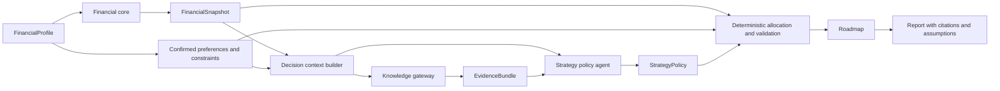

# Finance Coach: MVP 2 RAG-Assisted Adaptive Strategy

## Purpose

MVP 2 adds a governed Retrieval-Augmented Generation (RAG) system so the coach can adapt **which valid strategy to emphasize** based on the user's financial position, goals, constraints, and explicitly confirmed preferences. It builds on MVP 1; it does not replace its deterministic financial core.

**Hard entry condition — MVP 1 must be complete first.** MVP 2 begins only when MVP 1's release gate (`Implementation Plan - MVP 1.md`, Phase 11) is fully green: the end-to-end journey, contracts, Trend/Insight/Risk Engines, structured specialist output, consistency validator, Coach synthesis, golden fixtures, and property-based tests all shipped and passing. Nothing in this document may be built in parallel with MVP 1, and no MVP 2 contract, module, stub, or feature flag may exist in the MVP 1 codebase — every contract defined below (`PreferenceProfile`, `DecisionContext`, `EvidenceQuery`, `EvidenceBundle`, `StrategyPolicy`, `PlanValidation`) is introduced here, not earlier.

**What MVP 1 hands over.** MVP 2 is not starting from a bare deterministic core — it consumes several MVP 1 outputs directly:

* `Finding[]` and `Risk[]` from the Insight/Risk Engine, which `DecisionContext` derives its topics from (rather than re-deriving them from raw metrics).
* `Trend[]`, for explaining *why* a strategy applies with figures that already resolve to a `trend_id`.
* The `SpecialistResult` contract, so a policy-shaped narrative stays machine-checkable.
* The consistency validator, which MVP 2 extends with policy-specific checks rather than replacing.
* `build_roadmap()`'s waterfall and its `allocation` invariant, which a `StrategyPolicy` may re-weight but never violate.

**Why this is a separate increment.** `Review.md` item 25 ranked the strategy-policy layer below deterministic insight generation and validation, because `build_roadmap()` degrades gracefully with no policy at all (its fixed waterfall *is* `baseline_balanced`), while a wrong or contradictory dollar figure does not degrade gracefully. MVP 1 therefore ships a complete, correct product without any of this; MVP 2 makes it adaptive.

## The Important Boundary

RAG improves context and explanation. It does not calculate money.

```text
RAG may decide: "Given high-interest debt, a low emergency buffer, and a user
who asks for simple steps, emphasize the avalanche plan and a starter buffer
before lower-priority goals."

Deterministic code decides: exact monthly surplus, minimum payments, allowable
allocation, payoff timeline, interest totals, emergency-fund gap, and whether
the proposed plan is valid.
```

This resolves the one-size-fits-all limitation without creating an opaque system that can override a user's numbers.

## Why RAG Is Useful

The MVP 1 roadmap uses fixed priorities. A richer strategy needs reusable financial reasoning patterns that an agent can retrieve selectively, including:

* Balancing high-interest debt with a small cash buffer.
* Handling irregular income and variable cash flow.
* Behavioral tradeoffs between snowball and avalanche approaches.
* Sequencing conflicting near-term and long-term goals.
* Making a plan smaller and simpler when a user asks for less complexity.

RAG lets the strategy agent retrieve only the relevant patterns for the current `FinancialSnapshot` and explain why they apply. Use a curated, versioned coaching corpus rather than unrestricted web search.

## MVP 2 User Journey

```text
MVP 1 profile + snapshot + baseline roadmap
  -> ask optional preference and planning-style questions
  -> retrieve relevant coaching evidence
  -> propose a constrained strategy policy
  -> run deterministic allocation and plan validation
  -> show cited rationale, tradeoffs, and a user-approved plan
  -> allow the user to revise preferences or assumptions and rerun
```

The user can skip every preference question. A skipped answer remains `None`; the product uses the baseline MVP 1 strategy rather than guessing.

## Sentiment and Preference Policy

"Sentiment" must mean a user-controlled planning preference, not an unverified psychological diagnosis or a hidden inference from bank transactions.

Allowed signals are explicit answers or an LLM interpretation that the user reviews and confirms:

* `debt_payoff_style`: `lowest_interest`, `quick_wins`, or `no_preference`.
* `planning_style`: `simple_steps`, `detailed_plan`, or `no_preference`.
* `risk_comfort`: `conservative`, `balanced`, or `growth_oriented`.
* `financial_confidence`: `overwhelmed`, `comfortable`, or `no_preference`.
* `goal_tradeoff`: `debt_first`, `goal_first`, `balanced`, or `no_preference`.

The system may ask: "You mentioned feeling overwhelmed by several payments. Would a simpler quick-win plan be easier to follow?" It must not silently store a behavioral label inferred from a statement or chat.

Explicit constraints always win over preferences. A preference for quick wins cannot cause a plan to miss a debt minimum payment or use money reserved for the monthly buffer.

## Architecture



There are two distinct knowledge sources:

1. **User financial facts**: `FinancialProfile` and `FinancialSnapshot`, held in the application and passed to agents as minimal summaries. Do not add raw statements or every transaction to the vector index.
2. **Curated coaching knowledge**: versioned documents on general planning principles and strategy tradeoffs. This is the only source indexed for retrieval in MVP 2.

## New Contracts

MVP 2 reuses all MVP 1 contracts. The following additions belong in `utils/contracts.py` and extend the profile contract to schema version `1.1`.

### `PreferenceProfile`

```python
{
    "schema_version": "1.0",
    "debt_payoff_style": "quick_wins",
    "planning_style": "simple_steps",
    "risk_comfort": "conservative",
    "financial_confidence": "overwhelmed",
    "goal_tradeoff": "balanced",
    "source": "user_confirmed",
}
```

Every preference is optional. Valid `source` values are `user_confirmed` and `user_skipped`. An LLM-generated suggestion must remain unconfirmed until the UI obtains confirmation.

### `DecisionContext`

```python
{
    "schema_version": "1.0",
    "snapshot_summary": {
        "risk_flags": ["LOW_EMERGENCY_FUND"],
        "monthly_surplus": 2400.0,
        "emergency_fund_months": 0.66,
        "high_interest_debt": True,
        "goal_statuses": ["achievable", "shortfall"],
    },
    "constraints": {
        "minimum_monthly_buffer": 300.0,
        "protected_categories": ["Medication"],
    },
    "preferences": "PreferenceProfile",
    "topics": ["emergency_fund", "high_interest_debt", "simple_plan"],
}
```

`DecisionContext` deliberately excludes raw statement text, account numbers, full transaction histories, and values not needed for strategy selection.

### `EvidenceQuery` and `EvidenceBundle`

```python
{
    "schema_version": "1.0",
    "topics": ["high_interest_debt", "emergency_fund"],
    "audience": "individual_consumer",
    "max_results": 4,
    "corpus_version": "2026-07-01",
}
```

```python
{
    "schema_version": "1.0",
    "corpus_version": "2026-07-01",
    "evidence": [
        {
            "evidence_id": "debt-buffer-001",
            "title": "Starter-buffer sequencing",
            "topic": "high_interest_debt",
            "excerpt": "...",
            "source_uri": "knowledge/debt-buffer.md",
            "source_version": "1.0",
            "score": 0.91,
        }
    ],
    "warnings": [],
}
```

An evidence bundle is not a financial calculation and cannot contain a recommendation by itself.

### `StrategyPolicy`

```python
{
    "schema_version": "1.0",
    "strategy": "starter_buffer_then_avalanche",
    "action_order": ["starter_buffer", "avalanche_debt", "high_priority_goals"],
    "allocation_preferences": {
        "starter_buffer_share": 0.50,
        "extra_debt_share": 0.50,
    },
    "rationale": "A small buffer may reduce the need to re-borrow while high-interest debt remains.",
    "evidence_ids": ["debt-buffer-001"],
    "preference_refs": ["financial_confidence", "debt_payoff_style"],
}
```

The strategy agent may select only a predefined `strategy` and permitted allocation keys. It cannot return arbitrary code, formulas, URLs, products, interest rates, or amounts.

### `PlanValidation`

```python
{
    "schema_version": "1.0",
    "valid": True,
    "violations": [],
    "applied_policy": "starter_buffer_then_avalanche",
    "calculation_refs": ["monthly_surplus", "emergency_fund_months"],
}
```

The report displays the applied policy, assumptions, preference references, calculation references, and evidence citations.

## Phase 2 Components

| Component | Responsibility | Hard boundary | Initial implementation |
|---|---|---|---|
| Knowledge corpus | Curated, versioned coaching guidance | No user statements or dynamic web content | `knowledge/*.md` plus manifest metadata |
| Index and retrieval | Indexes chunks and returns relevant evidence | No direct agent database access | Local vector index with metadata filters and lexical fallback |
| Preference capture | Collects optional choices and user confirmation | Does not diagnose or infer private traits | Streamlit form and confirmation control |
| Decision-context builder | Converts snapshot, constraints, and preferences to topics | No raw transaction dump | Pure `utils/decision_context.py` function |
| Strategy policy agent | Selects an allowed policy and cites evidence | Cannot calculate or allocate money | Structured JSON output plus baseline fallback |
| Policy executor | Applies the policy, calculates plan, validates invariants | Rejects invalid allocations | `utils/roadmap.py` and `utils/finance_calc.py` |
| Explanation and report | Renders tradeoffs, citations, assumptions, and plan | Cannot alter calculated results | Extend `utils/reporting.py` |

## Retrieval Design

### Corpus

Start with 15 to 30 short, curated documents. Each document covers one reusable coaching topic, such as debt sequencing, emergency-fund staging, irregular income, goal triage, and behavioral plan adherence.

Every chunk requires metadata:

```text
document_id
title
topic
audience
jurisdiction
source_version
last_reviewed_at
allowed_for_coaching
```

Use stable general educational material first. Do not retrieve current tax rules, rates, regulated product information, or investment recommendations until the production governance path exists.

### Retrieval

1. Derive 2 to 4 topics from `DecisionContext` using deterministic rules.
2. Retrieve at most four chunks with topic and audience filters.
3. Reject chunks missing a source version or marked unavailable for coaching.
4. Pass only the compact evidence bundle, decision context, and allowed strategy list to the agent.
5. Return citations in the roadmap and report.

For the first implementation, an embedding store with a lexical fallback is enough. Do not add unrestricted web search. If embedding infrastructure is not ready, use topic-tag retrieval from the manifest as a deterministic interim implementation; the agent contract remains unchanged.

## Dynamic Strategy Algorithm

The dynamic behavior is a policy-selection layer, not free-form financial reasoning.

```text
FinancialProfile + confirmed assumptions
  -> calculate FinancialSnapshot
  -> derive DecisionContext topics and hard constraints
  -> retrieve EvidenceBundle
  -> choose one StrategyPolicy from an allowlist
  -> validate and allocate with deterministic functions
  -> produce Roadmap, explanation, citations, and tradeoffs
```

Example policy allowlist:

```text
baseline_balanced
starter_buffer_then_avalanche
avalanche_acceleration
snowball_motivation
goal_protection
cashflow_stabilization
```

The deterministic executor must enforce:

* Debt minimum payments are covered before extra allocation.
* Monthly allocations do not exceed surplus after the user's buffer.
* Protected categories are never reduced by a policy.
* A policy cannot add an investment product, assume a return, or claim a current regulatory rule.
* When evidence is unavailable or the agent output is invalid, use `baseline_balanced` and disclose the fallback.

## Agent Use

The existing specialist agents remain useful, but their role changes:

* Spending agent: explain trends and identify expense categories relevant to the selected policy.
* Debt agent: explain the validated payoff comparison and selected avalanche/snowball tradeoff.
* Savings agent: explain the buffer target and policy allocation.
* Budget agent: identify practical changes consistent with protected categories.
* Goal agent: explain deferred, protected, or funded goals.
* New strategy policy agent: return only `StrategyPolicy` JSON against an explicit schema.

No agent calls the vector store directly. A single `KnowledgeGateway.retrieve(query)` function owns retrieval, filtering, source versions, and result limits.

## Evaluation and Safety Gates

### Deterministic tests

* A policy never changes core metric calculations.
* Invalid policy allocation shares are rejected.
* Missing evidence triggers the baseline strategy, not a fabricated citation.
* An unconfirmed preference has no effect on the plan.
* Constraints and minimum payments override all preferences.
* The report's cited evidence IDs resolve in the retrieved bundle.

### Retrieval tests

Build a small fixture set mapping representative profiles to expected topics and allowed source documents. Measure:

* Topic-selection accuracy.
* Relevant evidence in the top four results.
* Citation resolution rate.
* Retrieval result count and prompt size.
* Fallback behavior during unavailable index or model calls.

### Review checklist

Review every new policy with scenarios for high-interest debt, no emergency savings, irregular income, conflicting goals, negative cash flow, and a user who prefers simplicity. The strategy is acceptable only when the deterministic plan remains valid and the explanation identifies tradeoffs.

## MVP 2 Delivery Order

**Entry gate (verify before step 1):** MVP 1 Phase 11 is green. Confirm specifically that `Finding[]`/`Risk[]`/`Trend[]`, the `SpecialistResult` contract, `validate_consistency()`, and the golden-fixture suite all exist and pass — `derive_decision_context()` reads `Risk[]` objects that do not exist without them, and every step below assumes the allocation invariant is already test-protected.

Like MVP 1, this is gated and sequential: finish and verify each step before starting the next.

1. Freeze the new contracts (`PreferenceProfile`, `DecisionContext`, `EvidenceQuery`, `EvidenceBundle`, `StrategyPolicy`, `PlanValidation`) and the strategy allowlist in `utils/contracts.py`. Add fixtures for each.
2. Create the curated corpus (15-30 short documents) and manifest with full source metadata: `document_id`, `title`, `topic`, `audience`, `jurisdiction`, `source_version`, `last_reviewed_at`, `allowed_for_coaching`.
3. Implement deterministic `derive_decision_context(snapshot, findings, risks, preferences) -> DecisionContext`, deriving 2-4 topics from MVP 1's `Risk[]`/`Finding[]` objects and confirmed preferences. No LLM call.
4. Implement `KnowledgeGateway.retrieve(query) -> EvidenceBundle` with metadata-filtered embedding retrieval and a deterministic topic-tag lexical fallback. No agent accesses the vector store directly.
5. Implement `select_strategy_policy(context, evidence) -> StrategyPolicy` — structured JSON output constrained to the allowlist, falling back to `baseline_balanced` on invalid output, model unavailability, or an empty evidence bundle.
6. Implement `validate_policy(policy, profile, snapshot) -> PlanValidation` and extend `build_roadmap()` to accept an optional `policy`, applying its `action_order`/`allocation_preferences` **inside** the existing hard constraints. Reject and fall back if the policy would breach a debt minimum, the buffer, a protected category, or the `sum(distributed allocation) <= allocatable_surplus` invariant.
7. Extend `validate_consistency()` with policy-specific checks: the applied policy's `evidence_ids` all resolve; no `SpecialistResult` cites an evidence ID absent from the retrieved bundle; a fallback policy is disclosed rather than silently substituted.
8. Wire the graph: `decision_context -> evidence -> strategy_policy -> validate_policy -> build_roadmap(policy)` in front of the existing `build_roadmap()` node, **before** the specialist tier. This does not reorder MVP 1's stages — Debt/Savings/Goal still read `roadmap.allocation` exactly as before.
9. Add the preference-capture UI (Streamlit form plus explicit confirmation control) so `PreferenceProfile` fields can hold `user_confirmed` values rather than always `no_preference`. Extend citations and policy display in the report.
10. Add the retrieval-quality eval suite (topic-selection accuracy, relevant-evidence-in-top-4 rate, citation resolution rate, prompt size, fallback behavior) before enabling embedding retrieval in place of the topic-tag path.
11. Re-run MVP 1's golden fixtures. With every preference left at `no_preference`, the roadmap must be **byte-identical** to MVP 1's frozen expected output — proof that the strategy layer is additive and changes nothing by default.

## Not in MVP 2

* Live web search, current tax/rate data, trading, lending, or product selection.
* Retrieval over raw statements, full chat histories, or other users' data.
* Autonomous plan changes without user-visible assumptions and citations.
* LLM-as-judge of financial calculations.
* Persistent identity, consent, and audit storage; those are prerequisites for handling real data at production scale and are defined in the later plan.

The MVP 2 product story is: **the coach uses a small, cited knowledge base and user-confirmed planning preferences to choose among validated strategies, while deterministic code continues to own every financial number and constraint.**
