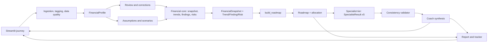

# Finance Coach: MVP 1 Architecture and Delivery Plan

This is the MVP 1 plan. **MVP 1 is a standalone, independently shippable product** — it contains no MVP 2 work, no MVP 2 contracts, and no MVP 2 stubs or feature flags. It incorporates `Review.md`'s structural review (see **Review Triage** at the end for the full prioritized list): a deterministic Insight/Trend/Risk Engine, a Finding/Risk/Action contract family with traceable IDs, structured specialist output, a consistency validator, and a lightweight Coach synthesis step. The later phases are deliberately separate and begin only after MVP 1's release gate is fully green:

* [MVP 2: RAG-assisted adaptive strategy](Architecture%20Plan%20-%20MVP%202.md) — the strategy-policy layer, curated knowledge corpus, embedding retrieval, and preference-capture UI.
* [Later: production architecture](Architecture%20Plan%20-%20Later.md)

Known gaps and their fixes are tracked in [gaps.md](gaps.md).

## Decision

Build MVP 1 as a **modular Python monolith inside the existing Streamlit application**. The current implementation already has a useful shape: CSV/PDF ingestion, deterministic financial calculations, specialist narratives, and a single Streamlit composition layer. MVP 1 should strengthen those boundaries instead of replacing the app with Next.js, microservices, Clerk, PostgreSQL, RAG, MCP servers, or web search. LangGraph is adopted, but narrowly: as an in-process orchestration layer over the existing specialist agents, not as a persistence or workflow-interrupt system.

`Review.md`'s core finding is that the plan's specialist agents and roadmap risked disagreeing with each other and with the underlying numbers — findings would be silently re-derived per agent, dollar amounts could drift between tabs, and a flat risk-flag list made a critical cashflow problem look equal to a long-term optimization tip. The fix is a deterministic **Insight/Trend/Risk Engine** that computes findings and trends *once*, **structured specialist output** so every narrative carries machine-checkable references instead of free prose, a **consistency validator** that checks every downstream claim against those structures before display, and a lightweight **Coach synthesis** step that produces one prioritized summary instead of concatenating agent output. All of these are deterministic; the LLM only explains what they already decided.

The MVP must make this demonstrable end-to-end journey reliable:

```text
Upload CSV/PDF or enter a short questionnaire
  -> normalize transactions, flag data-quality issues
  -> review unknown/uncertain categories
  -> enter or confirm income, debts, savings, goals, and constraints
  -> calculate a financial-health snapshot, trends, findings, and risks
  -> generate a prioritized, validated roadmap
  -> adjust assumptions and rerun
  -> download a report and monthly tracker
```

The application provides educational financial planning, not investment, tax, legal, or regulated financial advice. It must never invent account values, rates, or user constraints.

## Critical Review

### What the current code already supports

* `agents/data_agent.py` parses CSV and a narrow text-PDF pattern into `date`, `description`, and `amount`.
* `utils/finance_calc.py` owns deterministic categorization, cash-flow aggregation, budget math, goal feasibility, savings projection, and avalanche/snowball payoff simulation.
* `agents/orchestrator.py` enriches a shared context and invokes five specialist agents.
* `app.py` provides one working UI for uploads, manual income/savings/debt/goal entry, charts, analysis, and chat.
* Every narrative has an offline fallback, which is appropriate for a prototype.

### Gaps that affect the MVP

* Categorization silently maps unmatched entries to `Other`; the user cannot correct them before analysis.
* Income is entered manually and is not reconciled with transaction history.
* Financial results are separate agent outputs; there is no single health snapshot or ordered action plan.
* Key assumptions are hidden in code: 50/30/20 budget ratios, a 4% savings return, 50% of surplus to savings, and 30% of surplus as extra debt payment. **This is the specific bug the Multi-Agent Orchestration and Surplus/Allocation Semantics sections below fix — see the ⚠️ callout.**
* There is no report or tracker download.
* The PDF parser is useful only for a very specific transaction-line format. Mutual-fund/SIP/loan extraction is not an MVP promise.
* Specialist agents each independently re-derive patterns from raw transactions (e.g. "dining is up") with no shared, deterministic record of that finding — two agents can describe the same pattern differently, or one can miss it.
* Specialist agents return only free-text narratives, so nothing downstream can mechanically verify what they claimed.
* Risk flags are a flat list with no severity/urgency ordering, so a critical cashflow problem and a long-term retirement optimization read as equally important.

### Corrections to the diagram and broad architecture proposal

* Treat spend analysis, debt simulation, budget math, health metrics, trend/insight/risk derivation, allocation, and report rendering as deterministic functions, not agents. LangGraph orchestrates only the specialist narrative agents and the coach-synthesis step; it never recalculates or overrides a value the deterministic core already produced.
* Replace multiple component-owned `State` bubbles with one `FinancialProfile` contract and immutable results returned by each component.
* Remove runtime multi-model judging. A second model must not validate money calculations. The consistency validator is deterministic Python operating on structured fields — never an LLM judge.
* Keep web search, MCP, OAuth, persistent workflow checkpoints, and database storage out of this sprint. LangGraph is in scope only as a synchronous, in-memory graph, compiled and invoked without a checkpointer, holding no state across Streamlit reruns. **Deviation, 2026-07-19 (recorded, not silently applied):** OAuth/sign-in specifically was pivoted forward post-MVP-1 as a deliberate, user-directed decision — see `Implementation Plan - MVP 1.md`'s Post-Release Maintenance Log and `utils/auth.py`. Persistent workflow checkpoints and database storage remain out of scope; nothing here changed the graph's in-memory, no-checkpointer design.
* Keep RAG, the strategy-policy layer, and preference capture entirely in MVP 2. They must not appear in the MVP 1 codebase in any form.
* Keep evaluation as tests and demo fixtures, not a node that blocks a user workflow. The consistency validator is the one exception: it runs inside the graph, deterministically, with no LLM call, and its job is specifically to block a broken narrative from reaching the user — that is validation, not evaluation.
* Do not claim mutual-fund, SIP, loan-statement, image, login, prior-report, or external-data support until the related parser, data model, and storage exist.
* Do not hardcode US-specific product or regulatory terms (401(k), Roth IRA, contribution limits) or assume USD — see Guardrails below.

### Multi-Agent Orchestration (LangGraph)

`agents/orchestrator.py` already fans out to five specialist agents (spending, debt, savings, budget, goals) and, for chat, selects a relevant subset. MVP 1 keeps this shape but re-implements it as an explicit LangGraph graph, so the multi-agent story is demonstrable without the specialists producing independent, contradictory narratives.

> **⚠️ Corrected ordering — this fixes a real double-allocation bug, not a style preference.** An earlier draft ran the specialist nodes *before* roadmap allocation, which is backwards for Debt, Savings, and Goal. Today, `agents/orchestrator.py:34` hands Debt a hardcoded 30% of surplus (`extra_debt_payment = monthly_surplus * 0.3`); `agents/savings_agent.py:22` separately recomputes cash flow and claims a hardcoded 50% (`contribution = surplus * 0.5`); and `agents/goal_agent.py:16-20` treats the *entire* `monthly_surplus` as available to *each* goal on top of both. None of the three knows about the others' claim on the same dollars, and nothing checks that their combined claims stay under 100%. Example: income $6,200, expenses $3,800 → surplus $2,400. Debt recommends $720/month extra, Savings independently recommends $1,200/month, and every goal independently treats the full $2,400 as free — a user following all three narratives literally over-commits. The fix is architectural: `build_roadmap()` runs *first*, as a single deterministic waterfall allocator, and Debt/Savings/Goal narrate the dollar figure the waterfall already assigned them.

The full graph runs in four stages:

```text
Stage 0 (pre-graph, in the ingestion/questionnaire flow):
  validate_profile()                     -- Component 1
  normalize + tag transactions           -- Component 2
  detect_data_quality_issues()           -- Component 2

Stage 1 (deterministic core, no LLM, sequential):
  calculate_financial_snapshot()         -- Component 3
  -> compute_trends()                    -- Component 3 (Trend Engine)
  -> derive_findings()                   -- Component 3 (Insight Engine), reads trends + data-quality flags
  -> derive_risks()                      -- Component 3 (Risk Engine), reads findings

Stage 2 (parallel, from Stage 1's output):
  spending node
  build_roadmap(profile, snapshot, findings, risks)
        (the ONE allocation decision; writes `roadmap_result`, carrying an `allocation`
         breakdown plus action_id/finding_refs/risk_refs on every action)

Stage 3 (after Stage 2 — every node returns a structured SpecialistResult):
  budget  node  <- reads spending_result
  savings node  <- reads spending_result AND roadmap_result.allocation["savings_contribution"]
  debt    node  <- reads roadmap_result.allocation["debt_extra_payment"]
  goal    node  <- reads roadmap_result.allocation["goal_contributions"] (per goal, not raw surplus)

Stage 4 (after Stage 3):
  validate_consistency()   <- checks every SpecialistResult against roadmap.allocation,
                              findings, risks, trends, and snapshot metrics
        -> on failure: deterministic fallback narrative built from structured objects
  -> synthesize_coach_summary()  -> CoachSummary
        -> Roadmap + CoachSummary (final, narrated, validated)
```

Rules:

* Each specialist node calls the existing agent's `run()` method, refactored to accept the upstream value(s) it depends on and to return a structured `SpecialistResult` **in addition to** its free-text narrative. Concretely: `DebtAnalyzerAgent` takes its extra-payment figure from `roadmap_result`, not `context["extra_debt_payment"]`; `SavingsStrategyAgent` takes its contribution from `roadmap_result` instead of computing `surplus * 0.5`; `GoalPlannerAgent` takes each goal's allocated contribution from `roadmap_result` instead of treating raw `monthly_surplus` as available per goal; `savings`/`budget` take `spending`'s `by_category`/`monthly_cashflow` instead of recomputing it. No node ever produces a new number.
* `build_roadmap()` is the single deterministic waterfall that decides the *only* authoritative split of surplus across buffer, debt extra payment, goal contributions, and savings. Its distributed `allocation` values must sum to no more than `allocatable_surplus`.
* The graph is compiled and invoked synchronously within a single Streamlit rerun. No `checkpointer`, no `interrupt`, no state surviving past that invocation.
* Graph state is a single typed schema built from the contracts below (`FinancialProfile`, `FinancialSnapshot` as read-only inputs; each node writes its own result key — `trend_result`, `insight_result`, `spending_result`, `roadmap_result`, `debt_result`, `savings_result`, `budget_result`, `goal_result`, `validation_result`, `coach_summary`).
* Chat routing (`route_chat`) reuses the same specialist nodes rather than a second orchestration path; if a matched route includes `debt`, `savings`, `budget`, or `goal`, the graph still runs Stages 1-2 first to supply the dependency.
* Add `langgraph` to `requirements.txt`. No other new runtime dependency.

### Insight, Trend, and Risk Engines (`Review.md` items 1, 6, 7)

A deterministic layer sits between `FinancialSnapshot` and `build_roadmap()` so specialists narrate shared, structured facts instead of each re-deriving the same pattern or inventing a plausible-sounding one.

**Trend Engine** (`compute_trends()`). MVP 1 scope — 6 of `Review.md`'s 11 suggested trend types, chosen because they are cheap given existing `finance_calc.py` functions and directly feed the Insight/Risk Engine: monthly income, monthly expenses, monthly surplus, category spending, debt balances, savings balances (including `emergency_fund_months` as a runway trend). Deferred: spending volatility, recurring-expense detection, spending velocity, burn rate as a standalone metric.

**Insight Engine** (`derive_findings()`). MVP 1 scope — 8 finding types: income changes, expense changes, category trends, cashflow deterioration/improvement, debt risks, emergency-fund risks, goal feasibility issues, and data-quality problems (read from `snapshot.data_quality_flags`). Deferred: unusual-spending detection and spending-substitution inference (e.g. "dining may be replacing groceries") — these need a behavioral-inference layer with its own confidence methodology, exactly the kind of hypothesis `Review.md` item 3 says must never be presented as fact. MVP 1 does not fabricate this inference. A basic positive-behavior finding (e.g. debt balance trending down) is cheap and included.

**Risk Engine** (`derive_risks()`). MVP 1 scope — 6 of 11 risk types: negative cashflow, insufficient emergency fund, high-interest debt, high debt-service burden, overspending vs. budget, goal failure. Deferred: income concentration, income volatility, recurring-expense concentration, cash-runway as a distinct risk (folded into emergency-fund risk).

Rules:

* All three engines are pure functions. No LLM call anywhere in this layer.
* Every `Finding` and `Risk` carries `severity` (`critical`/`high`/`medium`/`low`/`positive`), `urgency` (`immediate`/`this_month`/`next_90_days`/`long_term`), a `confidence` score, and a `fact_or_inference` tag (`fact` or `deterministic_inference` for MVP 1 — MVP 1 does not generate LLM `hypothesis`-tagged findings).
* Confidence is calculated by a defined rule, never invented. A fact-based finding gets `confidence: 1.0`; a deterministic inference gets a confidence derived from a fixed formula documented in code — never a free-floating LLM-guessed number.
* `build_roadmap()` and every `SpecialistResult` reference `finding_refs`/`risk_refs`/`trend_refs`/`metric_refs` by ID; nothing invents a finding in prose that doesn't resolve to one of these IDs.
* These engines compute their metrics exactly once per graph invocation; specialists and reports consume the stored results and never recompute a percentage change or risk classification (`Review.md` item 15).

### Data Quality Detection (`Review.md` item 22, minimal form)

`derive_findings()` emits a `data_quality` finding type, which requires an upstream producer. Component 2 therefore runs `detect_data_quality_issues()` during ingestion, flagging: exact duplicate rows (same date + description + amount), missing months inside the date range, a partial trailing month, fewer than two complete months of history, and zero income transactions. Results land on `FinancialSnapshot.data_quality_flags`.

This is deliberately a handful of DataFrame checks, **not** the full anomaly engine (implausible dates, invalid currencies, inconsistent signs, refund reconciliation) which stays in the Production tier. It exists because a Critical-tier finding type cannot depend on a Production-tier engine. The Coach Summary's Assumptions and Data Limitations section surfaces these flags, so limited confidence is disclosed rather than silently ignored.

### Consistency Validator (`Review.md` item 10)

Runs once, deterministically, after the specialist tier (Stage 4), before anything reaches the UI or report. It operates primarily on **structured `SpecialistResult` fields** — validating free-flowing LLM prose is not deterministically possible, which is why structured specialist output (`Review.md` item 14) is a prerequisite, not an optional nicety.

**Structured checks (authoritative, fully deterministic):**

1. Every `recommends_action_ids` entry exists in `roadmap.actions`.
2. The order of `recommends_action_ids` is consistent with those actions' `priority` values.
3. Each `allocated_amount` exactly equals the corresponding `roadmap.allocation` entry.
4. If `allocation[x] == 0`, no specialist reports `allocated_amount > 0` for `x`, and no `recommends_action_ids` entry maps to an action allocating `x`. (This is how the negative-cashflow rule is enforced.)
5. Every `finding_refs`/`trend_refs`/`risk_refs` entry resolves against this invocation's objects.
6. No action's `monthly_amount` exceeds `allocatable_surplus`.

**Prose checks (secondary safety net, best-effort by design):**

7. Every `$` amount in a narrative appears in an allowlist derived from `roadmap.allocation` + `snapshot.metrics`.
8. Every `%` in a narrative resolves to a `Trend.percent_change` or a snapshot metric.
9. No narrative quotes an income/expense/surplus value absent from `snapshot.metrics`.

Checks 7-9 will not catch a figure spelled "twelve hundred"; they are defense in depth. Checks 1-6 are the guarantee.

On failure the graph does not surface the offending narrative. It falls back to a deterministic narrative built directly from `roadmap.actions`/`allocation`/findings (the same style as each specialist's existing offline fallback) and sets `ValidationResult.fallback_used`, so the substitution is visible in tests and disclosed in the UI rather than hidden.

### Coach Synthesis (`Review.md` items 11-12, scoped down)

A lightweight top-level synthesis step, not a new subsystem. It does not calculate or allocate money — it consumes `FinancialSnapshot`, trends, findings, risks, `Roadmap`, and the validated `SpecialistResult`s, and produces one `CoachSummary` with a fixed section order: Overall Financial Health, What Changed, Critical Risks, Important Patterns, Positive Changes, Your Priorities (max 3), Actions This Week / This Month / Next 90 Days / Long-Term, Assumptions and Data Limitations. Action bucketing is driven by each action's `urgency`. It replaces "concatenate five agent outputs" with "pick the 3 most important actions and say why."

MVP 1 does **not** build the fuller trade-off-suppression logic `Review.md` describes ("suppress irrelevant long-term advice during a short-term crisis" beyond ranking urgency first) — that is Important-tier, not a blocker.

### Surplus and Allocation Semantics (`Review.md` items 16-18)

`Review.md` correctly identifies that "surplus" was ambiguous — is a debt minimum already inside "expenses"? Is the buffer deducted once or twice? This is now the single formula every component uses:

```text
gross_surplus        = confirmed monthly_income - average_monthly_expenses
required_commitments = debt minimum payments not already counted inside average_monthly_expenses
minimum_buffer       = FinancialProfile.constraints.minimum_monthly_buffer (user-configured, protected)
allocatable_surplus  = max(0, gross_surplus - required_commitments - minimum_buffer)
roadmap.allocation   = amounts distributed from allocatable_surplus (never more)
```

`FinancialSnapshot.metrics.monthly_surplus` **is** `gross_surplus` (kept as an alias for backward compatibility); `allocatable_surplus` is a separate field so nothing confuses the two. Debt minimums already counted inside `average_monthly_expenses` (via the existing `Debt Payment` category in `NEEDS_CATS`) must not be subtracted a second time as `required_commitments` — that field covers only minimums *not* yet reflected in transaction history (e.g. a newly-added debt with no payment history). This distinction is unit-tested explicitly, not left implicit.

**`buffer_reserved` (`Review.md` item 17):** it is money that must remain available and is **not** distributed to any action — a planning constraint shown in the allocation breakdown for transparency, not a monthly transfer. It is excluded from any "total money in motion" the report sums, and excluded from the "does allocation exceed surplus" check, since it is already subtracted out via `allocatable_surplus` before the waterfall begins. The report labels it distinctly from `debt_extra_payment`/`goal_contributions`/`savings_contribution`, which *are* monthly transfers.

**Negative cashflow (`Review.md` item 18):** when `gross_surplus <= 0`, the formula forces `allocatable_surplus` to `0` — `debt_extra_payment`, `savings_contribution`, and every `goal_contributions` entry must be `0`. `build_roadmap()` then produces a cashflow-recovery roadmap focused on expense reduction, income recovery, and protecting debt minimums, and no specialist may produce a positive extra-payment or investment amount. This is true by construction in `build_roadmap()` and enforced by consistency-validator check 4 — not left to specialist good behavior.

### Guardrails: Currency, Locale, and Regulated Advice (`Review.md` items 23-24)

* No component may hardcode a country-specific product or rule (401(k), Roth IRA, US contribution limits, "high-yield savings account" as if universally available). `PlanningAssumptions.currency` exists as a field; MVP 1 does not yet support multiple currencies end-to-end, but no code path may assume USD implicitly where the profile's `currency` should be read.
* The product stays within financial education, budgeting guidance, debt-paydown modeling, and generic savings guidance. It must not recommend specific investment products, tax treatment, or jurisdiction-specific contribution limits unless a jurisdiction and an approved, current rules source are explicitly configured — out of scope for MVP 1, so these recommendations simply do not appear.
* This is a guardrail against future drift, not a fix to an existing violation — no current specialist agent mentions a specific investment product or jurisdiction-specific rule. Keep it that way.

## Scope Boundary

### Must ship in the MVP

* CSV and existing PDF transaction ingestion, with transaction-type tagging and data-quality flags.
* A basic questionnaire path for users without a statement.
* Category review for transactions that are `Other` or have low confidence.
* Manual debt, savings, goal, and constraint capture.
* A deterministic financial-health snapshot including the `gross_surplus`/`allocatable_surplus` distinction.
* A deterministic Trend Engine and Insight/Risk Engine producing `Finding`/`Risk` objects with `severity`, `urgency`, `confidence`, and `fact_or_inference`.
* A deterministic prioritized roadmap that is the **single** source of debt-extra-payment, savings-contribution, and per-goal-contribution figures — fixing the bug where Debt (30%), Savings (50%), and each Goal (100%) independently claimed overlapping shares of the same money.
* Structured `SpecialistResult` output from every specialist agent.
* A deterministic consistency validator that blocks any narrative contradicting the roadmap, findings, or snapshot before it reaches the UI.
* A lightweight Coach synthesis step producing one prioritized `CoachSummary`.
* User-adjustable assumptions and a rerun path.
* Downloadable Markdown/HTML-style report text and a monthly tracker CSV.
* Tests: calculation invariants, contract validation, every consistency-validator check, property-based allocation/payoff invariants, and a three-scenario golden-fixture regression set.

### Explicitly deferred to MVP 2

* The strategy-policy layer in every form: `PreferenceProfile`, `DecisionContext`, `EvidenceQuery`/`EvidenceBundle`, `StrategyPolicy`, `PlanValidation`, the policy allowlist, the evidence manifest, and preference capture. **None of these contracts or modules may exist in the MVP 1 codebase.**
* Curated knowledge corpus, embedding retrieval, and retrieval-quality evals.

### Explicitly deferred to later phases

* OCR, image uploads, institution-specific PDF extraction, mutual-fund/CAS/SIP parsing, and automatic loan extraction.
* ~~Authentication~~, multi-user storage, case history, cloud object storage, and databases. **Deviation, 2026-07-19:** sign-in itself (Logto via Streamlit's native `st.login()`) was pivoted forward as a deliberate, user-directed decision — see the Post-Release Maintenance Log in `Implementation Plan - MVP 1.md`. Multi-user *storage* (a database persisting per-user case data) remains genuinely deferred: signing in identifies who is using the app for the session; it does not yet unlock any new persistence.
* Live market data, tax/regulatory guidance, web search, and MCP integrations.
* Full richness of the Insight/Trend/Risk Engines (unusual-spending inference, spending-substitution hypotheses, volatility, recurring-transaction detection, income concentration/volatility).
* The full generic action-dependency/blocking-condition system (`depends_on`/`blocked_by`/`activation_condition`/`completion_condition` as free-form fields) — MVP 1 ships only the specific negative-cashflow case, enforced by the validator.
* The full anomaly/data-quality engine beyond the five cheap checks above, and full period reconciliation.
* Jurisdiction-specific regulated-advice rules.
* LangGraph interrupt persistence and background job queues.
* Product recommendations, portfolio allocation advice, and runtime LLM-as-judge.

## Canonical Contracts

All components communicate through plain Python dictionaries. They must be defined once in `utils/contracts.py` using `TypedDict` or dataclasses, and documented here before implementation. Each producer returns a new value; no component mutates a profile it did not create.

### Contract rules

1. All monetary values are positive `float` values in the selected `currency`; direction is represented by the signed `amount`.
2. Dates use ISO `YYYY-MM-DD` strings at component boundaries.
3. Unknown facts are `None`; never use zero as a substitute for missing data.
4. Each output contains `schema_version: "1.0"`.
5. All numeric recommendations identify their calculation source through a metric key or result key.
6. Narratives may explain values but must not create new values.
7. The UI is the only writer to Streamlit `session_state`; domain components remain pure.
8. Every `Finding`, `Risk`, `SpecialistResult`, and `Roadmap` action carries a stable ID and references the metric/finding/risk IDs that justify it — nothing is asserted without a resolvable reference (`Review.md` items 8, 13).
9. Deterministic Python owns every calculation, trend, finding, risk, allocation, validation, and reported number. The LLM owns only explanation and tone (`Review.md` item 29).

### `Transaction`

```python
{
    "date": "2026-07-18",
    "description": "Whole Foods",
    "amount": -83.42,
    "category": "Groceries",
    "category_confidence": 1.0,
    "needs_review": False,
    "transaction_type": "expense",
}
```

`amount > 0` is money in; `amount < 0` is money out. `category_confidence` is in $[0, 1]$; keyword matches use `1.0`, an unmatched negative transaction uses `0.0` and `needs_review=True`. `transaction_type` is one of `income`, `expense`, `debt_payment`, `transfer`, `savings_transfer`, `refund`, `unknown` — derived cheaply from the existing category rather than a dedicated classifier, so `spending_by_category`/`actual_budget_split` can exclude non-expense transfers.

### `Debt`

```python
{"name": "Credit Card", "balance": 4200.0, "apr": 22.9, "min_payment": 120.0}
```

Required fields are positive except `apr`, which may be `0.0`. An incomplete debt is not passed to payoff simulation; it becomes a validation issue for the UI.

### `Goal`

```python
{"name": "Emergency fund boost", "amount": 3000.0, "months": 6, "current": 500.0, "priority": "high"}
```

`priority` is `high`, `medium`, or `low`. Goals are optional.

### `PlanningAssumptions`

```python
{
    "currency": "USD",
    "needs_ratio": 0.50,
    "wants_ratio": 0.30,
    "savings_ratio": 0.20,
    "savings_apy": 0.04,
    "emergency_fund_months": 3,
}
```

All ratios are in $[0, 1]$; the three budget ratios must total $1.0$ within a small tolerance. The UI may offer presets but must display active values.

Note the old `savings_surplus_ratio` and `extra_debt_surplus_ratio` fields are **removed**, not retained. They were the mechanism by which Savings and Debt each independently claimed a share of surplus; keeping them invites the double-allocation bug to return. `build_roadmap()`'s waterfall is the sole allocator.

### `FinancialProfile`

```python
{
    "schema_version": "1.0",
    "transactions": [Transaction],
    "monthly_income": 6200.0,
    "current_savings": 2500.0,
    "debts": [Debt],
    "goals": [Goal],
    "constraints": {"minimum_monthly_buffer": 0.0, "protected_categories": []},
    "assumptions": PlanningAssumptions,
}
```

`monthly_income` is user-confirmed. Transaction-derived income is displayed as a comparison only; the UI flags a meaningful mismatch instead of overwriting the user value.

### `ReviewItem`

```python
{
    "transaction_index": 12,
    "description": "ACME PAYMENTS",
    "amount": -45.0,
    "suggested_category": "Other",
    "reason": "No matching category keyword",
}
```

### `FinancialSnapshot`

```python
{
    "schema_version": "1.0",
    "metrics": {
        "average_monthly_expenses": 3800.0,
        "monthly_surplus": 2400.0,
        "gross_surplus": 2400.0,
        "allocatable_surplus": 2100.0,
        "required_commitments": 0.0,
        "savings_rate_percent": 38.7,
        "debt_to_income_percent": 12.3,
        "emergency_fund_months": 0.66,
        "total_debt": 32500.0,
        "period": "2026-07",
        "is_partial_period": False,
    },
    "health_score": 72,
    "health_band": "Building",
    "risk_flags": [{"code": "LOW_EMERGENCY_FUND", "severity": "high", "metric": "emergency_fund_months"}],
    "data_quality_flags": [
        {"code": "DUPLICATE_TRANSACTIONS", "detail": "3 exact duplicate rows", "affects": ["average_monthly_expenses"]}
    ],
    "debt_comparison": {"avalanche": {}, "snowball": {}},
    "goal_results": [],
    "validation_issues": [],
}
```

Score inputs and weights must be visible in code and report output. A score is a coaching indicator, not a credit score. `monthly_surplus` is an alias of `gross_surplus`; new code reads `gross_surplus`/`allocatable_surplus` explicitly. `risk_flags` is a backward-compatible projection of `Risk[]`, never an independent source. `data_quality_flags` is produced by `detect_data_quality_issues()` and consumed by `derive_findings()`.

### `Trend`

```python
{
    "trend_id": "TREND_DINING_3M",
    "metric": "dining_spend",
    "period": "3_months",
    "start_value": 187.00,
    "end_value": 364.60,
    "absolute_change": 177.60,
    "percent_change": 94.97,
    "direction": "increasing",
    "classification": "sharp_increase",
}
```

All percentages quoted anywhere in a narrative or report must trace back to a `Trend` by `trend_id` — nothing computes its own percent-change.

### `Finding`

```python
{
    "finding_id": "FINDING_INCOME_DROP",
    "type": "income_trend",
    "title": "Income declined sharply",
    "severity": "critical",
    "urgency": "immediate",
    "confidence": 1.0,
    "fact_or_inference": "fact",
    "metric_refs": ["monthly_income_trend", "monthly_surplus"],
    "trend_refs": ["TREND_INCOME_3M"],
    "impact": "Current spending is no longer supported by income.",
    "recommended_response": "Stabilize cashflow before accelerating debt or savings.",
}
```

`fact_or_inference` is `fact` or `deterministic_inference` in MVP 1 (`hypothesis` is reserved for MVP 2+). `severity` ∈ `critical`/`high`/`medium`/`low`/`positive`; `urgency` ∈ `immediate`/`this_month`/`next_90_days`/`long_term`.

### `Risk`

```python
{
    "risk_id": "RISK_NEGATIVE_CASHFLOW",
    "category": "cashflow",
    "severity": "critical",
    "urgency": "immediate",
    "likelihood": "high",
    "impact": "Savings will decline if the pattern continues.",
    "metric_refs": ["monthly_surplus", "emergency_fund_months"],
    "finding_refs": ["FINDING_INCOME_DROP"],
    "mitigation_refs": ["ACTION_STABILIZE_CASHFLOW"],
}
```

### `SpecialistResult`

```python
{
    "schema_version": "1.0",
    "agent": "Debt Analyzer",
    "narrative": "...",
    "allocated_amount": 720.0,
    "why_allocated": "ACTION_ACCELERATE_DEBT",
    "expected_effect": "...",
    "tradeoffs": "...",
    "what_to_monitor": "...",
    "finding_refs": ["FINDING_HIGH_APR_DEBT"],
    "trend_refs": ["TREND_DEBT_BALANCE_3M"],
    "recommends_action_ids": ["ACTION_ACCELERATE_DEBT"],
    "supporting_tables": {},
    "live": True,
}
```

Returned by all five specialist agents. `allocated_amount` is **always copied from `roadmap.allocation`, never computed** — it is `None` for Spending and Budget, which do not allocate money. `narrative` is free text for display only; every machine-checkable claim lives in the structured fields. This contract is what makes the consistency validator's authoritative checks possible (`Review.md` item 14).

### `Roadmap`

```python
{
    "schema_version": "1.0",
    "actions": [
        {
            "action_id": "ACTION_STABILIZE_CASHFLOW",
            "priority": 1,
            "severity": "critical",
            "urgency": "immediate",
            "timeframe": "This month",
            "title": "Build a starter emergency buffer",
            "rationale": "Emergency coverage is below the chosen target.",
            "monthly_amount": 1200.0,
            "metric_refs": ["emergency_fund_months"],
            "finding_refs": ["FINDING_INCOME_DROP"],
            "risk_refs": ["RISK_NEGATIVE_CASHFLOW"],
        }
    ],
    "allocation": {
        "buffer_reserved": 300.0,
        "debt_extra_payment": 720.0,
        "goal_contributions": {"Emergency fund boost": 480.0},
        "savings_contribution": 900.0,
    },
    "narrative": "...",
    "assumptions_used": PlanningAssumptions,
}
```

Action ordering is deterministic: cover required debt minimums, address high-interest debt and a starter emergency buffer, fund high-priority achievable goals, then discretionary savings/investing. The narrative may rephrase the list but not reorder it.

`allocation` is the single authoritative breakdown of `allocatable_surplus`; its distributive values (`debt_extra_payment` + all `goal_contributions` + `savings_contribution`) must sum to no more than `allocatable_surplus`. `buffer_reserved` is a planning constraint, not a distributed amount. This is what `DebtAnalyzerAgent`, `SavingsStrategyAgent`, and `GoalPlannerAgent` read for their dollar figures. Every `action_id` is stable across roadmap, specialist tabs, report, chat, and tracker (`Review.md` item 8).

### `ValidationResult`

```python
{
    "schema_version": "1.0",
    "valid": True,
    "violations": [],
    "checked_agents": ["spending", "debt", "savings", "budget", "goal"],
    "fallback_used": False,
}
```

If `valid` is `False`, affected narratives are replaced with a deterministic fallback and `fallback_used` becomes `True` — disclosed in the UI, not hidden.

### `CoachSummary`

```python
{
    "schema_version": "1.0",
    "overall_health": "Building, with one critical near-term risk.",
    "what_changed": ["TREND_INCOME_3M", "TREND_DINING_3M"],
    "critical_risks": ["RISK_NEGATIVE_CASHFLOW"],
    "important_patterns": ["FINDING_DINING_INCREASE"],
    "positive_changes": [],
    "top_priorities": ["ACTION_STABILIZE_CASHFLOW"],
    "actions_this_week": [],
    "actions_this_month": ["ACTION_STABILIZE_CASHFLOW"],
    "actions_next_90_days": [],
    "actions_long_term": [],
    "assumptions_and_limitations": "...",
}
```

Every list holds IDs, never freestanding new claims. `top_priorities` is capped at 3. Action bucketing is driven by each action's `urgency`. `assumptions_and_limitations` surfaces `data_quality_flags`.

### `ReportPackage`

```python
{
    "schema_version": "1.0",
    "report_markdown": "# Your Finance Coach Report ...",
    "tracker_rows": [
        {"month": "2026-08", "planned_savings": 1200.0, "extra_debt_payment": 720.0, "goal_contributions": 480.0}
    ],
    "filename_stem": "finance-coach-plan",
}
```

The export component produces report text and a `pandas.DataFrame`; the UI owns conversion to downloadable bytes.

## Components

| # | Component | Owns | Depends on | MVP deliverable | Location |
|---|---|---|---|---|---|
| 1 | Contracts and validation | Contract types, defaults, input validation, fixtures | None | Valid/invalid profile checks and fixtures | `utils/contracts.py`, `tests/test_contracts.py` |
| 2 | Ingestion, questionnaire, data quality | CSV/PDF normalization, category confidence, transaction-type tagging, data-quality detection, review queue, questionnaire | 1 | Parsed transactions, `ReviewItem` list, `data_quality_flags` | `agents/data_agent.py`, `utils/ingestion.py` |
| 3 | Financial core, health, trends, insights, risks | Health metrics, score, budget calculations, debt and goal simulations, Trend/Insight/Risk Engines | 1 | Pure `FinancialSnapshot`, `Trend[]`, `Finding[]`, `Risk[]` | `utils/finance_calc.py` |
| 4 | Roadmap, specialists, validation, coach | Priority rules, action allocator, graph wiring, structured specialist output, consistency validator, Coach synthesis | 1, 3 | Validated `Roadmap` + `ValidationResult` + `CoachSummary` | `utils/roadmap.py`, `agents/graph.py`, `utils/validation.py`, `utils/coach.py` |
| 5 | Assumptions and scenarios | Assumption validation, what-if builder, comparison helpers | 1, 3 | Scenario outputs | `utils/scenarios.py` |
| 6 | Reports and tracker | Markdown report, tracker DataFrame, Coach Summary rendering | 1, 3, 4 | `ReportPackage` with no independently calculated numbers | `utils/reporting.py` |
| 7 | Streamlit experience | Guided journey, review UI, tabs, session-state adaptor, downloads, chat | 1-6 | Full end-to-end screen | `app.py` |

### Component 1: Contracts and validation

Freeze this first. It is the only shared surface and takes no dependency beyond the standard library and pandas types.

```python
default_assumptions() -> PlanningAssumptions
validate_profile(profile: FinancialProfile) -> list[str]
validate_assumptions(assumptions: PlanningAssumptions) -> list[str]
```

Acceptance checks:

* Reject a budget split that does not total $1.0$.
* Reject debt balances or minimum payments below zero.
* Accept an empty debt or goals list.
* Preserve unknown values as `None` rather than coercing them to zero.
* No MVP 2 contract exists in the module.

### Component 2: Ingestion, questionnaire, and data quality

Keep existing CSV/PDF support. Add confidence-aware categorization, transaction-type tagging, cheap data-quality detection, a review-item builder, and a form-based alternate path. No OCR, no file persistence, no new statement formats, no full reconciliation engine.

```python
load_transactions(uploaded_file) -> pd.DataFrame
categorize_with_confidence(transactions: pd.DataFrame) -> pd.DataFrame
tag_transaction_types(transactions: pd.DataFrame) -> pd.DataFrame
detect_data_quality_issues(transactions: pd.DataFrame) -> list[dict]
build_review_items(transactions: pd.DataFrame) -> list[ReviewItem]
questionnaire_to_profile_fields(form_values: dict) -> dict
```

Acceptance checks:

* An unmatched expense is `Other`, confidence `0.0`, and appears in the review list.
* A user category correction remains in the profile used by calculation.
* Existing sample data still loads without new required columns.
* A `Debt Payment`-categorized transaction is tagged `transaction_type: "debt_payment"`.
* A fixture with a duplicated transaction and a missing month produces the corresponding `data_quality_flags`.

### Component 3: Financial core, health, trends, insights, and risks

All math deterministic. No LLM call anywhere in this component.

```python
calculate_financial_snapshot(profile: FinancialProfile) -> FinancialSnapshot
calculate_health_score(metrics: dict, assumptions: PlanningAssumptions) -> tuple[int, str]
compute_trends(profile: FinancialProfile, snapshot: FinancialSnapshot) -> list[Trend]
derive_findings(snapshot: FinancialSnapshot, trends: list[Trend]) -> list[Finding]
derive_risks(snapshot: FinancialSnapshot, findings: list[Finding]) -> list[Risk]
```

Baseline metrics: average monthly expenses; `gross_surplus`, `required_commitments`, `allocatable_surplus` per Surplus and Allocation Semantics; savings rate; debt-to-income; emergency-fund months; total debt; debt payoff comparison; budget variance; goal feasibility.

The score is bounded 0-100 and explains each deduction through a `Risk` reference.

Acceptance checks:

* Debt balances never become negative in payoff timelines.
* `allocatable_surplus` is never negative and equals `max(0, gross_surplus − required_commitments − minimum_buffer)`.
* `gross_surplus <= 0` forces `allocatable_surplus == 0`.
* A user with no debt receives an empty debt comparison or an explicit debt-free result, not a crash.
* Every `Finding`/`Risk` has `severity`, `urgency`, `confidence`, and `fact_or_inference`; none is `hypothesis`.
* `Trend`/`Finding`/`Risk` objects are computed exactly once per snapshot.
* `data_quality_flags` feed the `data_quality` finding type.

### Component 4: Roadmap, specialists, validation, and coach

Replace the concatenation of specialist narratives with a deterministic action order, structured specialist output, a consistency check, and a single Coach summary.

```python
build_roadmap(profile, snapshot, findings, risks) -> Roadmap
explain_roadmap(roadmap, snapshot) -> str
validate_consistency(roadmap, specialist_results, snapshot, findings, risks, trends) -> ValidationResult
synthesize_coach_summary(snapshot, trends, findings, risks, roadmap, specialist_results) -> CoachSummary
```

Prioritization rules:

1. Resolve invalid or missing financial inputs before offering a monetary allocation.
2. Protect the configured minimum monthly buffer and debt minimum payments.
3. Address a starter emergency fund when coverage is below target.
4. Direct remaining debt allocation toward the avalanche strategy when high-interest debt exists.
5. Fund feasible high-priority goals from remaining surplus.
6. Allocate any remaining amount to the savings plan.

> **Deliberate divergence from `Review.md` item 4:** this ordering is **fixed and does not vary with finding or risk severity**. Severity and urgency control *presentation* (Coach Summary bucketing, UI emphasis, report ordering), not the allocation sequence. A deterministic, always-identical order is auditable and testable against golden fixtures; a severity-reshuffled one is neither. `Review.md` item 4's "control roadmap priority" half is therefore moved to the Important tier — recorded here so the divergence is a decision, not an oversight.

`explain_roadmap` may use the configured LLM, but its fallback must use the action list unchanged.

Acceptance checks:

* Every action points to a snapshot metric, and to a `finding_id`/`risk_id` where one exists.
* Action priorities are unique and sequential; every action has a stable `action_id`.
* `sum(distributed allocation)` (goal contributions summed, `buffer_reserved` excluded) never exceeds `allocatable_surplus`. *(This invariant belongs here, not in Component 3 — Component 3 produces no plan.)*
* `DebtAnalyzerAgent`, `SavingsStrategyAgent`, and `GoalPlannerAgent` read their dollar figure from `roadmap.allocation`; none computes a percentage of surplus. The old `agents/orchestrator.py:34` 30% default and `agents/savings_agent.py:22` 50% default are **removed**, not overridden.
* Every specialist returns a complete `SpecialistResult` with `allocated_amount` copied from `roadmap.allocation`.
* `validate_consistency()` catches every violation type listed under Consistency Validator, each with a dedicated test.
* When `gross_surplus <= 0`, no specialist proposes a positive extra-payment or investment amount.
* `synthesize_coach_summary()`'s `top_priorities` never exceeds 3 entries and every entry resolves to a real `action_id`.
* The graph runs without a checkpointer and completes within a single Streamlit rerun.
* The graph-produced `Roadmap` matches calling `build_roadmap()` directly.
* `savings` and `budget` consume `spending`'s result rather than recomputing `monthly_cashflow`/`spending_by_category`.

### Component 5: Assumptions and scenarios

```python
apply_assumptions(profile: FinancialProfile, updates: dict) -> FinancialProfile
compare_scenarios(base: FinancialSnapshot, adjusted: FinancialSnapshot) -> dict
```

Acceptance checks:

* Invalid ratios and negative rates return validation issues.
* The base profile is not mutated when a user previews a scenario.
* Report output states the assumptions used for the selected scenario.

### Component 6: Reports and tracker

```python
build_report(profile, snapshot, trends, findings, risks, roadmap, coach_summary) -> ReportPackage
build_tracker(roadmap: Roadmap, months: int = 12) -> pd.DataFrame
```

The report includes profile inputs, health metrics, trends, findings, risks with severity and urgency, roadmap actions, the Coach Summary's fixed section order, assumptions, data-quality limitations, and the educational-advice limitation. The tracker contains planned values only. `buffer_reserved` is labeled distinctly from distributed amounts.

Acceptance checks:

* Exported values match the source snapshot and roadmap exactly.
* A report with no debts or goals still renders.
* Tracker totals do not exceed the roadmap's distributed allocation (excluding `buffer_reserved`).
* Every cited `finding_id`/`risk_id`/`trend_id`/`action_id` resolves.

### Component 7: Streamlit experience and integration

Owns UX only. Calls components through public functions, stores results in `st.session_state`, duplicates no financial calculation.

Screen sequence:

1. Choose upload/sample data or questionnaire.
2. Show category-review table when review items exist; continue after confirmation.
3. Confirm income, savings, debts, goals, constraints, and assumptions.
4. Run analysis; show Overview (Coach Summary), Health & Roadmap, specialist tabs, and chat.
5. Preview an assumption change and rerun.
6. Download report and tracker.

Acceptance checks:

* The app does not run analysis before required inputs validate.
* Editing a review category changes the resulting spending/budget output.
* Download buttons work in offline mode.
* Specialist tabs and chat are served through the same graph nodes as the overview.
* The Overview renders the Coach Summary, not a concatenation of five agent outputs.
* A triggered validator fallback is visible in the UI.

## Integration Shape



`app.py` creates or updates a `FinancialProfile`, calls the pure functions, and renders returned contracts. Specialist agents receive an adaptor dictionary built from the profile, snapshot, and — critically — the already-computed roadmap allocation, never a locally-guessed share of surplus:

```python
{
    "transactions": profile["transactions"],
    "monthly_income": profile["monthly_income"],
    "current_savings": profile["current_savings"],
    "debts": profile["debts"],
    "goals": profile["goals"],
    "monthly_surplus": snapshot["metrics"]["gross_surplus"],
    "allocatable_surplus": snapshot["metrics"]["allocatable_surplus"],
    "extra_debt_payment": roadmap["allocation"]["debt_extra_payment"],
    "savings_contribution": roadmap["allocation"]["savings_contribution"],
    "goal_contributions": roadmap["allocation"]["goal_contributions"],
}
```

`build_roadmap()` is the *first* step of the graph, not the last — precisely so this dictionary carries one authoritative allocation instead of each specialist inventing its own.

## Delivery Order

The original ~14-hour estimate predates every addition in this document. Honest re-baseline: **roughly 20-25 hours**, and this table is sequenced to match the [Implementation Plan](Implementation%20Plan%20-%20MVP%201.md)'s gated phases exactly — the two documents describe the same order in different units.

| Time | Work | Phase | Completion criterion |
|---|---|---|---|
| 0:00-1:00 | Freeze contracts, fixtures, golden **inputs** | 0 | Other work can import the same shapes; no MVP 2 contract present |
| 1:00-3:00 | Ingestion, tagging, data-quality detection, financial core | 1 | Snapshot with `gross_surplus`/`allocatable_surplus`/`data_quality_flags` |
| 3:00-5:00 | Trend, Insight, and Risk Engines | 2 | `Trend[]`, `Finding[]`, `Risk[]` produced once, all fields populated |
| 5:00-8:00 | `build_roadmap()`, structured specialists, graph wiring, scenarios | 3 | Allocation invariant holds; all five agents return `SpecialistResult`; old 30%/50% defaults deleted |
| 8:00-9:30 | Consistency validator | 4 | All 9 checks implemented, each with a failing-case test |
| 9:30-10:30 | Coach synthesis | 5 | Fixed section order; `top_priorities` ≤ 3, all IDs resolve |
| 10:30-11:30 | Golden fixture freeze (reviewed, then frozen) | 6 | Three golden fixtures pass; a one-cent change fails the test |
| 11:30-13:00 | Reports and tracker | 7 | Exported values match source exactly; golden tests still pass |
| 13:00-16:00 | Streamlit integration | 8 | One end-to-end path works offline |
| 16:00-18:00 | Edge cases, property-based tests, regression | 9 | 11 edge paths + 5 property tests green |
| 18:00-20:00 | UX and narrative polish | 10 | Review, roadmap, Coach Summary, exports demo-ready |
| 20:00-23:00 | Demo rehearsal and release gate | 11 | Full journey twice, no manual edits; all suites green |

If time is tight, preserve in this order: category review, health snapshot, the roadmap-first allocation fix, the consistency validator, golden fixtures, deterministic roadmap, CSV/Markdown downloads. Drop, in order: LLM narrative polish, PDF-parsing improvements, then the non-essential richness of the Trend/Insight/Risk Engines (keeping income/expense/surplus trends and the negative-cashflow, emergency-fund, and high-interest-debt risks).

## Test and Demo Gates

Each component supplies focused tests. The final integration gate:

1. Load sample transactions.
2. Confirm an unknown category can be changed before analysis.
3. Enter a debt, a goal, and a minimum buffer.
4. Run health calculation; verify score and risks are plausible and explained.
5. Change an assumption; verify the scenario changes without corrupting the base result.
6. Download report and tracker; verify exported totals match the rendered plan.
7. Repeat in offline mode with no OpenRouter key.
8. Confirm the Debt, Goal, and Savings tabs quote the exact dollar figures in `roadmap.allocation`, and that those sum to no more than `allocatable_surplus`.
9. Load the negative-cashflow golden fixture; verify `allocatable_surplus` is `0`, no specialist proposes a positive extra-payment or investment, and the roadmap is a cashflow-recovery plan.
10. Load the income-drop-plus-rising-dining golden fixture; verify findings carry correct `fact_or_inference`/`confidence`/`severity`/`urgency`, and specialists cite those IDs rather than re-deriving the pattern.
11. Deliberately corrupt a `SpecialistResult`'s `allocated_amount`; verify the validator rejects it and the deterministic fallback is used and disclosed.
12. Verify `CoachSummary.top_priorities` never exceeds 3 and every ID resolves.
13. Verify a data-quality-limited fixture discloses its limitation in the Coach Summary.
14. `pytest` green across contracts, unit, golden, and property-based suites.

The MVP 1 product story: **deterministic financial calculations produce trends, findings, and risks once; a deterministic roadmap allocates surplus exactly once; every specialist returns structured output validated against that allocation before display; a lightweight Coach synthesis presents one prioritized summary instead of five concatenated agent outputs; optional LLMs only explain what deterministic code already decided.**

## Review Triage (from `Review.md`)

`Review.md` raised 30 structural points. Not all belong in MVP 1. Items not marked Critical are described above but do not block the MVP 1 gate.

### Critical before MVP (blocking — implemented in this doc and the Implementation Plan)

* Finding, Trend, Risk contracts with stable IDs (items 2, 6, 7 — scoped subsets).
* Fact / deterministic-inference distinction, with MVP 1 never generating a `hypothesis` (item 3).
* Severity and urgency on every Finding/Risk/action (item 4 — *presentation half only; see the Component 4 divergence note*).
* Deterministic confidence scores, never LLM-invented (item 5).
* A minimal deterministic Insight Engine (item 1, scoped subset).
* Action IDs and finding/risk/metric reference traceability (item 8).
* The specific negative-cashflow blocking rule, not a generic dependency engine (items 9, 18).
* The consistency validator (item 10).
* A lightweight Coach synthesis step (items 11-12, scoped down).
* **Structured specialist output** — the prescribed output shape, not just the prohibitions (item 14).
* Reducing duplicated calculations, extended to trends/findings/risks (item 15).
* Explicit `gross_surplus`/`required_commitments`/`minimum_buffer`/`allocatable_surplus` semantics (item 16).
* Clarifying `buffer_reserved`'s role (item 17).
* Explicit negative-cashflow handling (item 18).
* Minimal data-quality detection, sized to support the `data_quality` finding type (item 22, partial).
* Currency/locale and regulated-advice guardrails (items 23-24).
* Deferring the strategy-policy layer entirely to MVP 2 (item 25).
* The LangGraph topology update (item 28).
* Deterministic and probabilistic responsibilities kept separate (item 29).
* Updating both plans as contracts, functions, graph dependencies, acceptance criteria, tests, and phase gates — not commentary (item 30).
* Property-based tests for allocation and payoff invariants, plus the new edge-case tests (item 26).
* A three-scenario golden regression fixture set with reviewed, frozen expected outputs (item 27, scoped subset).

### Important for MVP quality (build if time allows; not a release blocker)

* Full Insight Engine richness: unusual-spending detection, spending-substitution hypotheses with confidence labels (item 1 remainder).
* Full Trend Engine richness: volatility, recurring-expense detection, spending velocity, burn rate (item 6 remainder).
* Full Risk Engine richness: income concentration/volatility, recurring-expense concentration (item 7 remainder).
* **Severity/urgency influencing roadmap allocation order** (item 4 remainder — deliberately excluded from MVP 1; see Component 4).
* The generic action-dependency/blocking-condition system beyond the hardcoded negative-cashflow case (item 9 remainder).
* Coach Summary UI formatting polish (item 12).
* A dedicated "Why this?" explainability view (item 13) — the `SpecialistResult` refs make this cheap to add later.
* Period tagging beyond `period`/`is_partial_period` (item 19).
* Full `transaction_type` classification beyond category-derived tagging (item 20).
* A larger golden-fixture set beyond three scenarios (item 27 remainder).

### Production hardening (`Architecture Plan - Later.md`)

* Recurring-transaction detection with cadence and confidence (item 21).
* Full anomaly/data-quality engine: implausible dates, invalid currencies, inconsistent signs, insufficient-history handling (item 22 remainder).
* Full data reconciliation: partial-month handling, transfer/refund/duplicate detection at production rigor (item 19 remainder).
* The full 8-scenario golden regression suite (item 27 remainder).
* A jurisdiction-specific regulated-advice rules engine behind an approved rules source (items 23-24 remainder).

### Future enhancements

* Full Coach/CFO trade-off suppression beyond urgency ranking (item 11 remainder).
* A full explainability system with stored reasoning chains (item 13 remainder).
* ML-based anomaly detection.

The principle underneath all four tiers, quoting `Review.md`: prefer the simplest architecture that guarantees one financial truth, one allocation truth, traceable findings, consistent narratives, clear priorities, deterministic validation, and trustworthy explanations.
