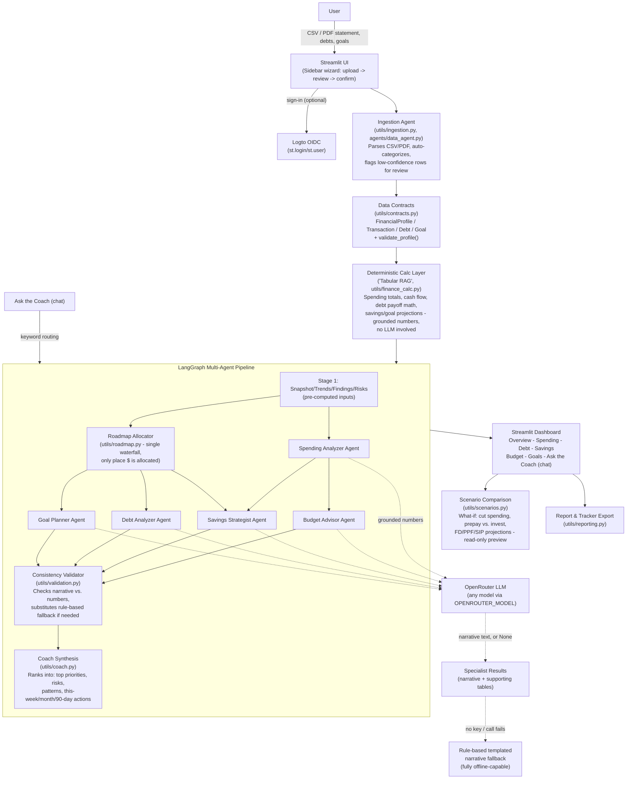

# AI Financial Coach — Problem Statement

## 1. Problem Statement

Most people who want to get serious about their money face the same wall: their income, spending, debts, and goals live in scattered PDFs, bank apps, and spreadsheets, and turning that raw data into an actual *plan* takes either a paid financial advisor or hours of manual spreadsheet work. Generic budgeting apps show dashboards of what already happened; they rarely tell you **what to do next with your next rupee/dollar of surplus**, and free-form "ask an LLM" chatbots hallucinate numbers because they aren't grounded in the user's real transactions.

The gap this project targets:
- No single place turns a bank statement + debts + goals into a **prioritized, numbers-backed action plan** (not just charts).
- LLM-based finance tools tend to **compute and narrate in the same breath**, so a wrong LLM guess becomes a wrong dollar figure the user might act on.
- Most demos break the moment there's no API key or the model is unavailable — they aren't demoable/usable offline.

## 2. Solution Approach

AI Financial Coach ingests a user's transactions (CSV/PDF), debts, and goals, then runs a **multi-agent pipeline** where every dollar figure is computed **deterministically first** and only *narrated* by an LLM afterward — never invented by one.

Core design decisions:
1. **Compute/narrate split.** A deterministic calculation layer (`utils/finance_calc.py`, referred to internally as the "tabular RAG" layer) produces every number — spending totals, debt-payoff schedules, savings projections, budget deltas. Specialist agents hand those *already-computed* numbers to an LLM to phrase as advice. If no LLM key is configured or the call fails, a rule-based templated narrative is used instead — the app is fully usable offline.
2. **Single allocator, no double-spending.** One waterfall allocator (`utils/roadmap.py`) is the *only* place that decides where a user's surplus money goes (debt, emergency fund, goals). Specialist agents narrate a figure they're handed; none of them independently allocate the same rupee twice.
3. **Consistency validation.** A validation layer cross-checks specialist narratives against the numbers that generated them and swaps in a deterministic fallback narrative if an LLM's phrasing drifts from the numbers — so a hallucinated sentence can never contradict the math shown next to it.
4. **Explainable orchestration.** A LangGraph state machine coordinates specialist agents with explicit dependency edges (e.g., Savings waits on both Spending and the Roadmap allocation) instead of a single mega-prompt — every stage's inputs/outputs are inspectable and testable in isolation.
5. **Region/currency aware.** Categorization keywords, benchmark investment rates (FD/PPF/SIP), and currency symbols are configurable (India/INR default, extensible), decoupled from each other.

**User journey:** Upload a statement (or use bundled sample data) → review/confirm auto-categorized transactions → enter debts & goals → confirm assumptions → get a scored financial-health snapshot, a prioritized roadmap, and per-domain specialist breakdowns → ask free-text follow-up questions in chat → explore "what-if" scenarios → export a report/tracker.

## 3. Tech Stack

| Layer | Technology |
|---|---|
| UI / App shell | **Streamlit** (multi-tab dashboard, sidebar wizard, native `st.login()` auth) |
| Authentication | **Logto** (OIDC provider) via Streamlit's built-in Authlib-backed login |
| Agent orchestration | **LangGraph** (`StateGraph`) — explicit multi-stage, fan-out/fan-in agent graph |
| LLM access | **OpenRouter** (OpenAI-compatible API) via the `openai` SDK — model-agnostic (Claude, GPT, Llama, etc.), fully optional |
| Data processing | **pandas**, **numpy** |
| Statement parsing | **pdfplumber** (PDF) + pandas (CSV) |
| Visualization | **Plotly** |
| Data contracts | Python `TypedDict` schemas (`utils/contracts.py`) — the shared vocabulary every module and test validates against |
| Testing | **pytest**, **Hypothesis** (property-based tests), `streamlit.testing.v1.AppTest` (UI tests), golden-fixture regression tests |
| Static analysis | **ruff** (lint), **mypy** (types) |

## 4. Architecture

### Architecture description

1. **Ingestion boundary.** The only layer tolerant of messy input (missing columns, bad dates, low-confidence categories). Everything downstream assumes clean, validated data.
2. **Data contracts.** Every module speaks the same typed vocabulary (`FinancialProfile`, `Transaction`, `Roadmap`, `CoachSummary`, …), so agents, tests, and the UI never disagree about shape.
3. **Deterministic calc layer ("tabular RAG").** All arithmetic — spending aggregates, avalanche/snowball debt simulation, savings growth projections — happens here, over pandas, with zero LLM involvement. This is the grounding layer agents retrieve from before generating any text.
4. **LangGraph pipeline.** A directed graph, not a linear script: the Spending Analyzer and Roadmap Allocator run in parallel (Stage 2); Budget/Savings/Debt/Goal specialists run in Stage 3, each depending only on the specific upstream node(s) it actually needs (LangGraph's native fan-in handles synchronization); Stage 4 validates consistency; Stage 5 (Coach) selects and ranks the final summary — it invents nothing new.
5. **LLM as narrator, not calculator.** Each specialist agent hands its own pre-computed slice of numbers to the LLM and asks only for phrasing. A missing API key or failed call transparently falls back to a rule-based narrative built from the same numbers — the roadmap and every dollar figure are identical either way.
6. **Presentation.** A tabbed Streamlit dashboard (Overview, Spending, Debt, Savings, Budget, Goals, Chat) renders the graph's output; a separate read-only Scenario Comparison section lets the user preview "what-if" changes without touching the confirmed plan; a report/tracker can be exported.

## 5. Key Concepts Incorporated

- **Multi-agent orchestration** via LangGraph, with explicit stage dependencies (fan-out/fan-in) instead of one monolithic prompt.
- **Grounded generation ("tabular RAG")** — deterministic computation retrieved from structured data and handed to the LLM as context, avoiding numeric hallucination, without needing a vector database (a plain pandas/dict lookup already fits the retrieval need — no embeddings forced where a simple table lookup works).
- **Graceful degradation** — every LLM-touching component has a deterministic, rule-based fallback; the app is 100% demoable with zero API key.
- **Consistency validation as a first-class stage** — narratives are checked against the numbers that produced them before being shown to the user.
- **Single-source-of-truth allocation** — one waterfall allocator prevents the classic "two agents recommend spending the same surplus dollar" bug.
- **Typed data contracts** as the seam between ingestion, computation, agents, and UI.
- **Model-agnostic LLM routing** via OpenRouter — swappable model slug, no vendor lock-in.
- **Cost-aware design** — narrow, explicit per-agent prompts (only the numbers a specialist needs) instead of dumping the full profile into every call.

## 6. Impact / Use Case

- **For individuals:** turns a raw bank statement into a concrete, prioritized "do this with your next surplus rupee" plan — debt payoff order, emergency fund target, budget overspend flags, and goal feasibility — in minutes, with or without an LLM key.
- **Trust-building:** because every number is computed deterministically and only *phrased* by an LLM (and cross-checked before display), users get advisor-style narrative without advisor-style hallucination risk.
- **Accessibility:** works fully offline/rule-based, so it's usable in low-connectivity or zero-budget contexts, not gated behind a paid LLM subscription.
- **Extensible foundation:** region/currency separation (India/INR default) and a typed contract layer make it straightforward to extend to new markets, new specialist agents (e.g., tax, insurance), or new statement formats without touching the core allocation logic.
