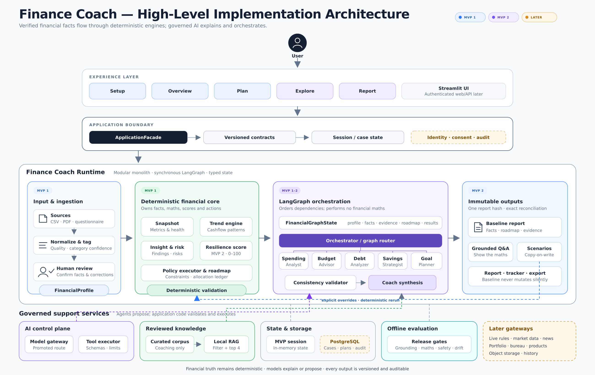

# AI Finance Coach

> Deterministic financial analysis with governed AI explanations—not regulated financial advice.

AI Finance Coach is a Streamlit application that turns a user's confirmed income, transactions, debts, savings, investments, goals, constraints, and assumptions into an auditable financial snapshot and prioritized action plan.

Financial calculations, findings, risks, allocations, validation, scenarios, and exports are produced by deterministic Python. Specialist agents use OpenRouter only to explain those verified results in plain language. If OpenRouter is unavailable, the application uses rule-based narratives and remains functional offline.

**Deployment endpoint:** [financialcoach.streamlit.app](https://financialcoach.streamlit.app/)

The hosted endpoint may require Streamlit or application sign-in. Local development can explicitly enable anonymous access as described below.

## Architecture at a glance



This is the consolidated target architecture across **MVP 1**, **MVP 2**, and **Future Works**. The colour labels identify the planned delivery stage.

### Detailed architecture diagram


The detailed diagram expands the same staged architecture into the user journey, UI surface, deterministic financial core, LangGraph state and orchestration, specialist agents, evaluation boundaries, RAG, and Future Works gateways.

### Delivery roadmap

| Stage | Scope |
| :--- | :--- |
| MVP 1 | Deterministic financial core, synchronous LangGraph orchestration, specialist explanations, validation, Coach synthesis, scenarios, report and tracker export |
| MVP 2 | Constrained adaptive strategy, reviewed-document RAG, financial dimensions and resilience scoring, grounded NLP interaction, preferences, and session-scoped what-if analysis |
| Future Works | Persistent cases, governed live laws/news/market/FX context, forecasting, portfolio data, production reconciliation, consent, audit, and durable storage |

The detailed plans are maintained in the [`planning-docs/`](planning-docs/) directory.

## Planning documentation

[`planning-docs/`](planning-docs/) contains the complete phase-wise product, architecture, implementation, UI, and execution planning history. It is the reference area for understanding what belongs to MVP 1, MVP 2, and Future Works.

| Planning area | Documents |
|---|---|
| Architecture | [`Architecture Plan.md`](planning-docs/Architecture%20Plan.md), [`Architecture Plan - MVP 2.md`](planning-docs/Architecture%20Plan%20-%20MVP%202.md), [`Architecture Plan - Later.md`](planning-docs/Architecture%20Plan%20-%20Later.md) |
| Implementation | [`Implementation Plan - MVP 1.md`](planning-docs/Implementation%20Plan%20-%20MVP%201.md), [`Implementation Plan - MVP 2.md`](planning-docs/Implementation%20Plan%20-%20MVP%202.md), [`Implementation Plan - MVP 2 Priority.md`](planning-docs/Implementation%20Plan%20-%20MVP%202%20Priority.md) |
| UI and execution | [`Unified UI Implementation Plan.md`](planning-docs/Unified%20UI%20Implementation%20Plan.md), [`Phase Prompts - MVP 2.md`](planning-docs/Phase%20Prompts%20-%20MVP%202.md) |
| Product context and review | [`intent.md`](planning-docs/intent.md), [`Problem Statement.md`](planning-docs/Problem%20Statement.md), [`Review.md`](planning-docs/Review.md), [`gaps.md`](planning-docs/gaps.md) |

The architecture diagrams and earlier design material are also preserved there, including the [`Finance Coach - Consolidated Architecture.md`](planning-docs/Finance%20Coach%20-%20Consolidated%20Architecture.md) and [`Base Architecture.md`](planning-docs/Base%20Architecture.md).

## Current user journey

```text
Landing page
  → sign in, or explicitly enable local anonymous access
  → upload a CSV/PDF statement or load sample data
  → normalize transactions and flag data-quality issues
  → review and correct uncertain categories
  → confirm income, expenses, savings, investments, debts, goals, constraints, and assumptions
  → calculate snapshot, trends, findings, and risks
  → build one deterministic allocation and prioritized roadmap
  → generate specialist explanations
  → validate specialist results before display
  → synthesize the Coach summary
  → explore specialist tabs, grounded chat, and what-if scenarios
  → download a Markdown report and CSV tracker
```

## Current architecture

### Deterministic financial core

The deterministic core owns financial truth. It performs:

- transaction normalization, regional keyword categorization, confidence flags, and human review;
- cash-flow, net-worth, debt, budget, savings, investment, goal, and health calculations;
- trend, finding, risk, and data-quality derivation;
- the single authoritative surplus-allocation waterfall and roadmap;
- consistency validation, scenario calculations, report rendering, and tracker generation.

The LLM does not calculate money, define formulas, change priorities, allocate surplus, or overwrite user facts.

### LangGraph orchestration

The graph is synchronous and in-memory. It is compiled without a checkpointer, and no graph state survives a Streamlit rerun.

```text
Pre-graph deterministic pipeline
  FinancialProfile → Snapshot → Trends → Findings → Risks

LangGraph
  START
    ├─ Spending Analyzer
    └─ Build deterministic roadmap (the only allocation authority)
          ↓
  Budget Advisor ← Spending result
  Savings Strategist ← Spending result + roadmap allocation
  Debt Analyzer ← Roadmap allocation
  Goal Planner ← Per-goal roadmap allocations
          ↓
  Deterministic consistency validator
          ↓
  Coach synthesis
          ↓
         END
```

### Components and agents

| Component | Grounded on | Responsibility |
|---|---|---|
| Input and ingestion service | Uploaded CSV/PDF or sample data | Parse transactions, normalize fields, categorize with confidence, flag uncertain entries for review |
| Spending Analyzer | Confirmed categorized transactions | Produce category totals, monthly cash flow, and recent category trends |
| Deterministic roadmap | Profile, snapshot, findings, and risks | Allocate available surplus once and create ordered actions |
| Budget Advisor | Spending result and confirmed income | Compare average actual spending with the 50/30/20 guideline |
| Savings Strategist | Spending result and roadmap allocation | Explain emergency-fund targets and 24-month savings/investment projections using confirmed rates |
| Debt Analyzer | Debts and roadmap allocation | Compare avalanche and snowball payoff simulations and explain the trade-off |
| Goal Planner | Goals and per-goal roadmap allocations | Calculate required contributions, feasibility, and shortfalls |
| Consistency validator | Snapshot, evidence, roadmap, and structured specialist results | Reject inconsistent structured claims and replace invalid narratives with deterministic fallbacks |
| Coach synthesis | Validated results | Rank and summarize existing risks, patterns, and actions without calculating anything new |

Each specialist returns structured fields plus a narrative. OpenRouter may generate the narrative; deterministic templates provide the offline fallback.

### Ask the Coach

The current chat is report-grounded navigation, not an unrestricted financial chatbot. A keyword router selects relevant narratives from the **same already-computed graph result** displayed in the report tabs. It does not invoke a second graph run, independently recalculate the plan, mutate the baseline report, or access live laws, news, market data, or the web.

The richer typed NLP interaction layer, reviewed-document RAG, suggested prompts, model routing, and tool calling are MVP 2 work and are not advertised in the current UI until implemented.

## Quick start

### 1. Clone and install

```bash
git clone https://github.com/bahl19/Financial-coach.git
cd Financial-coach
python -m venv .venv
source .venv/bin/activate
python -m pip install -r requirements.txt
```

### 2. Configure local access

Authentication fails closed. Choose one of these local configurations:

**Local anonymous development**

Create `.env` from `.env.example` and set:

```env
FC_ALLOW_ANONYMOUS=true
```

Do not enable anonymous access on a public deployment.

**Logto sign-in**

Copy `.streamlit/secrets.toml.example` to `.streamlit/secrets.toml` and complete its `[auth]` settings, including `client_secret`, `cookie_secret`, and the correct `/oauth2callback` redirect URI. Keep the supplied `client_kwargs` login prompt.

### 3. Configure OpenRouter (optional)

Add these values to `.env`:

```env
OPENROUTER_API_KEY=sk-or-v1-your-key-here
OPENROUTER_MODEL=anthropic/claude-sonnet-4.5
```

Without an API key—or if a model call fails—the app uses deterministic fallback narratives.

### 4. Run

```bash
streamlit run app.py
```

Open [http://localhost:8501](http://localhost:8501), dismiss the landing page, and either load the bundled sample data or upload a statement.

## Input contracts

### Transactions CSV

| Column | Type | Notes |
|---|---|---|
| `date` | date | Any pandas-parseable date |
| `description` | text | Merchant or memo used for categorization |
| `amount` | number | Expenses are negative; income and deposits are positive |

The app adds category, confidence, review, and transaction-type fields during ingestion. Unmatched expenses become `Other` with low confidence and are presented for user review.

### Debt

```json
{
  "name": "Credit Card",
  "balance": 4200.0,
  "apr": 22.9,
  "min_payment": 120.0
}
```

### Goal

```json
{
  "name": "Emergency Fund Boost",
  "amount": 4000.0,
  "months": 10,
  "current": 200.0,
  "priority": "high"
}
```

Goal priority must be `high`, `medium`, or `low`. Debts and goals are edited in Step 3 of the main application journey.

## Project structure

```text
Financial-coach/
├── app.py                         # Streamlit composition layer
├── agents/
│   ├── graph.py                   # Synchronous LangGraph and direct fallback path
│   ├── orchestrator.py            # Keyword routing over an existing graph result
│   ├── data_agent.py              # Tolerant CSV/PDF parsing
│   ├── spending_agent.py
│   ├── budget_agent.py
│   ├── savings_agent.py
│   ├── debt_agent.py
│   ├── goal_agent.py
│   └── base.py                    # Structured narrative and LLM fallback adapter
├── utils/
│   ├── contracts.py               # Typed financial contracts and validation
│   ├── ingestion.py               # Normalization, categorization, review, data quality
│   ├── finance_calc.py            # Deterministic financial calculations
│   ├── roadmap.py                 # Single deterministic allocation authority
│   ├── validation.py              # Specialist consistency validation
│   ├── coach.py                   # Deterministic Coach synthesis
│   ├── scenarios.py               # Copy-on-write what-if calculations
│   ├── reporting.py               # Markdown report and tracker package
│   ├── auth.py                    # Streamlit OIDC/Logto authentication gate
│   ├── app_state.py               # Controlled Streamlit session-state access
│   ├── region.py / currency.py    # Region, benchmark, and display helpers
│   ├── llm.py                     # OpenRouter adapter
│   └── landing.py / theme.py      # Streamlit experience layer
├── data/                          # Bundled sample transactions
├── fixtures/                      # Contracts, edge cases, and golden scenarios
├── tests/                         # Unit, property, integration, graph, and UI tests
├── tests/mvp2/                    # Cumulative MVP 2 regression gates
├── docs/verification/mvp2/        # Phase verification evidence
├── scripts/verify_mvp2_phase.py   # Cumulative MVP 2 phase verifier
├── plan/                          # Architecture and implementation plans
├── requirements.txt
└── pyproject.toml
```

## Verification

After installing the requirements in a compatible virtual environment:

```bash
python -m pytest -q
python -m ruff check .
python -m mypy utils agents
python scripts/verify_mvp2_phase.py --phase 0
git diff --check
```

The cumulative verifier must be run with the latest completed MVP 2 phase number as implementation progresses.

## Scope and safety

- The application provides educational financial planning, not regulated financial, investment, tax, legal, lending, or product advice.
- Current savings APY and investment CAGR are user-confirmed assumptions, not predictions or guarantees.
- The FD/PPF/equity comparison uses illustrative regional benchmark assumptions and is not a product recommendation.
- Live laws, news, market prices, FX data, forecasting, current product advice, durable user history, comprehensive transaction reconciliation, and governed production data gateways are **not currently implemented**.
- Current authentication identifies the user but does not provide per-user persistent financial-case storage.
- Auto-categorization is keyword-based and region-aware; the user must review uncertain categories before analysis.
- Debt payoff simulation rolls freed minimum payments into the next target debt for avalanche and snowball comparisons.

## Built by

C8 · Hackathon Group 13<br>
[github.com/bahl19](https://github.com/bahl19)

> Your income, spending, and debt—turned into a grounded plan, not just a dashboard.
