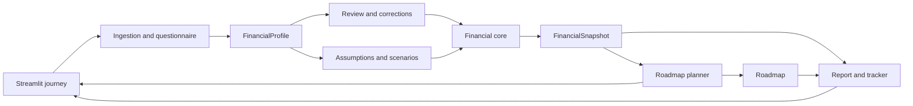

# Finance Coach: MVP 1 Architecture and Parallel Delivery Plan

This is the MVP 1 plan. It now includes a minimal version of MVP 2's strategy-selection layer — a deterministic decision context, a small hardcoded evidence manifest, an allowlisted policy choice, and validated fallback — implemented as an extension of the same LangGraph graph described below. The next phases are still deliberately separate for everything MVP 1 does *not* take on:

* [MVP 2: harden the strategy layer](Architecture%20Plan%20-%20MVP%202.md) — replace the hardcoded manifest with a real curated corpus and embedding retrieval, add the preference-capture UI, add retrieval evals.
* [Later: production architecture](Architecture%20Plan%20-%20Later.md)

## Decision

Build MVP 1 as a **modular Python monolith inside the existing Streamlit application**. The current implementation already has a useful shape: CSV/PDF ingestion, deterministic financial calculations, specialist narratives, and a single Streamlit composition layer. MVP 1 should strengthen those boundaries instead of replacing the app with Next.js, microservices, Clerk, PostgreSQL, RAG, MCP servers, or web search. LangGraph is adopted, but narrowly: as an in-process orchestration layer over the existing specialist agents, not as a persistence or workflow-interrupt system. That same graph is extended with a minimal strategy-policy layer pulled forward from MVP 2 — a small hardcoded evidence manifest and an allowlisted policy choice with deterministic validation and fallback — not new infrastructure (no vector store, no curated corpus, no retrieval evals).

Those are valid production follow-ons, but introducing them now would consume the remaining prototype time on infrastructure rather than a credible financial-coaching journey.

The MVP must make this demonstrable end-to-end journey reliable:

```text
Upload CSV/PDF or enter a short questionnaire
  -> normalize transactions
  -> review unknown/uncertain categories
  -> enter or confirm income, debts, savings, goals, and constraints
  -> calculate a financial-health snapshot
  -> generate a prioritized roadmap
  -> adjust assumptions and rerun
  -> download a report and monthly tracker
```

The application provides educational financial planning, not investment, tax, legal, or regulated financial advice. It must never invent account values, rates, or user constraints.

## Critical Review

### What the current code already supports

* `agents/data_agent.py` parses CSV and a narrow text-PDF pattern into `date`, `description`, and `amount`.
* `utils/finance_calc.py` owns deterministic categorization, cash-flow aggregation, budget math, goal feasibility, savings projection, and avalanche/snowball payoff simulation.
* `agents/orchestrator.py` enriches a shared context and invokes five specialist agents.
* `app.py` provides one working UI for uploads, manual income/savings/debt/goal entry, charts, analysis, and chat.
* Every narrative has an offline fallback, which is appropriate for an 18-hour prototype.

### Gaps that affect the MVP

* Categorization silently maps unmatched entries to `Other`; the user cannot correct them before analysis.
* Income is entered manually and is not reconciled with transaction history.
* Financial results are separate agent outputs; there is no single health snapshot or ordered action plan.
* Key assumptions are hidden in code: 50/30/20 budget ratios, a 4% savings return, 50% of surplus to savings, and 30% of surplus as extra debt payment.
* There is no report or tracker download.
* The PDF parser is useful only for a very specific transaction-line format. Mutual-fund/SIP/loan extraction is not an MVP promise.

### Corrections to the diagram and broad architecture proposal

The supplied diagram correctly places documents, financial facts, specialist capabilities, reporting, and evaluation in the product. It is not an implementation topology yet.

* Treat spend analysis, debt simulation, budget math, health metrics, and report rendering as deterministic functions, not agents. The current code already largely follows this principle. LangGraph orchestrates only the specialist narrative agents and the roadmap synthesis step; it never recalculates or overrides a value the deterministic core already produced.
* Replace multiple component-owned `State` bubbles with one `FinancialProfile` contract and immutable results returned by each component.
* Remove runtime multi-model judging. A second model should not validate money calculations. Deterministic validation and manual demo review are sufficient for the MVP.
* Keep web search, MCP, OAuth, persistent workflow checkpoints, and database storage out of this sprint. LangGraph is in scope only as a synchronous, in-memory graph that fans out to the specialist agents and converges on one synthesis node; it is compiled and invoked without a checkpointer and holds no state across Streamlit reruns. RAG is intentionally scheduled for MVP 2 after deterministic calculations and profile contracts have stabilized.
* Keep evaluation as tests and demo fixtures, not a node that blocks a user workflow.
* Do not claim mutual-fund, SIP, loan-statement, image, login, prior-report, or external-data support until the related parser, data model, and storage exist.

### Multi-Agent Orchestration (LangGraph)

`agents/orchestrator.py` already fans out to five specialist agents (spending, debt, savings, budget, goals) and, for chat, selects a relevant subset. MVP 1 keeps this shape but re-implements it as an explicit LangGraph graph instead of a dict comprehension, so the multi-agent story is demonstrable without the specialists producing independent, potentially contradictory narratives.

> **⚠️ Corrected ordering — this fixes a real double-allocation bug, not a style preference.** An earlier draft of this graph ran the specialist nodes *before* roadmap allocation, which is backwards for Debt, Savings, and Goal. Today, `agents/orchestrator.py:34` hands Debt a hardcoded 30% of surplus (`extra_debt_payment = monthly_surplus * 0.3`); `agents/savings_agent.py:22` separately recomputes cash flow from scratch and claims a hardcoded 50% (`contribution = surplus * 0.5`); and `agents/goal_agent.py:16-20` treats the *entire* `monthly_surplus` as available to *each* goal on top of both of those. None of the three knows about the other's claim on the same surplus dollars, and nothing checks that their combined claims stay under 100%. Example: income $6,200, expenses $3,800 → surplus $2,400. Debt recommends $720/month extra, Savings independently recommends $1,200/month, and every goal independently treats the full $2,400 as free — a user following all three narratives literally over-commits. The fix is architectural: `build_roadmap()` runs *first*, as a single deterministic waterfall allocator, and Debt/Savings/Goal narrate the dollar figure the waterfall already assigned them instead of computing their own share.

The graph therefore runs in three stages, not one flat or two-tier fan-out:

```text
Stage A (parallel, from graph start — neither depends on the other):
  spending node
  decision_context -> evidence -> strategy_policy -> validate_policy -> build_roadmap(policy)
                                                        (the ONE allocation decision; writes `roadmap_result`,
                                                         which carries a per-action `allocation` breakdown)

Stage B (after Stage A):
  budget  node  <- reads spending_result
  savings node  <- reads spending_result AND roadmap_result.allocation["savings_contribution"]
  debt    node  <- reads roadmap_result.allocation["debt_extra_payment"]
  goal    node  <- reads roadmap_result.allocation["goal_contributions"] (per goal, not the raw surplus)

Stage C (after Stage B):
  explain_roadmap()  <- reads all five specialist narratives + Roadmap.actions
        -> Roadmap (final, narrated)
```

Rules:

* Each specialist node calls the existing agent's `run()` method, refactored to accept the upstream value(s) it now depends on. Concretely: `DebtAnalyzerAgent` takes its extra-payment figure from `roadmap_result`, not `context["extra_debt_payment"]`; `SavingsStrategyAgent` takes its contribution figure from `roadmap_result` instead of computing `surplus * 0.5` itself; `GoalPlannerAgent` takes each goal's allocated contribution from `roadmap_result` instead of treating the raw `monthly_surplus` as available per goal; `savings`/`budget` still take `spending`'s `by_category`/`monthly_cashflow` output instead of recomputing it. Every node still returns narrative text and its own supporting tables, never a new number.
* `build_roadmap()` is the single deterministic waterfall (see Component 4's prioritization rules) that decides the *only* authoritative split of surplus across buffer, debt extra payment, goal contributions, and savings. Its returned `allocation` values must sum to no more than `monthly_surplus`. `explain_roadmap()` may use specialist narratives as supporting context; it does not let a specialist re-order or re-allocate the roadmap.
* The graph is compiled and invoked synchronously within a single Streamlit rerun. It uses no `checkpointer`, no `interrupt`, and no state that survives past that invocation — this keeps the "no persistent workflow checkpoints" boundary intact.
* Graph state is a single typed schema built from the existing contracts (`FinancialProfile`, `FinancialSnapshot`, `PreferenceProfile` as read-only inputs; each node writes its own result key — `spending_result`, `roadmap_result`, `debt_result`, `savings_result`, `budget_result`, `goal_result` — which downstream nodes read). The graph introduces no state shape beyond these named results.
* Chat routing (`route_chat`) reuses the same specialist nodes rather than a second orchestration path; keyword-based topic selection stays as-is, but if a matched route includes `debt`, `savings`, `budget`, or `goal`, the graph still runs Stage A first to supply the dependency (it is simply not shown in the chat reply).
* Add `langgraph` to `requirements.txt`. No other new runtime dependency is introduced for this.

### Strategy Policy Layer (merged from MVP 2)

MVP 1 pulls forward the graph shape from `Architecture Plan - MVP 2.md`'s Dynamic Strategy Algorithm, scoped down: a small hardcoded evidence manifest instead of a curated corpus, deterministic topic-tag matching instead of embeddings, no retrieval-quality eval suite, and no dedicated preference-capture UI (preferences default to `no_preference`). MVP 2 remains responsible for hardening this into the full pipeline. This layer is Stage A's second branch in the diagram above — it runs before, not after, the specialist tier, since it needs only `FinancialSnapshot` and `PreferenceProfile`, never a specialist narrative.

Rules:

* `decision_context` derives 2-4 topics deterministically from `FinancialSnapshot.risk_flags` and metrics (e.g., `LOW_EMERGENCY_FUND` -> `emergency_fund`, high-interest debt present -> `high_interest_debt`, a goal shortfall -> `goal_tradeoff`) and from any confirmed `PreferenceProfile` fields. No LLM call.
* `evidence` looks up those topics against a 3-6 entry hardcoded manifest in `knowledge/manifest.py`; it rejects nothing else and adds no new infrastructure. A topic with no match returns an empty bundle plus a warning — never a fabricated citation.
* `strategy_policy` asks the configured LLM for one `StrategyPolicy` JSON object constrained to the allowlist and permitted allocation keys. An invalid response, an unavailable model, or an empty evidence bundle all fall back to `baseline_balanced`, and the UI discloses the fallback.
* `validate_policy` + `build_roadmap(policy)` apply the policy's `action_order`/`allocation_preferences` inside the waterfall's existing hard constraints (debt minimums, buffer, protected categories) and produce the `allocation` breakdown Stage B's nodes read. If applying the policy would violate a constraint, it is rejected and replaced with `baseline_balanced` — this rejection is the `PlanValidation` record, not a silent failure.
* An unconfirmed or skipped preference has no effect on the selected policy; explicit constraints always win over preferences.
* No vector store, no corpus files on disk, no retrieval-quality eval suite — those stay MVP 2 scope.

## Scope Boundary

### Must ship in the MVP

* CSV and existing PDF transaction ingestion.
* A basic questionnaire path for users without a statement.
* Category review for transactions that are `Other` or have low confidence.
* Manual debt, savings, goal, and constraint capture.
* A deterministic financial-health snapshot.
* A deterministic prioritized roadmap with a concise LLM or offline explanation, which is the **single** source of debt-extra-payment, savings-contribution, and per-goal-contribution figures — fixing the existing bug where Debt (30% of surplus), Savings (50% of surplus), and each Goal (100% of surplus) independently claim overlapping shares of the same money with nothing reconciling them.
* A minimal strategy-policy layer: deterministic decision-context topics, a small hardcoded evidence manifest, an allowlisted policy choice that adjusts roadmap emphasis, and a validated fallback to `baseline_balanced` — see Strategy Policy Layer below.
* User-adjustable assumptions and a rerun path.
* Downloadable Markdown/HTML-style report text and a monthly tracker CSV.
* Tests for calculation invariants and contract validation.

### Explicitly deferred

* OCR, image uploads, institution-specific PDF extraction, mutual-fund/CAS/SIP parsing, and automatic loan extraction.
* Authentication, multi-user storage, case history, cloud object storage, and databases.
* Live market data, tax/regulatory guidance, web search, and MCP integrations.
* A real curated knowledge corpus (15-30 documents), embedding-based retrieval, a dedicated preference-capture UI, and retrieval-quality evals — these harden the strategy-policy layer and are the dedicated MVP 2 scope; MVP 1 ships that layer with a hardcoded manifest and default (`no_preference`) preferences only.
* LangGraph interrupt persistence and background job queues.
* Product recommendations, portfolio allocation advice, and runtime LLM-as-judge.

## Canonical Contracts

All components communicate through plain Python dictionaries in the MVP. They must be defined once in a new `utils/contracts.py` module using `TypedDict` or dataclasses, and documented here before implementation. Each producer returns a new value; no component mutates a profile it did not create.

### Contract rules

1. All monetary values are positive `float` values in the selected `currency`; transaction direction is represented by the signed `amount`.
2. Dates use ISO `YYYY-MM-DD` strings at component boundaries.
3. Unknown facts are `None`; do not use zero as a substitute for missing data.
4. Each output contains `schema_version: "1.0"`.
5. All numeric recommendations identify their calculation source through a metric key or result key.
6. Narratives may explain values but must not create new values.
7. The UI is the only writer to Streamlit `session_state`; domain components remain pure.

### `Transaction`

```python
{
    "date": "2026-07-18",
    "description": "Whole Foods",
    "amount": -83.42,
    "category": "Groceries",
    "category_confidence": 1.0,
    "needs_review": False,
}
```

Required keys: `date`, `description`, `amount`, `category`, `category_confidence`, `needs_review`.

`amount > 0` is money in; `amount < 0` is money out. `category_confidence` is in $[0, 1]$. Keyword matches use `1.0`; an unmatched negative transaction uses `0.0` and `needs_review=True`.

### `Debt`

```python
{
    "name": "Credit Card",
    "balance": 4200.0,
    "apr": 22.9,
    "min_payment": 120.0,
}
```

Required fields are positive except `apr`, which may be `0.0`. An incomplete debt is not passed to payoff simulation; it becomes a validation issue for the UI.

### `Goal`

```python
{
    "name": "Emergency fund boost",
    "amount": 3000.0,
    "months": 6,
    "current": 500.0,
    "priority": "high",
}
```

`priority` is `high`, `medium`, or `low`. Goals are optional.

### `PlanningAssumptions`

```python
{
    "currency": "USD",
    "needs_ratio": 0.50,
    "wants_ratio": 0.30,
    "savings_ratio": 0.20,
    "savings_apy": 0.04,
    "savings_surplus_ratio": 0.50,
    "extra_debt_surplus_ratio": 0.30,
    "emergency_fund_months": 3,
}
```

All ratios are in $[0, 1]$. The three budget ratios must total $1.0$ (allowing a small floating-point tolerance). The UI may offer presets but must display the active values.

### `FinancialProfile`

```python
{
    "schema_version": "1.0",
    "transactions": [Transaction],
    "monthly_income": 6200.0,
    "current_savings": 2500.0,
    "debts": [Debt],
    "goals": [Goal],
    "constraints": {
        "minimum_monthly_buffer": 0.0,
        "protected_categories": [],
    },
    "assumptions": PlanningAssumptions,
}
```

`monthly_income` is user-confirmed for the MVP. Transaction-derived income is displayed as a comparison only; the UI flags a meaningful mismatch instead of overwriting the user value.

### `ReviewItem`

```python
{
    "transaction_index": 12,
    "description": "ACME PAYMENTS",
    "amount": -45.0,
    "suggested_category": "Other",
    "reason": "No matching category keyword",
}
```

The UI may change the category, then writes the corrected transaction back into the next `FinancialProfile` version.

### `FinancialSnapshot`

```python
{
    "schema_version": "1.0",
    "metrics": {
        "average_monthly_expenses": 3800.0,
        "monthly_surplus": 2400.0,
        "savings_rate_percent": 38.7,
        "debt_to_income_percent": 12.3,
        "emergency_fund_months": 0.66,
        "total_debt": 32500.0,
    },
    "health_score": 72,
    "health_band": "Building",
    "risk_flags": [
        {"code": "LOW_EMERGENCY_FUND", "severity": "high", "metric": "emergency_fund_months"}
    ],
    "debt_comparison": {"avalanche": {}, "snowball": {}},
    "goal_results": [],
    "validation_issues": [],
}
```

Score inputs and weights must be visible in code and report output. A score is a coaching indicator, not a credit score.

### `Roadmap`

```python
{
    "schema_version": "1.0",
    "actions": [
        {
            "priority": 1,
            "timeframe": "This month",
            "title": "Build a starter emergency buffer",
            "rationale": "Emergency coverage is below the chosen target.",
            "monthly_amount": 1200.0,
            "metric_refs": ["emergency_fund_months"],
        }
    ],
    "allocation": {
        "buffer_reserved": 300.0,
        "debt_extra_payment": 720.0,
        "goal_contributions": {"Emergency fund boost": 480.0},
        "savings_contribution": 900.0,
    },
    "narrative": "...",
    "assumptions_used": PlanningAssumptions,
}
```

Roadmap action ordering is deterministic: cover required debt minimums, address high-interest debt and a starter emergency buffer, fund high-priority achievable goals, then discretionary savings/investing. The narrative may rephrase the list but not reorder it. When a `StrategyPolicy` is applied (see Strategy Policy Layer), it may adjust which of these steps is emphasized and the allocation split between them, but it cannot remove a step or violate the ordering's hard constraints.

`allocation` is the single authoritative breakdown of `monthly_surplus`; its values must sum to no more than `monthly_surplus` after the buffer. This is what `DebtAnalyzerAgent`, `SavingsStrategyAgent`, and `GoalPlannerAgent` read for their dollar figures instead of each independently computing a share of the raw surplus (see the corrected-ordering callout under Multi-Agent Orchestration).

### `PreferenceProfile` (optional, minimal for MVP 1)

```python
{
    "schema_version": "1.0",
    "debt_payoff_style": "no_preference",
    "planning_style": "no_preference",
    "risk_comfort": "no_preference",
    "financial_confidence": "no_preference",
    "goal_tradeoff": "no_preference",
    "source": "user_skipped",
}
```

MVP 1 does not add a dedicated preference-capture UI. Every field defaults to `no_preference` / `user_skipped` unless a preference form exists. The contract is frozen now so that adding real capture later (MVP 2) needs no shape change. Valid `source` values are `user_confirmed` and `user_skipped`; an LLM-suggested preference must remain unconfirmed until the UI obtains explicit confirmation.

### `DecisionContext`

```python
{
    "schema_version": "1.0",
    "snapshot_summary": {
        "risk_flags": ["LOW_EMERGENCY_FUND"],
        "monthly_surplus": 2400.0,
        "emergency_fund_months": 0.66,
        "high_interest_debt": True,
        "goal_statuses": ["achievable", "shortfall"],
    },
    "constraints": {
        "minimum_monthly_buffer": 300.0,
        "protected_categories": ["Medication"],
    },
    "preferences": "PreferenceProfile",
    "topics": ["emergency_fund", "high_interest_debt", "simple_plan"],
}
```

Derived deterministically from `FinancialSnapshot` and `PreferenceProfile` — no LLM call. `topics` excludes raw statement text, account numbers, and full transaction histories.

### `EvidenceQuery` and `EvidenceBundle`

```python
{
    "schema_version": "1.0",
    "topics": ["high_interest_debt", "emergency_fund"],
    "audience": "individual_consumer",
    "max_results": 4,
    "corpus_version": "mvp1-manifest-1",
}
```

```python
{
    "schema_version": "1.0",
    "corpus_version": "mvp1-manifest-1",
    "evidence": [
        {
            "evidence_id": "debt-buffer-001",
            "title": "Starter-buffer sequencing",
            "topic": "high_interest_debt",
            "excerpt": "...",
            "source_uri": "knowledge/manifest.py#debt-buffer-001",
            "source_version": "1.0",
            "score": 1.0,
        }
    ],
    "warnings": [],
}
```

For MVP 1, the corpus is 3-6 hardcoded entries in `knowledge/manifest.py`, and retrieval is deterministic topic-tag matching (`score` is always `1.0` for a topic match, not a similarity score) — no embeddings, no files on disk, no corpus governance beyond this fixed version string. An evidence bundle is not a financial calculation and cannot contain a recommendation by itself.

### `StrategyPolicy`

```python
{
    "schema_version": "1.0",
    "strategy": "starter_buffer_then_avalanche",
    "action_order": ["starter_buffer", "avalanche_debt", "high_priority_goals"],
    "allocation_preferences": {
        "starter_buffer_share": 0.50,
        "extra_debt_share": 0.50,
    },
    "rationale": "A small buffer may reduce the need to re-borrow while high-interest debt remains.",
    "evidence_ids": ["debt-buffer-001"],
    "preference_refs": ["financial_confidence", "debt_payoff_style"],
}
```

The strategy agent may select only a predefined `strategy` from the allowlist (`baseline_balanced`, `starter_buffer_then_avalanche`, `avalanche_acceleration`, `snowball_motivation`, `goal_protection`, `cashflow_stabilization`) and permitted allocation keys. It cannot return arbitrary code, formulas, URLs, products, interest rates, or amounts.

### `PlanValidation`

```python
{
    "schema_version": "1.0",
    "valid": True,
    "violations": [],
    "applied_policy": "starter_buffer_then_avalanche",
    "calculation_refs": ["monthly_surplus", "emergency_fund_months"],
}
```

The report displays the applied policy, assumptions, preference references, calculation references, and evidence citations.

### `ReportPackage`

```python
{
    "schema_version": "1.0",
    "report_markdown": "# Your Finance Coach Report ...",
    "tracker_rows": [
        {"month": "2026-08", "planned_savings": 1200.0, "extra_debt_payment": 720.0, "goal_contributions": 480.0}
    ],
    "filename_stem": "finance-coach-plan",
}
```

The export component produces report text and a `pandas.DataFrame`; the UI owns conversion to downloadable bytes.

## Seven Parallel Components

Each owner works in an isolated module and consumes only the contracts above. Merge order is intentionally limited to contracts first, then components, then app wiring.

| # | Component | Owns | Depends on | MVP deliverable | Suggested location |
|---|---|---|---|---|---|
| 1 | Contracts and validation | Contract types, defaults, input validation, fixture profile | None | Valid/invalid profile checks and fixtures | `utils/contracts.py`, `tests/test_contracts.py` |
| 2 | Ingestion and questionnaire | CSV/PDF normalization, category confidence, review queue, questionnaire-to-profile data | 1 | Parsed transactions plus `ReviewItem` list | `agents/data_agent.py`, `utils/ingestion.py` |
| 3 | Financial core and health | Health metrics, score, flags, budget calculations, debt and goal simulations | 1 | Pure `FinancialSnapshot` calculator | `utils/finance_calc.py` |
| 4 | Roadmap planner and strategy policy | Deterministic priority rules, action allocator, optional narrative prompt/fallback, LangGraph fan-out/synthesis wiring, decision-context derivation, hardcoded evidence manifest, allowlisted policy selection with fallback | 1, 3 | Valid `Roadmap` from snapshot/profile, optionally shaped by a validated `StrategyPolicy` | `agents/roadmap_agent.py` or `utils/roadmap.py`; graph wiring in `agents/graph.py`; manifest in `knowledge/manifest.py` |
| 5 | Assumptions and scenarios | Assumption validation, what-if profile builder, comparison helpers | 1, 3 | Scenario outputs when the user changes a ratio/rate/buffer | `utils/scenarios.py` |
| 6 | Reports and tracker | Markdown report renderer, tracker DataFrame, download-ready formats | 1, 3, 4 | `ReportPackage` with no independently calculated numbers | `utils/reporting.py` |
| 7 | Streamlit experience and integration | Guided journey, review UI, tabs, session-state adaptor, download buttons, existing chat integration | 1-6 | Full end-to-end screen using fixture-safe contracts | `app.py` |

### Component 1: Contracts and validation

Freeze this first. It is the only shared surface and should take no external dependency beyond the existing standard library and pandas types where necessary.

Public functions:

```python
default_assumptions() -> PlanningAssumptions
validate_profile(profile: FinancialProfile) -> list[str]
validate_assumptions(assumptions: PlanningAssumptions) -> list[str]
```

Acceptance checks:

* Reject a budget split that does not total $1.0$.
* Reject debt balances or minimum payments below zero.
* Accept an empty debt or goals list.
* Preserve unknown values as `None` rather than coercing them to zero.

### Component 2: Ingestion and questionnaire

Keep the existing CSV/PDF support. Add a confidence-aware categorization wrapper, a review-item builder, and a simple form-based alternate path. Do not add OCR, file persistence, or new statement formats.

Public functions:

```python
load_transactions(uploaded_file) -> pd.DataFrame
categorize_with_confidence(transactions: pd.DataFrame) -> pd.DataFrame
build_review_items(transactions: pd.DataFrame) -> list[ReviewItem]
questionnaire_to_profile_fields(form_values: dict) -> dict
```

Acceptance checks:

* An unmatched expense is `Other`, has confidence `0.0`, and appears in the review list.
* A user category correction remains in the profile used by calculation.
* Existing sample data still loads without new required columns.

### Component 3: Financial core and health

Refactor existing calculations only where the contract requires it. Keep all math deterministic. Add a single `calculate_financial_snapshot()` entry point that composes existing cash-flow, budget, debt, savings, and goal functions.

Public functions:

```python
calculate_financial_snapshot(profile: FinancialProfile) -> FinancialSnapshot
calculate_health_score(metrics: dict, assumptions: PlanningAssumptions) -> tuple[int, str]
```

Baseline metrics:

* Average monthly expenses and surplus.
* Savings rate: $\frac{income - expenses}{income} \times 100$ when income is positive.
* Debt-to-income: $\frac{total\ minimum\ debt\ payments}{monthly\ income} \times 100$ when income is positive.
* Emergency-fund months: $\frac{current\ savings}{average\ monthly\ expenses}$ when expenses are positive.
* Total debt, debt payoff comparison, budget variance, and goal feasibility.

The score must be bounded from 0 to 100 and explain each deduction through a risk flag. Do not call an LLM from this component.

Acceptance checks:

* Debt balances never become negative in payoff timelines.
* A plan cannot allocate more than surplus after the configured buffer.
* A user with no debt receives an empty debt comparison or an explicit debt-free result, not a crash.

### Component 4: Roadmap planner and strategy policy

Replace the fixed concatenation of specialist narratives on the overview with a deterministic action order, optionally shaped by an allowlisted strategy policy. Existing specialist agents may still provide detailed tab-specific explanations and chat replies. Implement this as a LangGraph subgraph: specialist nodes run in parallel and feed a decision-context / evidence / strategy-policy chain that ends in a validated synthesis node calling `build_roadmap()`; see Multi-Agent Orchestration and Strategy Policy Layer above.

Public functions:

```python
build_roadmap(profile: FinancialProfile, snapshot: FinancialSnapshot, policy: StrategyPolicy | None = None) -> Roadmap
explain_roadmap(roadmap: Roadmap, snapshot: FinancialSnapshot) -> str
derive_decision_context(snapshot: FinancialSnapshot, preferences: PreferenceProfile) -> DecisionContext
retrieve_evidence(query: EvidenceQuery) -> EvidenceBundle
select_strategy_policy(context: DecisionContext, evidence: EvidenceBundle) -> StrategyPolicy
validate_policy(policy: StrategyPolicy, profile: FinancialProfile, snapshot: FinancialSnapshot) -> PlanValidation
```

MVP prioritization rules:

1. Resolve invalid or missing financial inputs before offering a monetary allocation.
2. Protect the configured minimum monthly buffer and debt minimum payments.
3. Address a starter emergency fund when coverage is below target.
4. Direct remaining debt allocation toward the avalanche strategy when high-interest debt exists.
5. Fund feasible high-priority goals from remaining surplus.
6. Allocate any remaining amount to the savings plan.

`explain_roadmap` may use the configured LLM, but its fallback must use the action list unchanged.

Acceptance checks:

* Every action points to a snapshot metric.
* Action priorities are unique and sequential.
* Allocation never exceeds available surplus after the buffer.
* `sum(roadmap.allocation.values())` (goal contributions summed across goals) never exceeds `monthly_surplus` — this is the concrete regression test for the double-allocation bug described above.
* `DebtAnalyzerAgent`, `SavingsStrategyAgent`, and `GoalPlannerAgent` read their dollar figure from `roadmap_result.allocation`; none of them independently computes a percentage of `monthly_surplus` (the old `agents/orchestrator.py:34` 30%-of-surplus default and `agents/savings_agent.py:22` 50%-of-surplus default are removed, not just overridden).
* The graph runs without a checkpointer and completes within a single Streamlit rerun.
* The graph-produced `Roadmap` matches calling `build_roadmap()` directly — no drift between orchestrated and direct invocation.
* `savings` and `budget` nodes consume `spending`'s result rather than independently recomputing `monthly_cashflow`/`spending_by_category` from raw transactions.
* `debt` and `goal` nodes depend on `roadmap_result`, not on `spending`, and produce narratives consistent with the roadmap's actual allocation.
* `decision_context`'s topics are derived deterministically from the snapshot and preferences — no LLM call.
* An invalid `StrategyPolicy`, an unavailable model, or an empty evidence bundle all fall back to `baseline_balanced`, and the report discloses the fallback.
* A policy can never violate a debt minimum, the configured buffer, or a protected category; `validate_policy` rejects it and falls back if it would.
* Skipping every preference produces the same `Roadmap` as MVP 1 without the strategy layer (baseline behavior is the default, not a special case).

### Component 5: Assumptions and scenarios

Move hidden constants to a visible structure. It owns adjusted inputs, not financial math; it calls the financial core to obtain results.

Public functions:

```python
apply_assumptions(profile: FinancialProfile, updates: dict) -> FinancialProfile
compare_scenarios(base: FinancialSnapshot, adjusted: FinancialSnapshot) -> dict
```

Acceptance checks:

* Invalid ratios and negative rates return validation issues.
* The base profile is not mutated when a user previews a scenario.
* Report output states the assumptions used for the selected scenario.

### Component 6: Reports and tracker

Make export deterministic and lightweight. A Markdown report and CSV tracker satisfy the MVP; do not add a PDF renderer unless time remains after integration.

Public functions:

```python
build_report(profile: FinancialProfile, snapshot: FinancialSnapshot, roadmap: Roadmap) -> ReportPackage
build_tracker(roadmap: Roadmap, months: int = 12) -> pd.DataFrame
```

The report includes profile inputs, health metrics, risk flags, roadmap actions, assumptions, and the educational-advice limitation. The tracker contains planned values only, not fabricated future transactions.

Acceptance checks:

* Exported values match the source snapshot and roadmap exactly.
* A report with no debts or goals still renders.
* The tracker totals do not exceed the roadmap's monthly allocation.

### Component 7: Streamlit experience and integration

This component owns the UX only. It calls components through their public functions and stores resulting objects in `st.session_state`; it does not duplicate financial calculations.

Screen sequence:

1. Choose upload/sample data or questionnaire.
2. Show category-review table when review items exist; continue after confirmation.
3. Confirm income, savings, debts, goals, constraints, and assumptions.
4. Run analysis and show Overview, Health & Roadmap, specialist tabs, and chat.
5. Preview an assumption change and rerun.
6. Download report and tracker.

Acceptance checks:

* The app does not run analysis before required inputs validate.
* Editing a review category changes the resulting spending/budget output.
* Download buttons work in offline mode.
* Existing specialist tabs and chat still work with the generated profile context.
* Specialist tabs and chat are served through the same LangGraph nodes as the overview, so results are consistent across tabs.

## Integration Shape



The composition rule is simple: `app.py` creates or updates a `FinancialProfile`, calls the pure functions, and renders returned contracts. Existing agents receive an adaptor dictionary built from the selected profile, snapshot, and — critically — the already-computed roadmap allocation, not a locally-guessed share of surplus:

```python
{
    "transactions": profile["transactions"],
    "monthly_income": profile["monthly_income"],
    "current_savings": profile["current_savings"],
    "debts": profile["debts"],
    "goals": profile["goals"],
    "monthly_surplus": snapshot["metrics"]["monthly_surplus"],
    "extra_debt_payment": roadmap["allocation"]["debt_extra_payment"],
    "savings_contribution": roadmap["allocation"]["savings_contribution"],
    "goal_contributions": roadmap["allocation"]["goal_contributions"],
}
```

This preserves working agent behavior while the roadmap becomes the authoritative cross-cutting plan. `H` (Roadmap planner) is now the *first* step of the extended graph, not the last: `decision_context` -> `evidence` -> `strategy_policy` -> validated `build_roadmap()` runs before the specialist tier, precisely so this adaptor dictionary carries one authoritative allocation instead of each specialist inventing its own — see the corrected-ordering callout under Multi-Agent Orchestration and the Strategy Policy Layer section. The specialist agents run as the graph's Stage B/C nodes and receive this same adaptor dictionary as their LangGraph state.

## Remaining-Hours Delivery Order

Approximately 14 hours remain after the initial four hours — **this budget predates the merged strategy-policy layer and no longer fits it.** Folding in a decision-context/evidence/policy chain realistically adds 2-3 hours on top of the original estimate; treat the table below as ~16-17 hours remaining (roughly 20-21 hours total), not 14, or cut UX polish time to compensate. Parallel work only helps once the contract is frozen; avoid merging feature branches that each redefine profile fields.

| Time | Work | Owners | Completion criterion |
|---|---|---|---|
| 0:00-0:45 | Freeze contracts, defaults, and one sample fixture | Component 1 | Other work can import the same shapes |
| 0:45-3:00 | Build components 2, 3, and 6 in parallel | Ingestion, Core, Reporting | Each passes its local tests using the fixture |
| 3:00-4:30 | Build components 4 and 5 in parallel | Roadmap, Scenarios | Roadmap allocations validate against snapshot; graph produces the same `Roadmap` as calling `build_roadmap()` directly; **Debt/Savings/Goal agents refactored to read `roadmap.allocation` instead of their old hardcoded 30%/50%/full-surplus shares** |
| 4:30-6:30 | Build the strategy-policy layer | Roadmap/Strategy | `decision_context` -> `evidence` (hardcoded manifest) -> `strategy_policy` -> validated `build_roadmap()` chain works; invalid/missing policy falls back to `baseline_balanced` |
| 6:30-9:30 | Wire component 7 | UI/integration | One end-to-end sample path works offline, including the strategy layer |
| 9:30-11:00 | Add validation tests and repair integration defects | All | Invalid input, no debt, no goal, unknown category, and policy-fallback paths all work |
| 11:00-13:00 | Improve UX and narrative quality | UI/Roadmap | Clear review, roadmap, and exports ready for demo |
| 13:00-16:00 | Demo rehearsal, regression test, and polish | All | Run the complete journey twice without manual code edits |

If time is tight, preserve the end-to-end core: category review, health snapshot, deterministic roadmap, and CSV/Markdown downloads. Drop PDF improvements and LLM narrative polish first, then the strategy-policy layer itself (fall back to calling `build_roadmap()` with no policy — it already behaves exactly like `baseline_balanced`). Adopting LangGraph adds a new dependency; if the base fan-out/synthesis graph is not stable by 4:30, fall back to calling the specialist agents and `build_roadmap()` directly (no graph) and skip the strategy-policy layer entirely rather than build it on an unstable foundation.

## Test and Demo Gates

Before merging, each component supplies one focused test. The final integration gate is:

1. Load sample transactions.
2. Confirm an unknown category can be changed before analysis.
3. Enter a debt, a goal, and a minimum buffer.
4. Run health calculation and verify score/risk flags are plausible and explained.
5. Change an assumption and verify the scenario changes without corrupting the base result.
6. Download report and tracker; verify exported totals match the rendered plan.
7. Repeat in offline mode with no OpenRouter key.
8. Force an invalid/unavailable strategy-policy response and verify the plan falls back to `baseline_balanced` with the fallback disclosed in the report.
9. Leave every preference at `no_preference` and verify the resulting `Roadmap` is unchanged from the baseline (no silent effect from an unset preference).
10. Enter a debt, a goal, and confirm the Debt Analyzer's extra-payment figure, the Goal Planner's contribution figure, and the Savings Strategist's contribution figure all equal `roadmap.allocation`'s values exactly, and that those values sum to no more than `monthly_surplus`.

The MVP 1 product story is therefore precise: **deterministic financial calculations produce a transparent health snapshot and roadmap, optionally shaped by a small allowlisted strategy policy with a validated, disclosed fallback; optional LLMs explain the result; users review uncertain transaction classifications and control the assumptions.**
