# Finance Coach — Consolidated System Architecture

This diagram consolidates the runtime and trust architecture across MVP 1, MVP 2, and Later. Colours indicate the first release stage that owns a capability; they do not imply that Later services exist in the MVP 1 deployment.

Rendered poster: [SVG](Finance%20Coach%20-%20Consolidated%20Architecture.svg) · [PNG](Finance%20Coach%20-%20Consolidated%20Architecture.png)

```mermaid
%%{init: {"flowchart": {"defaultRenderer": "elk", "nodeSpacing": 28, "rankSpacing": 42}, "themeVariables": {"fontSize": "16px"}}}%%
flowchart TB
    %% ------------------------------------------------------------------
    %% USER STORY AND UI
    %% ------------------------------------------------------------------
    subgraph STORY["1 · User story"]
        direction LR
        U((User)) --> U1["Bring transactions or answer questionnaire"]
        U1 --> U2["Review categories and confirm facts, goals, constraints"]
        U2 --> U3["Understand financial position and priorities"]
        U3 --> U4["Follow a goal-aligned plan"]
        U4 --> U5["Ask questions and understand the maths"]
        U5 --> U6["Compare a copy-on-write scenario"]
        U6 --> U7["Export / approve / track without silent mutation"]
    end

    subgraph UI["2 · Stable UI surface — Streamlit first, authenticated web/API Later"]
        direction LR
        UI0["Setup\nUpload/sample/questionnaire\nCategory review\nProfile + preferences"]
        UI1["Overview\nCoach Summary\nFinancial dimensions\nResilience score"]
        UI2["Plan\nRoadmap + allocation\nGoal impact\nWhy this?"]
        UI3["Explore\nGrounded NLP\nShow the maths\nScenarios + suggested prompts"]
        UI4["Report\nSimple / Detailed\nEvidence + assumptions\nReport + tracker"]
        UI5["Later surfaces\nConnections + history\nPortfolio\nCredit profile\nConsent + approvals"]
        UI0 --> UI1 --> UI2 --> UI3 --> UI4
        UI4 -. activated capability only .-> UI5
    end
    STORY --> UI

    subgraph APP["3 · Application boundary and immutable contracts"]
        direction LR
        FACADE["ApplicationFacade\nOnly backend entry point used by UI"]
        CAPS["Capability + command registry\nVersioned schemas\nCompleted capabilities only"]
        SESSION["Session / case state\nrevision + baseline hash\ncopy-on-write scenarios"]
        AUTH["Later: identity, consent, tenant scope\nhuman approval + audit event"]
        FACADE --> CAPS --> SESSION
        AUTH --> FACADE
    end
    UI --> FACADE

    %% ------------------------------------------------------------------
    %% FINANCIAL RUNTIME
    %% ------------------------------------------------------------------
    subgraph RUNTIME["4 · Financial runtime — deterministic truth inside a modular monolith"]
        direction LR

        subgraph INGEST["MVP 1 · Input and fact boundary"]
            direction TB
            I1["CSV / narrow PDF / questionnaire"]
            I2["Validate + normalize + tag\ncategory confidence + data quality"]
            I3["Human review / corrections"]
            PROFILE["FinancialProfile\ntransactions · income · savings · debts\ngoals · constraints · assumptions"]
            I1 --> I2 --> I3 --> PROFILE
        end

        subgraph CORE["MVP 1 · Deterministic financial core — no model"]
            direction TB
            SNAP["FinancialSnapshot\nmetrics · health · debt/goal simulations"]
            TREND["Trend Engine"]
            FIND["Insight Engine\nFinding[]"]
            RISK["Risk Engine\nRisk[]"]
            SCORE["MVP 2 deterministic profile\nFinancial dimensions + 0–100\nFinancial Resilience Score"]
            SNAP --> TREND --> FIND --> RISK
            SNAP --> SCORE
            FIND --> SCORE
            RISK --> SCORE
        end

        subgraph ADAPT["MVP 2 · Governed constrained adaptation"]
            direction TB
            PREF["Confirmed PreferenceProfile\nnever inferred"]
            CTX["DecisionContext\nknown refs + 2–4 deterministic topics"]
            EVID["KnowledgeGateway → EvidenceBundle\nmetadata filter + top-4 ranked chunks"]
            SELECT["Constrained selector\nreturns allowed strategy_id + refs only"]
            POLICIES["Deterministic policy registry\nbaseline_balanced\nstarter_buffer_then_avalanche\nsnowball_motivation"]
            EXEC["Single policy executor / build_roadmap\nhard constraints + allocation ledger"]
            PLANVAL["PlanValidation\nfallback to baseline_balanced"]
            PREF --> CTX
            CTX --> EVID --> SELECT
            CTX --> SELECT
            SELECT --> POLICIES --> EXEC --> PLANVAL
        end

        PROFILE --> SNAP
        PROFILE --> CTX
        RISK --> CTX
        PROFILE --> EXEC
        RISK --> EXEC

        subgraph GRAPH["5 · LangGraph orchestration — typed state, synchronous MVP 1/2"]
            direction TB
            STATE["FinancialGraphState\nprofile · snapshot · trends · findings · risks\ndecision_context · evidence · policy · roadmap\nspecialist_results · validation · coach_summary\nMVP 1/2: in-memory, no checkpointer"]
            ORCH["Orchestrator / graph router\norders dependencies; performs no financial maths"]
            SPEND["Spending Analyst\nScope: cashflow, categories, trends\nModel: economy narrative or template\nTools: report metric/dimension refs"]
            BUDGET["Budget Advisor\nScope: budget variance and monitor actions\nModel: economy narrative or template\nTools: report metric/calculation/action refs"]
            DEBT["Debt Analyzer\nScope: payoff trade-offs; copies debt allocation\nModel: economy narrative or template\nTools: metric/math/action/evidence refs"]
            SAVE["Savings Strategist\nScope: runway; copies savings allocation\nModel: economy narrative or template\nTools: metric/math/action/evidence refs"]
            GOAL["Goal Planner\nScope: feasibility, priority, goal allocation\nModel: promoted evaluated route or template\nTools: goal-impact/math/action/evidence refs"]
            CONSIST["Deterministic consistency validator\nIDs · amounts · order · refs · constraints\ninvalid prose → deterministic fallback"]
            COACH["Coach synthesis\nFixed ordered CoachSummary; max 3 priorities\nModel may explain; cannot create facts/actions"]
            STATE --> ORCH
            ORCH --> SPEND
            SPEND --> BUDGET
            ORCH --> DEBT
            ORCH --> SAVE
            ORCH --> GOAL
            SPEND --> CONSIST
            BUDGET --> CONSIST
            DEBT --> CONSIST
            SAVE --> CONSIST
            GOAL --> CONSIST
            CONSIST --> COACH
        end

        PLANVAL --> STATE
        SNAP --> STATE

        subgraph OUT["6 · Immutable outputs and interaction"]
            direction TB
            REPORT["Immutable baseline report\nprofile + facts + roadmap + evidence + validation"]
            VIEWS["Simple and Detailed projections\none report hash; exact reconciliation"]
            NLP["Typed NLP intent router\nreport Q&A · maths · evidence · prompts"]
            SCEN["Scenario workspace\nexplicit overrides → deterministic rerun\ncomparison; baseline unchanged"]
            EXPORT["Report + monthly tracker\nLater: approved version + history"]
            COACH --> REPORT
            SCORE --> REPORT
            REPORT --> VIEWS
            REPORT --> NLP
            NLP --> SCEN
            REPORT --> EXPORT
        end
    end
    SESSION --> INGEST

    %% ------------------------------------------------------------------
    %% MODELS, TOOLS, KNOWLEDGE, LIVE CAPABILITIES AND STORAGE
    %% ------------------------------------------------------------------
    subgraph CONTROL["7 · Governed model and tool control plane"]
        direction LR
        ROUTER["Purpose-based model routes via OpenRouter\ndeterministic · economy_structured\nbalanced_judgement · high_reasoning_exception\none promoted model + tested fallback; no runtime voting"]
        TOOLREG["AgentCapability + strict tool registry\nJSON Schema · read/write class · call limits"]
        EXECUTOR["Application tool executor\nauthorization · refs · freshness · schema\ntoken/cost/latency budget · audit"]
        TOOLS["MVP 2 read-only tools\nreport.get_* · knowledge.retrieve_*\nscenario.validate/run/compare\nprompt.list_suggestions"]
        LTOOLS["Later gated tools\nrules · market/FX · news · forecast\nportfolio · bureau · products · persistence"]
        ROUTER --> TOOLREG --> EXECUTOR
        EXECUTOR --> TOOLS
        EXECUTOR -. active Later gate only .-> LTOOLS
    end
    GRAPH -. narrative calls .-> ROUTER
    NLP -. structured intent / tool proposal .-> ROUTER
    GRAPH -. schema-constrained requests .-> EXECUTOR
    NLP -. schema-constrained requests .-> EXECUTOR

    subgraph KNOWLEDGE["8 · Knowledge, RAG, and current-context boundaries"]
        direction LR
        CORPUS["MVP 2 reviewed coaching corpus — 10–15 docs\n• starter emergency buffer + staging\n• avalanche vs snowball trade-offs\n• minimum-payment protection\n• negative-cashflow stabilization\n• irregular-income budgeting\n• competing-goal sequencing\n• simplifying a plan\n• cautious trend interpretation\n• monthly plan review"]
        RAG["Local governed RAG\nMiniLM pinned embeddings\nmetadata/topic/jurisdiction filter first\nChromaDB ranking inside filter · max 4\ndeterministic manifest fallback"]
        NORAG["Never embedded\nraw statements · transactions · profile\nuser documents · chat history"]
        LIVE["Later governed gateways — not ordinary RAG\nversioned laws/tax/rules · structured market/macro/rates/FX\nallowlisted expiring news · forecast service\nauthorized bureau · approved product facts"]
        CORPUS --> RAG
        NORAG -. prohibited .-> RAG
        LIVE --> LTOOLS
    end
    RAG --> EVID
    TOOLS --> RAG

    subgraph DATA["9 · State and storage evolution"]
        direction LR
        D1["MVP 1\nStreamlit session only\nLangGraph invocation state only"]
        D2["MVP 2\nimmutable session baseline\nlocal Chroma: curated corpus only"]
        D3["Later\nPostgreSQL: versioned cases/facts/plans/audit\nprivate object storage: source docs/reports\npgvector: curated knowledge only"]
        D1 --> D2 --> D3
    end
    SESSION --> DATA
    LIVE --> D3

    %% ------------------------------------------------------------------
    %% EVALUATION MAP
    %% ------------------------------------------------------------------
    subgraph EVALS["10 · Offline/release evaluation map — never a runtime financial authority"]
        direction LR
        EV1["Input + financial core\nTargets: ingestion, reconciliation, snapshot, roadmap\nExtraction precision/recall · data quality\nunit/property/golden invariants · allocation caps"]
        EV2["RAG + strategy\nTargets: topic router, retrieval, selector, policy executor\nrelevance/top-4 · source/citation/freshness\neligibility · fallback · no invented values"]
        EV3["Specialists + Coach + report\nTargets: five agents, consistency, synthesis, rendering\nschema/ref/amount fidelity · grounding\ncross-agent coherence · Simple/Detailed equality"]
        EV4["Goal Planner development council\nTargets: Goal Planner model/prompt/skill only\n100% deterministic pre-gates, then blinded\nhuman-calibrated relevance judge; no runtime council"]
        EV5["Conversation + tools + scenarios\nTargets: NLP router, executor, maths, prompts, scenarios\nintent/tool/schema/refusal/injection · exact maths\nprompt relevance · baseline immutability/equivalence"]
        EV6["Later live + operations\nTargets: rules/data/news/forecast/portfolio/bureau/product\ngeography · chronology · freshness · contradiction\ncalibration/drift · consent · quality/token/cost/latency"]
    end

    %% ------------------------------------------------------------------
    %% STYLES
    %% ------------------------------------------------------------------
    classDef user fill:#0f172a,color:#ffffff,stroke:#0f172a,stroke-width:2px;
    classDef mvp1 fill:#dbeafe,color:#0f172a,stroke:#2563eb,stroke-width:2px;
    classDef mvp2 fill:#ede9fe,color:#0f172a,stroke:#7c3aed,stroke-width:2px;
    classDef later fill:#fef3c7,color:#0f172a,stroke:#d97706,stroke-width:2px;
    classDef deterministic fill:#dcfce7,color:#0f172a,stroke:#16a34a,stroke-width:2px;
    classDef model fill:#fee2e2,color:#0f172a,stroke:#dc2626,stroke-width:2px;
    classDef eval fill:#cffafe,color:#0f172a,stroke:#0891b2,stroke-width:2px;
    classDef boundary fill:#f8fafc,color:#0f172a,stroke:#475569,stroke-width:2px;

    class U user;
    class U1,U2,U3,U4,U5,U6,U7,UI0,UI1,UI2,UI3,UI4,FACADE,CAPS,SESSION,I1,I2,I3,PROFILE,SPEND,BUDGET,DEBT,SAVE,GOAL,CONSIST,COACH,D1 mvp1;
    class PREF,CTX,EVID,SELECT,POLICIES,EXEC,PLANVAL,SCORE,REPORT,VIEWS,NLP,SCEN,EXPORT,ROUTER,TOOLREG,EXECUTOR,TOOLS,CORPUS,RAG,NORAG,D2 mvp2;
    class UI5,AUTH,LTOOLS,LIVE,D3 later;
    class SNAP,TREND,FIND,RISK deterministic;
    class ROUTER model;
    class EV1,EV2,EV3,EV4,EV5,EV6 eval;
    class STATE,ORCH boundary;
```

## Reading rules

- Financial calculations, score/status creation, action creation, allocation, forecasting outputs, authorization, and validation remain deterministic or specialist-service outputs.
- Models explain, classify bounded intents, select an allowed policy ID when deterministic selection is insufficient, or propose schema-constrained tool calls.
- Agents never access a vector database, web search, SQL, filesystem, MCP, live provider, or persistence store directly.
- The Goal Planner council and LLM judge are development-only evaluation infrastructure. Production invokes one promoted Goal Planner route once.
- Later capabilities are activated independently only after their complete consent, data, validation, evaluation, UI, operations, and rollback gates pass.
